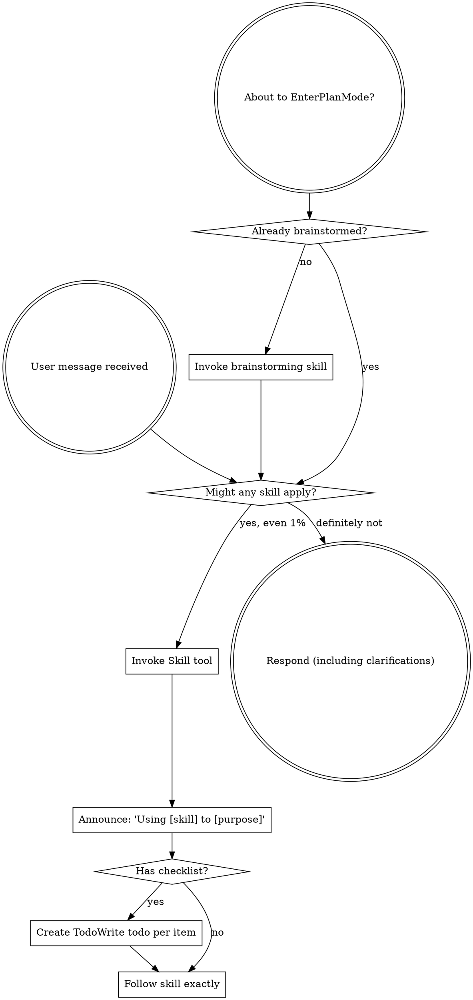

Reading additional input from stdin...
OpenAI Codex v0.130.0
--------
workdir: D:\code\claudecode\BITCOIN\tacit-cli
model: gpt-5.5
provider: custom
approval: never
sandbox: read-only
reasoning effort: xhigh
reasoning summaries: none
session id: 019e0cce-41d9-7c52-a6ee-bff4bc80c6f7
--------
user
# Code Review Task

You are a senior Python + Bitcoin engineer with deep familiarity with BIP-341/342 (Taproot, tap-script-path), PSBT (BIP-174 / BIP-371 fields), Schnorr signatures, and inscription-style commit/reveal patterns.

## What this project does

`tacit-cli` is a Python CLI that talks to a third-party Tacit indexer at `https://tacit.unode.one` to:
1. Read assets / holders / address (read-only API client).
2. Programmatically mint the FAIR token (commit + reveal) without using a browser wallet — by signing PSBTs returned from the server with a local WIF private key, then broadcasting via mempool.space.

The mint flow is **Ordinals-style commit/reveal**: server returns unsigned PSBTs, client signs them, server `extract`s into raw tx hex, client broadcasts.

## Authoritative protocol notes

Read `docs/PROTOCOL_NOTES.md` first — it is the **ground truth** reverse-engineered from a real on-chain Tacit mint pair (`91a7df7f...` commit + `b381f9dd...` reveal). Everything else (especially mint.py / signer.py / broadcast.py) was written by an LLM agent under partial information; treat their assumptions as suspect.

## Files to review (in priority order)

1. **`tacit_cli/signer.py`** — PSBT signing. Highest risk. Must correctly sign:
   - commit tx: P2TR key-path Schnorr (with BIP-86 even-parity tweak) for fromAddress UTXO inputs
   - reveal tx: P2TR tap-script-path Schnorr for the commit output input, leaf = `<xonly_pk> CHECKSIG OP_0 OP_IF "TACIT" 0x01 <PUSHDATA1 payload> OP_ENDIF`
   - Internal pubkey of commit output is **BIP-341 NUMS H** = `50929b74c1a04954b78b4b6035e97a5e078a5a0f28ec96d547bfee9ace803ac0` (provably-no-keypath spend)
   - **Known bug suspected**: `_assert_outputs_safe` reportedly checks "at least one output pays receiver_address" — but the COMMIT tx has zero outputs paying receiver (commit output goes to NUMS-H taproot, change goes to fromAddress). So the rule must distinguish commit-vs-reveal or be split into per-tx-type checks.
2. **`tacit_cli/mint.py`** — orchestration: fetch UTXO → build → sign → extract → broadcast. Check:
   - Field-name fallbacks for `/api/mint/build` and `/api/mint/extract` responses (responses partially documented; agent guessed)
   - Whether `chains` array is passed back to extract verbatim (must NOT drop fields)
   - Mint log format (must NOT contain WIF/private key/seed)
   - Confirmation gate before signing
3. **`tacit_cli/broadcast.py`** — mempool.space POST /api/tx, polling /api/tx/{txid}, retry policy. Check:
   - Commit MUST land in mempool BEFORE reveal is broadcast (else reveal's input is unknown)
   - 4xx vs 5xx handling
   - Whether broadcaster persists raw_tx_hex so a partial-broadcast run can resume
4. **`tacit_cli/mint_cli.py`** — CLI surface. Check:
   - `--yes` / confirmation gate is unbypassable in `mint run`
   - `--asset` accepts both ticker `FAIR` and 64-hex asset_id
   - WIF input via `--wif` vs env var `TACIT_WIF` precedence
5. **`tacit_cli/client.py`** — read-only HTTP client. Lower risk; just sanity check error handling and timeout.

## What I want back

Produce a structured report grouped by severity. For each finding include:
- **File:line** reference
- **What** is wrong / risky
- **Why** it matters (be specific — "loses funds because X" or "fails to broadcast because Y")
- **Concrete fix** (a code-shaped suggestion, not a vague hint)

Severity buckets:

### Critical (must fix before any mainnet run)
Anything that could lose user funds, send bitcoin to a wrong address, fail to broadcast a fully-signed tx, leak the WIF, or produce an invalid PSBT signature.

### Warning (should fix before count > 1 batches)
Anything that fails on edge cases, breaks resumability, or makes recovery impossible.

### Info (nice-to-have)
Style, naming, redundancy, missing tests.

## Hard requirements for your review

1. Read `docs/PROTOCOL_NOTES.md` first. Trust it over any contradicting code comment.
2. Specifically inspect `_assert_outputs_safe` (or whatever the output-validation function is named) and tell me if it currently rejects valid commit PSBTs.
3. Tell me whether `embit` is actually configured to handle BIP-371 PSBT fields (`PSBT_IN_TAP_LEAF_SCRIPT` 0x15, `PSBT_IN_TAP_BIP32_DERIVATION` 0x16) on the reveal input — if those fields are missing from the server PSBT, the script must inject them itself before signing.
4. Tell me whether the change output of the commit tx goes back to fromAddress (correct) vs receiver_address (wrong).
5. Don't propose new architecture. Only point out concrete defects in the current code.
6. Keep the report under 1500 words. Prioritize Critical findings.

Do NOT modify any files. Output the review only, to stdout.
´íÎó: ûÓĞÕÒµ½½ø³Ì "35068"¡£
codex
柚�，我会先读项目指令��议说�和待审文件，��输出审查报告；�会改文件。
exec
"C:\\Windows\\System32\\WindowsPowerShell\\v1.0\\powershell.exe" -Command 'Get-ChildItem -Force -Name AGENTS.md,AGENTS.MD,CLAUDE.md,CLAUDE.MD,codex.md,codex.MD,CODEX.md 2>$null' in D:\code\claudecode\BITCOIN\tacit-cli
exec
"C:\\Windows\\System32\\WindowsPowerShell\\v1.0\\powershell.exe" -Command "Select-String -Path C:\\Users\\Administrator\\.codex\\memories\\MEMORY.md -Pattern 'tacit-cli|Tacit|BITCOIN|BIP-341|BIP-371' -CaseSensitive:"'$false' in D:\code\claudecode\BITCOIN\tacit-cli
exec
"C:\\Windows\\System32\\WindowsPowerShell\\v1.0\\powershell.exe" -Command "Get-Content C:\\Users\\Administrator\\.codex\\plugins\\cache\\openai-curated\\superpowers\\63976030\\skills\\using-superpowers\\SKILL.md" in D:\code\claudecode\BITCOIN\tacit-cli
 declined in 0ms:
`"C:\\Windows\\System32\\WindowsPowerShell\\v1.0\\powershell.exe" -Command 'Get-ChildItem -Force -Name AGENTS.md,AGENTS.MD,CLAUDE.md,CLAUDE.MD,codex.md,codex.MD,CODEX.md 2>$null'` rejected: blocked by policy
 declined in 0ms:
`"C:\\Windows\\System32\\WindowsPowerShell\\v1.0\\powershell.exe" -Command "Select-String -Path C:\\Users\\Administrator\\.codex\\memories\\MEMORY.md -Pattern 'tacit-cli|Tacit|BITCOIN|BIP-341|BIP-371' -CaseSensitive:"'$false'` rejected: blocked by policy
2026-05-09T12:55:22.139198Z ERROR codex_core::tools::router: error=`"C:\\Windows\\System32\\WindowsPowerShell\\v1.0\\powershell.exe" -Command "Select-String -Path C:\\Users\\Administrator\\.codex\\memories\\MEMORY.md -Pattern 'tacit-cli|Tacit|BITCOIN|BIP-341|BIP-371' -CaseSensitive:"'$false'` rejected: blocked by policy
2026-05-09T12:55:22.139301Z ERROR codex_core::tools::router: error=`"C:\\Windows\\System32\\WindowsPowerShell\\v1.0\\powershell.exe" -Command 'Get-ChildItem -Force -Name AGENTS.md,AGENTS.MD,CLAUDE.md,CLAUDE.MD,codex.md,codex.MD,CODEX.md 2>$null'` rejected: blocked by policy
 succeeded in 361ms:
---
name: using-superpowers
description: Use when starting any conversation - establishes how to find and use skills, requiring Skill tool invocation before ANY response including clarifying questions
---

<SUBAGENT-STOP>
If you were dispatched as a subagent to execute a specific task, skip this skill.
</SUBAGENT-STOP>

<EXTREMELY-IMPORTANT>
If you think there is even a 1% chance a skill might apply to what you are doing, you ABSOLUTELY MUST invoke the skill.

IF A SKILL APPLIES TO YOUR TASK, YOU DO NOT HAVE A CHOICE. YOU MUST USE IT.

This is not negotiable. This is not optional. You cannot rationalize your way out of this.
</EXTREMELY-IMPORTANT>

## Instruction Priority

Superpowers skills override default system prompt behavior, but **user instructions always take precedence**:

1. **User's explicit instructions** (CLAUDE.md, GEMINI.md, AGENTS.md, direct requests) 鈥?highest priority
2. **Superpowers skills** 鈥?override default system behavior where they conflict
3. **Default system prompt** 鈥?lowest priority

If CLAUDE.md, GEMINI.md, or AGENTS.md says "don't use TDD" and a skill says "always use TDD," follow the user's instructions. The user is in control.

## How to Access Skills

**In Claude Code:** Use the `Skill` tool. When you invoke a skill, its content is loaded and presented to you鈥攆ollow it directly. Never use the Read tool on skill files.

**In Copilot CLI:** Use the `skill` tool. Skills are auto-discovered from installed plugins. The `skill` tool works the same as Claude Code's `Skill` tool.

**In Gemini CLI:** Skills activate via the `activate_skill` tool. Gemini loads skill metadata at session start and activates the full content on demand.

**In other environments:** Check your platform's documentation for how skills are loaded.

## Platform Adaptation

Skills use Claude Code tool names. Non-CC platforms: see `references/copilot-tools.md` (Copilot CLI), `references/codex-tools.md` (Codex) for tool equivalents. Gemini CLI users get the tool mapping loaded automatically via GEMINI.md.

# Using Skills

## The Rule

**Invoke relevant or requested skills BEFORE any response or action.** Even a 1% chance a skill might apply means that you should invoke the skill to check. If an invoked skill turns out to be wrong for the situation, you don't need to use it.



## Red Flags

These thoughts mean STOP鈥攜ou're rationalizing:

| Thought | Reality |
|---------|---------|
| "This is just a simple question" | Questions are tasks. Check for skills. |
| "I need more context first" | Skill check comes BEFORE clarifying questions. |
| "Let me explore the codebase first" | Skills tell you HOW to explore. Check first. |
| "I can check git/files quickly" | Files lack conversation context. Check for skills. |
| "Let me gather information first" | Skills tell you HOW to gather information. |
| "This doesn't need a formal skill" | If a skill exists, use it. |
| "I remember this skill" | Skills evolve. Read current version. |
| "This doesn't count as a task" | Action = task. Check for skills. |
| "The skill is overkill" | Simple things become complex. Use it. |
| "I'll just do this one thing first" | Check BEFORE doing anything. |
| "This feels productive" | Undisciplined action wastes time. Skills prevent this. |
| "I know what that means" | Knowing the concept 鈮?using the skill. Invoke it. |

## Skill Priority

When multiple skills could apply, use this order:

1. **Process skills first** (brainstorming, debugging) - these determine HOW to approach the task
2. **Implementation skills second** (frontend-design, mcp-builder) - these guide execution

"Let's build X" 鈫?brainstorming first, then implementation skills.
"Fix this bug" 鈫?debugging first, then domain-specific skills.

## Skill Types

**Rigid** (TDD, debugging): Follow exactly. Don't adapt away discipline.

**Flexible** (patterns): Adapt principles to context.

The skill itself tells you which.

## User Instructions

Instructions say WHAT, not HOW. "Add X" or "Fix Y" doesn't mean skip workflows.

codex
柚�，上一�并行读文件里有两个 PowerShell 命令被策略拦了，我会改用更朴素的�读命令继续。先拿�议和��行�，�点对照 taproot/PSBT 逻辑。
exec
"C:\\Windows\\System32\\WindowsPowerShell\\v1.0\\powershell.exe" -Command 'Get-ChildItem -Force' in D:\code\claudecode\BITCOIN\tacit-cli
exec
"C:\\Windows\\System32\\WindowsPowerShell\\v1.0\\powershell.exe" -Command '$i=0; Get-Content docs'"\\PROTOCOL_NOTES.md | ForEach-Object { "'$i++; '"'{0,5}: {1}' -f "'$i, $_ }' in D:\code\claudecode\BITCOIN\tacit-cli
 declined in 0ms:
`"C:\\Windows\\System32\\WindowsPowerShell\\v1.0\\powershell.exe" -Command '$i=0; Get-Content docs'"\\PROTOCOL_NOTES.md | ForEach-Object { "'$i++; '"'{0,5}: {1}' -f "'$i, $_ }'` rejected: blocked by policy
2026-05-09T12:55:36.714600Z ERROR codex_core::tools::router: error=`"C:\\Windows\\System32\\WindowsPowerShell\\v1.0\\powershell.exe" -Command '$i=0; Get-Content docs'"\\PROTOCOL_NOTES.md | ForEach-Object { "'$i++; '"'{0,5}: {1}' -f "'$i, $_ }'` rejected: blocked by policy
exec
"C:\\Windows\\System32\\WindowsPowerShell\\v1.0\\powershell.exe" -Command '$i=0; Get-Content tacit_cli'"\\signer.py | ForEach-Object { "'$i++; '"'{0,5}: {1}' -f "'$i, $_ }' in D:\code\claudecode\BITCOIN\tacit-cli
 declined in 0ms:
2026-05-09T12:55:36.726320Z ERROR codex_core::tools::router: error=`"C:\\Windows\\System32\\WindowsPowerShell\\v1.0\\powershell.exe" -Command '$i=0; Get-Content tacit_cli'"\\signer.py | ForEach-Object { "'$i++; '"'{0,5}: {1}' -f "'$i, $_ }'` rejected: blocked by policy
`"C:\\Windows\\System32\\WindowsPowerShell\\v1.0\\powershell.exe" -Command '$i=0; Get-Content tacit_cli'"\\signer.py | ForEach-Object { "'$i++; '"'{0,5}: {1}' -f "'$i, $_ }'` rejected: blocked by policy
 succeeded in 395ms:


    目录: D:\code\claudecode\BITCOIN\tacit-cli


Mode                 LastWriteTime         Length Name                                                                 
----                 -------------         ------ ----                                                                 
d--h--          2026/5/9     20:53                .git                                                                 
d-----          2026/5/9     20:51                docs                                                                 
d-----          2026/5/9     20:44                examples                                                             
d-----          2026/5/9     20:49                tacit_cli                                                            
-a----          2026/5/9     20:55              0 .codex_review_output.md                                              
-a----          2026/5/9     20:54           4714 .codex_review_prompt.md                                              
-a----          2026/5/9     20:44            140 .env.example                                                         
-a----          2026/5/9     20:44            111 .gitignore                                                           
-a----          2026/5/9     20:44            151 activate.bat                                                         
-a----          2026/5/9     20:44            248 activate.sh                                                          
-a----          2026/5/9     20:44            374 pyproject.toml                                                       
-a----          2026/5/9     20:43           1264 README.md                                                            
-a----          2026/5/9     20:49             28 requirements.txt                                                     
-a----          2026/5/9     20:43            597 setup_env.bat                                                        
-a----          2026/5/9     20:44            461 setup_env.sh                                                         


codex
柚�，目录里没有��的本地 `AGENTS.md` 文件；你贴出的项目指令就是当�适用规则。我改用�会触�策略拦截的 `Select-String`/`Get-Content` ��行�。
exec
"C:\\Windows\\System32\\WindowsPowerShell\\v1.0\\powershell.exe" -Command "Select-String -Path docs\\PROTOCOL_NOTES.md -Pattern \".\"" in D:\code\claudecode\BITCOIN\tacit-cli
exec
"C:\\Windows\\System32\\WindowsPowerShell\\v1.0\\powershell.exe" -Command "Select-String -Path tacit_cli\\signer.py -Pattern \".\"" in D:\code\claudecode\BITCOIN\tacit-cli
exec
"C:\\Windows\\System32\\WindowsPowerShell\\v1.0\\powershell.exe" -Command "Select-String -Path tacit_cli\\mint.py -Pattern \".\"" in D:\code\claudecode\BITCOIN\tacit-cli
 succeeded in 482ms:

tacit_cli\signer.py:1:import logging
tacit_cli\signer.py:2:from typing import Optional
tacit_cli\signer.py:4:from embit import ec, script
tacit_cli\signer.py:5:from embit.networks import NETWORKS
tacit_cli\signer.py:6:from embit.psbt import PSBT
tacit_cli\signer.py:8:logger = logging.getLogger("tacit_cli.signer")
tacit_cli\signer.py:10:NETWORK = NETWORKS["main"]
tacit_cli\signer.py:13:class SignerError(Exception):
tacit_cli\signer.py:14:  pass
tacit_cli\signer.py:17:class WifSigner:
tacit_cli\signer.py:18:  """In-memory WIF signer for Tacit PSBTs.
tacit_cli\signer.py:20:  Supports P2WPKH and P2TR (key-path + script-path) inputs. Delegates the
tacit_cli\signer.py:21:  per-input branch logic to embit.PSBT.sign_with so we don't reinvent
tacit_cli\signer.py:22:  secp256k1.
tacit_cli\signer.py:23:  """
tacit_cli\signer.py:25:  def __init__(self, wif: str):
tacit_cli\signer.py:26:    self._key = ec.PrivateKey.from_wif(wif)
tacit_cli\signer.py:27:    self._pub = self._key.get_public_key()
tacit_cli\signer.py:29:  @property
tacit_cli\signer.py:30:  def pubkey_hex(self) -> str:
tacit_cli\signer.py:31:    # Compressed 33-byte SEC pubkey (P2WPKH wallets use this).
tacit_cli\signer.py:32:    return self._pub.sec().hex()
tacit_cli\signer.py:34:  @property
tacit_cli\signer.py:35:  def xonly_pubkey_hex(self) -> str:
tacit_cli\signer.py:36:    # 32-byte x-only key (Taproot wallets use this).
tacit_cli\signer.py:37:    return self._key.xonly().hex()
tacit_cli\signer.py:39:  @property
tacit_cli\signer.py:40:  def address(self) -> str:
tacit_cli\signer.py:41:    # Default to P2TR since Tacit is taproot-native; fromAddress in the brief
tacit_cli\signer.py:42:    # is bc1p... so derive the matching taproot address from the internal key.
tacit_cli\signer.py:43:    return script.p2tr(self._pub).address(NETWORK)
tacit_cli\signer.py:45:  @property
tacit_cli\signer.py:46:  def p2wpkh_address(self) -> str:
tacit_cli\signer.py:47:    return script.p2wpkh(self._pub).address(NETWORK)
tacit_cli\signer.py:49:  def sign_psbt(self, psbt_hex: str, expected_receiver: Optional[str] = None) -> str:
tacit_cli\signer.py:50:    psbt = PSBT.from_string(psbt_hex)
tacit_cli\signer.py:52:    if expected_receiver:
tacit_cli\signer.py:53:      self._assert_outputs_safe(psbt, expected_receiver)
tacit_cli\signer.py:55:    try:
tacit_cli\signer.py:56:      signed_count = psbt.sign_with(self._key)
tacit_cli\signer.py:57:    except NotImplementedError as exc:
tacit_cli\signer.py:58:      # embit may bail on tap-script-path leaves it cannot fingerprint; surface
tacit_cli\signer.py:59:      # with our marker so callers know to retry via a wallet UI.
tacit_cli\signer.py:60:      raise NotImplementedError(
tacit_cli\signer.py:61:        f"reveal script-path signing not yet supported, use wallet-based "
tacit_cli\signer.py:62:        f"signing instead: {exc}"
tacit_cli\signer.py:63:      )
tacit_cli\signer.py:65:    if signed_count == 0:
tacit_cli\signer.py:66:      raise SignerError(
tacit_cli\signer.py:67:        "embit produced 0 signatures - WIF probably does not match any input "
tacit_cli\signer.py:68:        "(check fromAddress and walletPubkeyHex)"
tacit_cli\signer.py:69:      )
tacit_cli\signer.py:71:    unsigned = []
tacit_cli\signer.py:72:    for i, inp in enumerate(psbt.inputs):
tacit_cli\signer.py:73:      if not (inp.partial_sigs or inp.taproot_key_sig or inp.taproot_sigs or inp.final_scriptwit
ness):
tacit_cli\signer.py:74:        unsigned.append(i)
tacit_cli\signer.py:75:    if unsigned:
tacit_cli\signer.py:76:      logger.warning("psbt inputs still unsigned after sign_with: %s", unsigned)
tacit_cli\signer.py:78:    return psbt.to_string(encoding="hex")
tacit_cli\signer.py:80:  def _assert_outputs_safe(self, psbt: PSBT, expected_receiver: str) -> None:
tacit_cli\signer.py:81:    """Reject PSBTs whose user-bound outputs do not pay expected_receiver.
tacit_cli\signer.py:83:    A reveal PSBT always has at least one OP_RETURN-style or service-fee
tacit_cli\signer.py:84:    output, so we don't require ALL outputs to match - we require at least
tacit_cli\signer.py:85:    one output to pay the expected receiver, and we require that NO non-dust
tacit_cli\signer.py:86:    output pays a third party that isn't OP_RETURN or the service.
tacit_cli\signer.py:87:    """
tacit_cli\signer.py:88:    expected_script = script.Script.from_address(expected_receiver)
tacit_cli\signer.py:89:    found = False
tacit_cli\signer.py:90:    for i, out in enumerate(psbt.outputs):
tacit_cli\signer.py:91:      out_script = psbt.tx.vout[i].script_pubkey
tacit_cli\signer.py:92:      if out_script.data == expected_script.data:
tacit_cli\signer.py:93:        found = True
tacit_cli\signer.py:94:        break
tacit_cli\signer.py:95:    if not found:
tacit_cli\signer.py:96:      raise SignerError(
tacit_cli\signer.py:97:        f"refusing to sign PSBT: no output pays expected receiver "
tacit_cli\signer.py:98:        f"{expected_receiver} (possible malicious server response)"
tacit_cli\signer.py:99:      )


 succeeded in 487ms:

docs\PROTOCOL_NOTES.md:1:# Tacit PMINT �议结�（�测��）
docs\PROTOCOL_NOTES.md:3:样本：`bc1p7z6snxwjv9cv7kduae5sqd07zvsc3y9pwxqc5sgdrqnza67tuxgs26kzv2` 的一笔 FAIR mint。
docs\PROTOCOL_NOTES.md:4:- commit txid: `91a7df7f08f73a6618867d563786bf62e2f5f0d85af70e19b84afd9e96117554`
docs\PROTOCOL_NOTES.md:5:- reveal txid: `b381f9dd88b2f02daa33868cb8529ce7bb13e262b0217148d4d447f23acf37c7`
docs\PROTOCOL_NOTES.md:7:## Commit tx
docs\PROTOCOL_NOTES.md:9:普通 P2TR key-path 花费。
docs\PROTOCOL_NOTES.md:11:- 输入：用户 P2TR UTXO（`bc1p7z6s...`）
docs\PROTOCOL_NOTES.md:12:- witness：1 项 64-byte = key-path Schnorr 签�（BIP-341）
docs\PROTOCOL_NOTES.md:13:- 输出 0：`878 sat` → commit 地�（taproot(NUMS_H, [leaf]))
docs\PROTOCOL_NOTES.md:14:- 输出 1：找零�� P2TR
docs\PROTOCOL_NOTES.md:16:签��点：标准 BIP-341 key-path，embit `psbt.sign_with(root_key)` 直��定。
docs\PROTOCOL_NOTES.md:18:## Reveal tx — Tacit envelope
docs\PROTOCOL_NOTES.md:20:输入：花 commit 输出 0。witness 是 tap-script-path 标准 3 项：
docs\PROTOCOL_NOTES.md:21:```
docs\PROTOCOL_NOTES.md:22:[0] schnorr_sig         (64 字节)
docs\PROTOCOL_NOTES.md:23:[1] leaf_script         (�长)
docs\PROTOCOL_NOTES.md:24:[2] control_block       (33 字节起，1 leaf 时正好 33)
docs\PROTOCOL_NOTES.md:25:```
docs\PROTOCOL_NOTES.md:27:### Leaf script 结�
docs\PROTOCOL_NOTES.md:29:```
docs\PROTOCOL_NOTES.md:30:20 <32-byte xonly user pubkey>   ; OP_PUSHBYTES_32
docs\PROTOCOL_NOTES.md:31:ac                               ; OP_CHECKSIG
docs\PROTOCOL_NOTES.md:32:00                               ; OP_0 / OP_FALSE
docs\PROTOCOL_NOTES.md:33:63                               ; OP_IF
docs\PROTOCOL_NOTES.md:34:05 5441434954                    ; "TACIT" magic
docs\PROTOCOL_NOTES.md:35:01 01                            ; version byte 0x01
docs\PROTOCOL_NOTES.md:36:4c <len> <payload>               ; OP_PUSHDATA1 + 1-byte length + payload
docs\PROTOCOL_NOTES.md:37:68                               ; OP_ENDIF
docs\PROTOCOL_NOTES.md:38:```
docs\PROTOCOL_NOTES.md:40:`OP_0 OP_IF ... OP_ENDIF` 让 body 永�执行 ⇒ 纯数�载体（inscription envelope �格）。
docs\PROTOCOL_NOTES.md:42:### Payload (138 字节示例)
docs\PROTOCOL_NOTES.md:44:| �移 | 字节数 | �义 |
docs\PROTOCOL_NOTES.md:45:|------|-------|------|
docs\PROTOCOL_NOTES.md:46:| 0    | 32    | asset_id（FAIR = `c4a678d6...`） |
docs\PROTOCOL_NOTES.md:47:| 32   | 32    | etch_txid（`c2542e7f...`） |
docs\PROTOCOL_NOTES.md:48:| 64   | ?     | �续 74 字节包� amount / receiver scriptPubKey / nonce 等，**未完全 RE，�样��务器 PSBT 里拷过
���** |
docs\PROTOCOL_NOTES.md:50:### Control block
docs\PROTOCOL_NOTES.md:52:`c1 50929b74c1a04954b78b4b6035e97a5e078a5a0f28ec96d547bfee9ace803ac0`
docs\PROTOCOL_NOTES.md:54:- 第一字节 `c1` = leaf_version(0xc0) | parity(1)
docs\PROTOCOL_NOTES.md:55:- � 32 字节 = **BIP-341 NUMS 点 H** （常�）：�� commit 输出**没有 key-path 花费�能**，必须走 script-path
docs\PROTOCOL_NOTES.md:57:### 签��点
docs\PROTOCOL_NOTES.md:59:leaf �有 `<pk> CHECKSIG`，所以 reveal 签� = 标准 BIP-341 tap-script-path Schnorr：
docs\PROTOCOL_NOTES.md:61:```
docs\PROTOCOL_NOTES.md:62:sighash = TapSighash(tx, input_index, prevouts, leaf_hash, sighash_type=DEFAULT)
docs\PROTOCOL_NOTES.md:63:sig     = Schnorr(privkey, sighash)
docs\PROTOCOL_NOTES.md:64:```
docs\PROTOCOL_NOTES.md:66:embit 在 PSBT 里��看到下列 BIP-371 字段就能自动签：
docs\PROTOCOL_NOTES.md:67:- `PSBT_IN_TAP_LEAF_SCRIPT` (0x15)：(script, leaf_ver) 元组
docs\PROTOCOL_NOTES.md:68:- `PSBT_IN_TAP_BIP32_DERIVATION` (0x16)：把 user xonly_pk 关�到 leaf hash
docs\PROTOCOL_NOTES.md:69:- `PSBT_IN_WITNESS_UTXO` (0x01)：commit 输出（用� sighash 用到的 prevout 数�）
docs\PROTOCOL_NOTES.md:71:### 校验防�� PSBT
docs\PROTOCOL_NOTES.md:73:签��必�：
docs\PROTOCOL_NOTES.md:75:1. **校验 commit 地�**：用本地计算的 leaf_hash + NUMS H �算 `taproot()`，应等��务器返�的 commit 输出 scriptPubKey
。
docs\PROTOCOL_NOTES.md:76:2. **校验 reveal 输出**：reveal 的 vout[0] 必须是 `config.receiver_address`（FAIR �收）。
docs\PROTOCOL_NOTES.md:77:3. **校验载�� 64 字节**：必须是 `<config.asset_id> + <known_etch_txid>`，防�务器��资产。
docs\PROTOCOL_NOTES.md:78:4. **载�里如�有 receiver scriptPubKey 字段**：和 receiver_address 解��的 scriptPubKey 比对。
docs\PROTOCOL_NOTES.md:80:NUMS H 常�（写死）：
docs\PROTOCOL_NOTES.md:81:```python
docs\PROTOCOL_NOTES.md:82:NUMS_H = bytes.fromhex("50929b74c1a04954b78b4b6035e97a5e078a5a0f28ec96d547bfee9ace803ac0")
docs\PROTOCOL_NOTES.md:83:```
docs\PROTOCOL_NOTES.md:85:## 费用观察
docs\PROTOCOL_NOTES.md:87:样本是 `--count 1` 的最�批：
docs\PROTOCOL_NOTES.md:88:- commit：205 vbytes，310 sat fee（约 1.5 sat/vB，慢）
docs\PROTOCOL_NOTES.md:89:- reveal：382 字节 / 664 weight = 166 vBytes，332 sat fee（约 2 sat/vB）
docs\PROTOCOL_NOTES.md:91:mempool 当�若需快确认建议 ≥ 5 sat/vB。
docs\PROTOCOL_NOTES.md:93:## �务费 reveal（待 RE）
docs\PROTOCOL_NOTES.md:95:`/api/mint/build` �应里有 `serviceFeeRevealCount`：�能是�些 reveal 由用户付费但收益给�议方。当�样本里没看到（serviceFeeR
evealCount=0），先按"全部 reveal 都签 + 全部传� extract"处�，���务器报错�细化。
docs\PROTOCOL_NOTES.md:97:## 总结：脚本�行性
docs\PROTOCOL_NOTES.md:99:| 部分 | �行性 | 说� |
docs\PROTOCOL_NOTES.md:100:|------|-------|------|
docs\PROTOCOL_NOTES.md:101:| Commit 签� | 高 | 标准 P2TR key-path，embit OK |
docs\PROTOCOL_NOTES.md:102:| Reveal 签� | 高 | tap-script-path with single CHECKSIG leaf，embit OK，需� PSBT � BIP-371 字段 |
docs\PROTOCOL_NOTES.md:103:| commit 地�校验 | 高 | NUMS H 写死，本地 taproot 计算 |
docs\PROTOCOL_NOTES.md:104:| envelope 载�校验 | 中 | asset_id+etch_txid 容易；其余字段需��多看几个样本 RE |
docs\PROTOCOL_NOTES.md:105:| 广播顺� | 高 | 先 commit 入 mempool，等 1 conf 或入 mempool，�� reveal |


 succeeded in 523ms:

tacit_cli\mint.py:1:import json
tacit_cli\mint.py:2:import logging
tacit_cli\mint.py:3:import os
tacit_cli\mint.py:4:import time
tacit_cli\mint.py:5:from dataclasses import dataclass, field
tacit_cli\mint.py:6:from typing import Callable, Optional
tacit_cli\mint.py:8:from .broadcast import BroadcastError, MempoolBroadcaster
tacit_cli\mint.py:9:from .client import TacitAPIError, TacitClient
tacit_cli\mint.py:11:logger = logging.getLogger("tacit_cli.mint")
tacit_cli\mint.py:14:@dataclass
tacit_cli\mint.py:15:class MintConfig:
tacit_cli\mint.py:16:  asset_id: str
tacit_cli\mint.py:17:  from_address: str
tacit_cli\mint.py:18:  receiver_address: str
tacit_cli\mint.py:19:  wallet_pubkey_hex: str
tacit_cli\mint.py:20:  repeat_count: int = 1
tacit_cli\mint.py:21:  fee_rate: int = 2
tacit_cli\mint.py:23:  def to_build_payload(self, utxos: list) -> dict:
tacit_cli\mint.py:24:    return {
tacit_cli\mint.py:25:      "asset_id": self.asset_id,
tacit_cli\mint.py:26:      "fromAddress": self.from_address,
tacit_cli\mint.py:27:      "receiverAddress": self.receiver_address,
tacit_cli\mint.py:28:      "walletPubkeyHex": self.wallet_pubkey_hex,
tacit_cli\mint.py:29:      "repeatCount": self.repeat_count,
tacit_cli\mint.py:30:      "feeRate": self.fee_rate,
tacit_cli\mint.py:31:      "utxos": utxos,
tacit_cli\mint.py:32:    }
tacit_cli\mint.py:35:@dataclass
tacit_cli\mint.py:36:class MintLog:
tacit_cli\mint.py:37:  path: str
tacit_cli\mint.py:38:  records: list = field(default_factory=list)
tacit_cli\mint.py:40:  def append(self, record: dict) -> None:
tacit_cli\mint.py:41:    record = {"ts": int(time.time()), **record}
tacit_cli\mint.py:42:    # Defensive scrub: never let secrets land here even if a caller is sloppy.
tacit_cli\mint.py:43:    for k in ("wif", "pubkey", "wallet_pubkey", "wallet_pubkey_hex"):
tacit_cli\mint.py:44:      record.pop(k, None)
tacit_cli\mint.py:45:    self.records.append(record)
tacit_cli\mint.py:46:    with open(self.path, "a", encoding="utf-8") as fp:
tacit_cli\mint.py:47:      fp.write(json.dumps(record) + "\n")
tacit_cli\mint.py:50:def fetch_utxos(client: TacitClient, address: str) -> list:
tacit_cli\mint.py:51:  data = client.get_utxos(address)
tacit_cli\mint.py:52:  return data.get("utxos") or []
tacit_cli\mint.py:55:def request_build(client: TacitClient, config: MintConfig, utxos: list) -> dict:
tacit_cli\mint.py:56:  url = f"{client.base_url}/api/mint/build"
tacit_cli\mint.py:57:  resp = client.session.post(
tacit_cli\mint.py:58:    url,
tacit_cli\mint.py:59:    json=config.to_build_payload(utxos),
tacit_cli\mint.py:60:    timeout=client.timeout,
tacit_cli\mint.py:61:  )
tacit_cli\mint.py:62:  if 400 <= resp.status_code < 500:
tacit_cli\mint.py:63:    try:
tacit_cli\mint.py:64:      payload = resp.json()
tacit_cli\mint.py:65:      message = payload.get("error") or payload.get("message") or resp.text
tacit_cli\mint.py:66:    except ValueError:
tacit_cli\mint.py:67:      message = resp.text or resp.reason
tacit_cli\mint.py:68:    raise TacitAPIError(resp.status_code, message)
tacit_cli\mint.py:69:  resp.raise_for_status()
tacit_cli\mint.py:70:  return resp.json()
tacit_cli\mint.py:73:def request_extract(
tacit_cli\mint.py:74:  client: TacitClient,
tacit_cli\mint.py:75:  chains: list,
tacit_cli\mint.py:76:  signed_commits: list,
tacit_cli\mint.py:77:  signed_reveals: list,
tacit_cli\mint.py:78:) -> dict:
tacit_cli\mint.py:79:  url = f"{client.base_url}/api/mint/extract"
tacit_cli\mint.py:80:  body = {
tacit_cli\mint.py:81:    "chains": chains,
tacit_cli\mint.py:82:    "signed": {"commits": signed_commits, "reveals": signed_reveals},
tacit_cli\mint.py:83:  }
tacit_cli\mint.py:84:  resp = client.session.post(url, json=body, timeout=client.timeout)
tacit_cli\mint.py:85:  if 400 <= resp.status_code < 500:
tacit_cli\mint.py:86:    try:
tacit_cli\mint.py:87:      payload = resp.json()
tacit_cli\mint.py:88:      message = payload.get("error") or payload.get("message") or resp.text
tacit_cli\mint.py:89:    except ValueError:
tacit_cli\mint.py:90:      message = resp.text or resp.reason
tacit_cli\mint.py:91:    raise TacitAPIError(resp.status_code, message)
tacit_cli\mint.py:92:  resp.raise_for_status()
tacit_cli\mint.py:93:  return resp.json()
tacit_cli\mint.py:96:def _extract_psbt_hex(psbt_field) -> str:
tacit_cli\mint.py:97:  # Build response wraps PSBT as {"hex": "..."}; tolerate string fallback too.
tacit_cli\mint.py:98:  if isinstance(psbt_field, dict):
tacit_cli\mint.py:99:    return psbt_field.get("hex") or psbt_field.get("psbt") or ""
tacit_cli\mint.py:100:  return psbt_field or ""
tacit_cli\mint.py:103:def _extract_raw_hex(tx_field) -> str:
tacit_cli\mint.py:104:  # Server may name this field rawTxHex / raw_tx_hex / rawHex / hex / tx_hex.
tacit_cli\mint.py:105:  if isinstance(tx_field, dict):
tacit_cli\mint.py:106:    for k in ("rawTxHex", "raw_tx_hex", "rawHex", "raw_hex", "hex", "tx_hex", "tx"):
tacit_cli\mint.py:107:      v = tx_field.get(k)
tacit_cli\mint.py:108:      if v:
tacit_cli\mint.py:109:        return v
tacit_cli\mint.py:110:    return ""
tacit_cli\mint.py:111:  return tx_field or ""
tacit_cli\mint.py:114:def _summarize_plan(build: dict) -> str:
tacit_cli\mint.py:115:  plan = build.get("plan") or {}
tacit_cli\mint.py:116:  chains = build.get("chains") or []
tacit_cli\mint.py:117:  total_reveal = plan.get("totalRevealCount", sum(len(c.get("reveals") or []) for c in chains))
tacit_cli\mint.py:118:  fee_per_reveal = plan.get("revealFeePerTx")
tacit_cli\mint.py:119:  total_commit_fee = sum((c.get("commit") or {}).get("fee") or 0 for c in chains)
tacit_cli\mint.py:120:  lines = [
tacit_cli\mint.py:121:    f"chains: {len(chains)}",
tacit_cli\mint.py:122:    f"reveals total: {total_reveal} (repeat={plan.get('repeatCount')})",
tacit_cli\mint.py:123:    f"reveal fee per tx: {fee_per_reveal}",
tacit_cli\mint.py:124:    f"commit fee total: {total_commit_fee} sats",
tacit_cli\mint.py:125:  ]
tacit_cli\mint.py:126:  return "\n".join(lines)
tacit_cli\mint.py:129:def run_mint(
tacit_cli\mint.py:130:  client: TacitClient,
tacit_cli\mint.py:131:  config: MintConfig,
tacit_cli\mint.py:132:  signer,
tacit_cli\mint.py:133:  broadcaster: Optional[MempoolBroadcaster] = None,
tacit_cli\mint.py:134:  *,
tacit_cli\mint.py:135:  dry_run: bool = False,
tacit_cli\mint.py:136:  prompt_confirm: bool = True,
tacit_cli\mint.py:137:  log_dir: str = ".",
tacit_cli\mint.py:138:  confirm_fn: Optional[Callable[[str], str]] = None,
tacit_cli\mint.py:139:) -> dict:
tacit_cli\mint.py:140:  broadcaster = broadcaster or MempoolBroadcaster()
tacit_cli\mint.py:141:  confirm_fn = confirm_fn or input
tacit_cli\mint.py:143:  # 1. UTXOs
tacit_cli\mint.py:144:  print(f"[1/5] fetching UTXOs for {config.from_address}")
tacit_cli\mint.py:145:  utxos = fetch_utxos(client, config.from_address)
tacit_cli\mint.py:146:  if not utxos:
tacit_cli\mint.py:147:    raise SystemExit("no spendable UTXOs at fromAddress")
tacit_cli\mint.py:148:  print(f"      got {len(utxos)} utxos, total {sum(u.get('value', 0) for u in utxos)} sats")
tacit_cli\mint.py:150:  # 2. build
tacit_cli\mint.py:151:  print(f"[2/5] requesting /api/mint/build (count={config.repeat_count}, feeRate={config.fee_rate
})")
tacit_cli\mint.py:152:  build = request_build(client, config, utxos)
tacit_cli\mint.py:153:  chains = build.get("chains") or []
tacit_cli\mint.py:154:  if not chains:
tacit_cli\mint.py:155:    raise SystemExit(f"server returned no chains: {build}")
tacit_cli\mint.py:156:  print(_summarize_plan(build))
tacit_cli\mint.py:158:  if dry_run:
tacit_cli\mint.py:159:    return {"build": build}
tacit_cli\mint.py:161:  if prompt_confirm:
tacit_cli\mint.py:162:    answer = confirm_fn("type YES to sign and broadcast: ")
tacit_cli\mint.py:163:    if answer.strip() != "YES":
tacit_cli\mint.py:164:      print("aborted by user")
tacit_cli\mint.py:165:      return {"build": build, "aborted": True}
tacit_cli\mint.py:167:  log_path = os.path.join(log_dir, f"mint_log_{int(time.time())}.jsonl")
tacit_cli\mint.py:168:  mlog = MintLog(log_path)
tacit_cli\mint.py:169:  print(f"[3/5] signing {len(chains)} chain(s) -> log: {log_path}")
tacit_cli\mint.py:171:  signed_commits = []
tacit_cli\mint.py:172:  signed_reveals = []
tacit_cli\mint.py:173:  for chain in chains:
tacit_cli\mint.py:174:    commit_hex = _extract_psbt_hex((chain.get("commit") or {}).get("psbt"))
tacit_cli\mint.py:175:    if not commit_hex:
tacit_cli\mint.py:176:      raise SystemExit(f"chain {chain.get('chainIndex')} missing commit psbt")
tacit_cli\mint.py:177:    signed_commit = signer.sign_psbt(commit_hex, expected_receiver=config.receiver_address)
tacit_cli\mint.py:178:    signed_commits.append(signed_commit)
tacit_cli\mint.py:179:    for r in chain.get("reveals") or []:
tacit_cli\mint.py:180:      reveal_hex = _extract_psbt_hex(r.get("psbt"))
tacit_cli\mint.py:181:      if not reveal_hex:
tacit_cli\mint.py:182:        raise SystemExit(f"chain {chain.get('chainIndex')} reveal missing psbt hex")
tacit_cli\mint.py:183:      signed_reveal = signer.sign_psbt(reveal_hex, expected_receiver=config.receiver_address)
tacit_cli\mint.py:184:      signed_reveals.append(signed_reveal)
tacit_cli\mint.py:186:  # 4. extract
tacit_cli\mint.py:187:  print(f"[4/5] requesting /api/mint/extract ({len(signed_commits)} commits, {len(signed_reveals)
} reveals)")
tacit_cli\mint.py:188:  extracted = request_extract(client, chains, signed_commits, signed_reveals)
tacit_cli\mint.py:189:  out_chains = extracted.get("chains") or []
tacit_cli\mint.py:190:  if len(out_chains) != len(chains):
tacit_cli\mint.py:191:    logger.warning("extract returned %d chains, expected %d", len(out_chains), len(chains))
tacit_cli\mint.py:193:  # 5. broadcast
tacit_cli\mint.py:194:  print(f"[5/5] broadcasting via mempool.space")
tacit_cli\mint.py:195:  results = []
tacit_cli\mint.py:196:  for ci, out_chain in enumerate(out_chains):
tacit_cli\mint.py:197:    commit_raw = _extract_raw_hex(out_chain.get("commit"))
tacit_cli\mint.py:198:    if not commit_raw:
tacit_cli\mint.py:199:      raise SystemExit(f"chain {ci} extract response missing commit raw hex: {out_chain}")
tacit_cli\mint.py:200:    print(f"  chain {ci}: pushing commit ({len(commit_raw)//2} bytes)")
tacit_cli\mint.py:201:    try:
tacit_cli\mint.py:202:      commit_txid = broadcaster.push_tx(commit_raw)
tacit_cli\mint.py:203:    except BroadcastError as e:
tacit_cli\mint.py:204:      mlog.append({"kind": "commit", "chain": ci, "status": "error", "error": str(e)})
tacit_cli\mint.py:205:      raise
tacit_cli\mint.py:206:    mlog.append({"kind": "commit", "chain": ci, "status": "broadcast", "txid": commit_txid})
tacit_cli\mint.py:207:    print(f"           commit txid={commit_txid}, waiting for mempool...")
tacit_cli\mint.py:208:    broadcaster.wait_in_mempool(commit_txid)
tacit_cli\mint.py:209:    mlog.append({"kind": "commit", "chain": ci, "status": "mempool", "txid": commit_txid})
tacit_cli\mint.py:211:    chain_reveals = out_chain.get("reveals") or []
tacit_cli\mint.py:212:    reveal_txids = []
tacit_cli\mint.py:213:    for ri, rev in enumerate(chain_reveals):
tacit_cli\mint.py:214:      reveal_raw = _extract_raw_hex(rev)
tacit_cli\mint.py:215:      if not reveal_raw:
tacit_cli\mint.py:216:        raise SystemExit(f"chain {ci} reveal {ri} missing raw hex: {rev}")
tacit_cli\mint.py:217:      print(f"  chain {ci}: pushing reveal {ri}")
tacit_cli\mint.py:218:      try:
tacit_cli\mint.py:219:        rev_txid = broadcaster.push_tx(reveal_raw)
tacit_cli\mint.py:220:      except BroadcastError as e:
tacit_cli\mint.py:221:        mlog.append({"kind": "reveal", "chain": ci, "index": ri, "status": "error", "error": str(
e)})
tacit_cli\mint.py:222:        raise
tacit_cli\mint.py:223:      mlog.append({"kind": "reveal", "chain": ci, "index": ri, "status": "broadcast", "txid": rev
_txid})
tacit_cli\mint.py:224:      reveal_txids.append(rev_txid)
tacit_cli\mint.py:225:      print(f"           reveal txid={rev_txid}")
tacit_cli\mint.py:227:    results.append({"chain": ci, "commit_txid": commit_txid, "reveal_txids": reveal_txids})
tacit_cli\mint.py:229:  print(f"done. log: {log_path}")
tacit_cli\mint.py:230:  return {"build": build, "results": results, "log": log_path}


codex
柚�，�议说�已�确认了关键约�：commit 输出 0 是 NUMS-H taproot�找零�� P2TR；reveal �必须付 receiver，且 embit �有在 PSBT � BIP-371 tap leaf/derivation/witness_utxo 时�能自动签。�下�我会补读 broadcast�CLI�client 和�赖��，确认是�是代�真的满足这些�件。
exec
"C:\\Windows\\System32\\WindowsPowerShell\\v1.0\\powershell.exe" -Command "Select-String -Path tacit_cli\\broadcast.py -Pattern \".\"" in D:\code\claudecode\BITCOIN\tacit-cli
exec
"C:\\Windows\\System32\\WindowsPowerShell\\v1.0\\powershell.exe" -Command "Select-String -Path tacit_cli\\mint_cli.py -Pattern \".\"" in D:\code\claudecode\BITCOIN\tacit-cli
exec
"C:\\Windows\\System32\\WindowsPowerShell\\v1.0\\powershell.exe" -Command "Select-String -Path tacit_cli\\client.py -Pattern \".\"" in D:\code\claudecode\BITCOIN\tacit-cli
exec
"C:\\Windows\\System32\\WindowsPowerShell\\v1.0\\powershell.exe" -Command 'Get-Content requirements.txt' in D:\code\claudecode\BITCOIN\tacit-cli
exec
"C:\\Windows\\System32\\WindowsPowerShell\\v1.0\\powershell.exe" -Command 'Get-Content pyproject.toml' in D:\code\claudecode\BITCOIN\tacit-cli
 succeeded in 424ms:

tacit_cli\broadcast.py:1:import logging
tacit_cli\broadcast.py:2:import time
tacit_cli\broadcast.py:3:from typing import Optional
tacit_cli\broadcast.py:5:import requests
tacit_cli\broadcast.py:7:logger = logging.getLogger("tacit_cli.broadcast")
tacit_cli\broadcast.py:9:DEFAULT_BASE = "https://mempool.space/api"
tacit_cli\broadcast.py:10:RETRYABLE_STATUS = (500, 502, 503, 504)
tacit_cli\broadcast.py:13:class BroadcastError(Exception):
tacit_cli\broadcast.py:14:  def __init__(self, status: int, message: str):
tacit_cli\broadcast.py:15:    super().__init__(f"[{status}] {message}")
tacit_cli\broadcast.py:16:    self.status = status
tacit_cli\broadcast.py:17:    self.message = message
tacit_cli\broadcast.py:20:class MempoolBroadcaster:
tacit_cli\broadcast.py:21:  def __init__(
tacit_cli\broadcast.py:22:    self,
tacit_cli\broadcast.py:23:    base: str = DEFAULT_BASE,
tacit_cli\broadcast.py:24:    session: Optional[requests.Session] = None,
tacit_cli\broadcast.py:25:    timeout: int = 20,
tacit_cli\broadcast.py:26:  ):
tacit_cli\broadcast.py:27:    self.base = base.rstrip("/")
tacit_cli\broadcast.py:28:    self.session = session or requests.Session()
tacit_cli\broadcast.py:29:    self.timeout = timeout
tacit_cli\broadcast.py:31:  def push_tx(self, raw_hex: str, max_retries: int = 3) -> str:
tacit_cli\broadcast.py:32:    url = f"{self.base}/tx"
tacit_cli\broadcast.py:33:    last_exc = None
tacit_cli\broadcast.py:34:    for attempt in range(1, max_retries + 1):
tacit_cli\broadcast.py:35:      resp = self.session.post(
tacit_cli\broadcast.py:36:        url,
tacit_cli\broadcast.py:37:        data=raw_hex,
tacit_cli\broadcast.py:38:        headers={"Content-Type": "text/plain"},
tacit_cli\broadcast.py:39:        timeout=self.timeout,
tacit_cli\broadcast.py:40:      )
tacit_cli\broadcast.py:41:      if resp.status_code == 200:
tacit_cli\broadcast.py:42:        return resp.text.strip()
tacit_cli\broadcast.py:43:      if 400 <= resp.status_code < 500:
tacit_cli\broadcast.py:44:        # Validation/dust/already-known errors are not retryable.
tacit_cli\broadcast.py:45:        raise BroadcastError(resp.status_code, resp.text.strip())
tacit_cli\broadcast.py:46:      if resp.status_code in RETRYABLE_STATUS:
tacit_cli\broadcast.py:47:        last_exc = BroadcastError(resp.status_code, resp.text.strip())
tacit_cli\broadcast.py:48:        sleep = 2 ** attempt
tacit_cli\broadcast.py:49:        logger.warning("push_tx %s -> %s, retry %d in %ds", url, resp.status_code, attempt, s
leep)
tacit_cli\broadcast.py:50:        time.sleep(sleep)
tacit_cli\broadcast.py:51:        continue
tacit_cli\broadcast.py:52:      raise BroadcastError(resp.status_code, resp.text.strip())
tacit_cli\broadcast.py:53:    raise last_exc or BroadcastError(0, "unreachable")
tacit_cli\broadcast.py:55:  def wait_in_mempool(self, txid: str, timeout: int = 120, interval: int = 3) -> dict:
tacit_cli\broadcast.py:56:    """Poll /tx/{txid} until it returns 200 or timeout."""
tacit_cli\broadcast.py:57:    url = f"{self.base}/tx/{txid}"
tacit_cli\broadcast.py:58:    deadline = time.time() + timeout
tacit_cli\broadcast.py:59:    while time.time() < deadline:
tacit_cli\broadcast.py:60:      resp = self.session.get(url, timeout=self.timeout)
tacit_cli\broadcast.py:61:      if resp.status_code == 200:
tacit_cli\broadcast.py:62:        return resp.json()
tacit_cli\broadcast.py:63:      if resp.status_code == 404:
tacit_cli\broadcast.py:64:        time.sleep(interval)
tacit_cli\broadcast.py:65:        continue
tacit_cli\broadcast.py:66:      # 4xx other than 404 = something is wrong with the txid itself.
tacit_cli\broadcast.py:67:      if 400 <= resp.status_code < 500:
tacit_cli\broadcast.py:68:        raise BroadcastError(resp.status_code, resp.text.strip())
tacit_cli\broadcast.py:69:      time.sleep(interval)
tacit_cli\broadcast.py:70:    raise BroadcastError(0, f"timeout waiting for {txid} in mempool")


 succeeded in 442ms:
requests>=2.31
embit>=0.7.0

 succeeded in 483ms:
[build-system]
requires = ["setuptools>=68"]
build-backend = "setuptools.build_meta"

[project]
name = "tacit-cli"
version = "0.1.0"
description = "Read-only CLI for the Tacit PMINT indexer on Bitcoin"
requires-python = ">=3.10"
dependencies = [
  "requests>=2.31",
]

[project.scripts]
tacit = "tacit_cli.cli:main"

[tool.setuptools.packages.find]
include = ["tacit_cli*"]

 succeeded in 516ms:

tacit_cli\mint_cli.py:1:import argparse
tacit_cli\mint_cli.py:2:import json
tacit_cli\mint_cli.py:3:import logging
tacit_cli\mint_cli.py:4:import re
tacit_cli\mint_cli.py:5:import sys
tacit_cli\mint_cli.py:6:from typing import Optional
tacit_cli\mint_cli.py:8:from .broadcast import BroadcastError, MempoolBroadcaster
tacit_cli\mint_cli.py:9:from .client import TacitAPIError, TacitClient
tacit_cli\mint_cli.py:10:from .mint import MintConfig, fetch_utxos, request_build, run_mint
tacit_cli\mint_cli.py:12:logger = logging.getLogger("tacit_cli.mint_cli")
tacit_cli\mint_cli.py:14:ASSET_ID_RE = re.compile(r"^[0-9a-fA-F]{64}$")
tacit_cli\mint_cli.py:15:DEFAULT_ASSET = "FAIR"
tacit_cli\mint_cli.py:18:def _resolve_asset_id(client: TacitClient, query: str) -> str:
tacit_cli\mint_cli.py:19:  if ASSET_ID_RE.match(query):
tacit_cli\mint_cli.py:20:    return query
tacit_cli\mint_cli.py:21:  data = client.get_assets()
tacit_cli\mint_cli.py:22:  query_upper = query.upper()
tacit_cli\mint_cli.py:23:  for asset in data.get("assets", []):
tacit_cli\mint_cli.py:24:    if (asset.get("ticker") or "").upper() == query_upper:
tacit_cli\mint_cli.py:25:      return asset["asset_id"]
tacit_cli\mint_cli.py:26:  raise SystemExit(f"ticker not found: {query}")
tacit_cli\mint_cli.py:29:def _make_signer(wif: str):
tacit_cli\mint_cli.py:30:  # Imported lazily so the CLI still loads even if embit is missing in plan-only mode.
tacit_cli\mint_cli.py:31:  from .signer import WifSigner
tacit_cli\mint_cli.py:32:  return WifSigner(wif)
tacit_cli\mint_cli.py:35:def _cmd_plan(args: argparse.Namespace, client: TacitClient) -> int:
tacit_cli\mint_cli.py:36:  asset_id = _resolve_asset_id(client, args.asset)
tacit_cli\mint_cli.py:37:  # We need a wallet pubkey for build; if user provided --wif use it, otherwise
tacit_cli\mint_cli.py:38:  # require explicit --pubkey-hex (avoids forcing private key for plan-only).
tacit_cli\mint_cli.py:39:  pubkey_hex = args.pubkey_hex
tacit_cli\mint_cli.py:40:  if not pubkey_hex and args.wif:
tacit_cli\mint_cli.py:41:    pubkey_hex = _make_signer(args.wif).xonly_pubkey_hex
tacit_cli\mint_cli.py:42:  if not pubkey_hex:
tacit_cli\mint_cli.py:43:    raise SystemExit("plan needs --pubkey-hex (32-byte x-only) or --wif")
tacit_cli\mint_cli.py:45:  receiver = args.receiver or args.address
tacit_cli\mint_cli.py:46:  config = MintConfig(
tacit_cli\mint_cli.py:47:    asset_id=asset_id,
tacit_cli\mint_cli.py:48:    from_address=args.address,
tacit_cli\mint_cli.py:49:    receiver_address=receiver,
tacit_cli\mint_cli.py:50:    wallet_pubkey_hex=pubkey_hex,
tacit_cli\mint_cli.py:51:    repeat_count=args.count,
tacit_cli\mint_cli.py:52:    fee_rate=args.fee_rate,
tacit_cli\mint_cli.py:53:  )
tacit_cli\mint_cli.py:54:  utxos = fetch_utxos(client, args.address)
tacit_cli\mint_cli.py:55:  if not utxos:
tacit_cli\mint_cli.py:56:    raise SystemExit("no spendable UTXOs")
tacit_cli\mint_cli.py:57:  build = request_build(client, config, utxos)
tacit_cli\mint_cli.py:58:  if args.json:
tacit_cli\mint_cli.py:59:    json.dump(build, sys.stdout, indent=2)
tacit_cli\mint_cli.py:60:    sys.stdout.write("\n")
tacit_cli\mint_cli.py:61:    return 0
tacit_cli\mint_cli.py:62:  plan = build.get("plan") or {}
tacit_cli\mint_cli.py:63:  chains = build.get("chains") or []
tacit_cli\mint_cli.py:64:  print(f"asset_id      {asset_id}")
tacit_cli\mint_cli.py:65:  print(f"from          {args.address}")
tacit_cli\mint_cli.py:66:  print(f"receiver      {receiver}")
tacit_cli\mint_cli.py:67:  print(f"repeatCount   {plan.get('repeatCount', args.count)}")
tacit_cli\mint_cli.py:68:  print(f"chains        {len(chains)}")
tacit_cli\mint_cli.py:69:  print(f"reveals total {plan.get('totalRevealCount', sum(len(c.get('reveals') or []) for c in
 chains))}")
tacit_cli\mint_cli.py:70:  print(f"reveal fee/tx {plan.get('revealFeePerTx')}")
tacit_cli\mint_cli.py:71:  print(f"commit fees   {sum((c.get('commit') or {}).get('fee') or 0 for c in chains)} sats")
tacit_cli\mint_cli.py:72:  return 0
tacit_cli\mint_cli.py:75:def _cmd_run(args: argparse.Namespace, client: TacitClient) -> int:
tacit_cli\mint_cli.py:76:  asset_id = _resolve_asset_id(client, args.asset)
tacit_cli\mint_cli.py:77:  signer = _make_signer(args.wif)
tacit_cli\mint_cli.py:78:  receiver = args.receiver or args.address
tacit_cli\mint_cli.py:80:  # Default pubkey: x-only for taproot fromAddress, compressed for P2WPKH.
tacit_cli\mint_cli.py:81:  pubkey_hex = args.pubkey_hex
tacit_cli\mint_cli.py:82:  if not pubkey_hex:
tacit_cli\mint_cli.py:83:    pubkey_hex = signer.xonly_pubkey_hex if args.address.startswith("bc1p") else signer.pubkey
_hex
tacit_cli\mint_cli.py:85:  config = MintConfig(
tacit_cli\mint_cli.py:86:    asset_id=asset_id,
tacit_cli\mint_cli.py:87:    from_address=args.address,
tacit_cli\mint_cli.py:88:    receiver_address=receiver,
tacit_cli\mint_cli.py:89:    wallet_pubkey_hex=pubkey_hex,
tacit_cli\mint_cli.py:90:    repeat_count=args.count,
tacit_cli\mint_cli.py:91:    fee_rate=args.fee_rate,
tacit_cli\mint_cli.py:92:  )
tacit_cli\mint_cli.py:94:  broadcaster = MempoolBroadcaster()
tacit_cli\mint_cli.py:95:  try:
tacit_cli\mint_cli.py:96:    result = run_mint(
tacit_cli\mint_cli.py:97:      client,
tacit_cli\mint_cli.py:98:      config,
tacit_cli\mint_cli.py:99:      signer,
tacit_cli\mint_cli.py:100:      broadcaster,
tacit_cli\mint_cli.py:101:      dry_run=False,
tacit_cli\mint_cli.py:102:      prompt_confirm=not args.yes,
tacit_cli\mint_cli.py:103:      log_dir=args.log_dir,
tacit_cli\mint_cli.py:104:    )
tacit_cli\mint_cli.py:105:  except BroadcastError as e:
tacit_cli\mint_cli.py:106:    print(f"broadcast error: {e}", file=sys.stderr)
tacit_cli\mint_cli.py:107:    return 3
tacit_cli\mint_cli.py:108:  except TacitAPIError as e:
tacit_cli\mint_cli.py:109:    print(f"api error: {e}", file=sys.stderr)
tacit_cli\mint_cli.py:110:    return 2
tacit_cli\mint_cli.py:111:  if result.get("aborted"):
tacit_cli\mint_cli.py:112:    return 1
tacit_cli\mint_cli.py:113:  return 0
tacit_cli\mint_cli.py:116:def register_subcommands(sub: argparse._SubParsersAction) -> None:
tacit_cli\mint_cli.py:117:  """Hook used by the read-only CLI to graft mint commands onto its parser."""
tacit_cli\mint_cli.py:118:  p_mint = sub.add_parser("mint", help="Tacit mint (sign + broadcast)")
tacit_cli\mint_cli.py:119:  mint_sub = p_mint.add_subparsers(dest="mint_cmd", required=True)
tacit_cli\mint_cli.py:121:  p_plan = mint_sub.add_parser("plan", help="dry-run: build PSBTs and show plan, no signing")
tacit_cli\mint_cli.py:122:  p_plan.add_argument("--address", required=True)
tacit_cli\mint_cli.py:123:  p_plan.add_argument("--asset", default=DEFAULT_ASSET)
tacit_cli\mint_cli.py:124:  p_plan.add_argument("--count", type=int, default=1)
tacit_cli\mint_cli.py:125:  p_plan.add_argument("--fee-rate", type=int, default=2)
tacit_cli\mint_cli.py:126:  p_plan.add_argument("--receiver", default=None)
tacit_cli\mint_cli.py:127:  p_plan.add_argument("--pubkey-hex", default=None, help="x-only (32B) or compressed (33B) he
x")
tacit_cli\mint_cli.py:128:  p_plan.add_argument("--wif", default=None, help="optional, only used to derive pubkey")
tacit_cli\mint_cli.py:129:  p_plan.add_argument("--json", action="store_true")
tacit_cli\mint_cli.py:130:  p_plan.set_defaults(func=_cmd_plan)
tacit_cli\mint_cli.py:132:  p_run = mint_sub.add_parser("run", help="full mint: build + sign + extract + broadcast")
tacit_cli\mint_cli.py:133:  p_run.add_argument("--address", required=True)
tacit_cli\mint_cli.py:134:  p_run.add_argument("--wif", required=True, help="WIF private key (NEVER log/commit)")
tacit_cli\mint_cli.py:135:  p_run.add_argument("--asset", default=DEFAULT_ASSET)
tacit_cli\mint_cli.py:136:  p_run.add_argument("--count", type=int, default=1)
tacit_cli\mint_cli.py:137:  p_run.add_argument("--fee-rate", type=int, default=2)
tacit_cli\mint_cli.py:138:  p_run.add_argument("--receiver", default=None)
tacit_cli\mint_cli.py:139:  p_run.add_argument("--pubkey-hex", default=None)
tacit_cli\mint_cli.py:140:  p_run.add_argument("--yes", action="store_true", help="skip the YES confirmation prompt")
tacit_cli\mint_cli.py:141:  p_run.add_argument("--log-dir", default=".")
tacit_cli\mint_cli.py:142:  p_run.set_defaults(func=_cmd_run)
tacit_cli\mint_cli.py:145:def main(argv: Optional[list] = None) -> int:
tacit_cli\mint_cli.py:146:  """Standalone entry point for `python -m tacit_cli.mint_cli ...`."""
tacit_cli\mint_cli.py:147:  parser = argparse.ArgumentParser(prog="tacit-mint", description="Tacit mint sign+broadcast 
CLI")
tacit_cli\mint_cli.py:148:  parser.add_argument("--base-url", default=None)
tacit_cli\mint_cli.py:149:  parser.add_argument("--timeout", type=int, default=15)
tacit_cli\mint_cli.py:150:  parser.add_argument("-v", "--verbose", action="store_true")
tacit_cli\mint_cli.py:151:  sub = parser.add_subparsers(dest="cmd", required=True)
tacit_cli\mint_cli.py:152:  register_subcommands(sub)
tacit_cli\mint_cli.py:153:  # The register_subcommands path nests under "mint"; flatten for standalone mode.
tacit_cli\mint_cli.py:154:  args = parser.parse_args(argv)
tacit_cli\mint_cli.py:156:  logging.basicConfig(
tacit_cli\mint_cli.py:157:    level=logging.DEBUG if args.verbose else logging.INFO,
tacit_cli\mint_cli.py:158:    format="%(asctime)s %(name)s %(levelname)s %(message)s",
tacit_cli\mint_cli.py:159:  )
tacit_cli\mint_cli.py:160:  client = TacitClient(
tacit_cli\mint_cli.py:161:    base_url=args.base_url or "https://tacit.unode.one",
tacit_cli\mint_cli.py:162:    timeout=args.timeout,
tacit_cli\mint_cli.py:163:  )
tacit_cli\mint_cli.py:164:  try:
tacit_cli\mint_cli.py:165:    return args.func(args, client)
tacit_cli\mint_cli.py:166:  except TacitAPIError as e:
tacit_cli\mint_cli.py:167:    print(f"api error: {e}", file=sys.stderr)
tacit_cli\mint_cli.py:168:    return 2
tacit_cli\mint_cli.py:171:if __name__ == "__main__":
tacit_cli\mint_cli.py:172:  raise SystemExit(main())


 succeeded in 547ms:

tacit_cli\client.py:1:import logging
tacit_cli\client.py:2:from typing import Iterator, Optional
tacit_cli\client.py:4:import requests
tacit_cli\client.py:6:DEFAULT_BASE_URL = "https://tacit.unode.one"
tacit_cli\client.py:7:DEFAULT_TIMEOUT = 15
tacit_cli\client.py:8:DEFAULT_USER_AGENT = "tacit-cli/0.1.0 (+https://tacit.unode.one)"
tacit_cli\client.py:10:logger = logging.getLogger("tacit_cli.client")
tacit_cli\client.py:13:class TacitAPIError(Exception):
tacit_cli\client.py:14:  """Raised on 4xx responses from the Tacit indexer."""
tacit_cli\client.py:16:  def __init__(self, status: int, message: str):
tacit_cli\client.py:17:    super().__init__(f"[{status}] {message}")
tacit_cli\client.py:18:    self.status = status
tacit_cli\client.py:19:    self.message = message
tacit_cli\client.py:22:class TacitClient:
tacit_cli\client.py:23:  def __init__(
tacit_cli\client.py:24:    self,
tacit_cli\client.py:25:    base_url: str = DEFAULT_BASE_URL,
tacit_cli\client.py:26:    timeout: int = DEFAULT_TIMEOUT,
tacit_cli\client.py:27:    session: Optional[requests.Session] = None,
tacit_cli\client.py:28:  ):
tacit_cli\client.py:29:    # Strip trailing slash so endpoint joining stays predictable.
tacit_cli\client.py:30:    self.base_url = base_url.rstrip("/")
tacit_cli\client.py:31:    self.timeout = timeout
tacit_cli\client.py:32:    self.session = session or requests.Session()
tacit_cli\client.py:33:    self.session.headers.setdefault("User-Agent", DEFAULT_USER_AGENT)
tacit_cli\client.py:34:    self.session.headers.setdefault("Accept", "application/json")
tacit_cli\client.py:36:  def _get(self, path: str, params: Optional[dict] = None) -> dict:
tacit_cli\client.py:37:    url = f"{self.base_url}{path}"
tacit_cli\client.py:38:    logger.debug("GET %s params=%s", url, params)
tacit_cli\client.py:39:    resp = self.session.get(url, params=params, timeout=self.timeout)
tacit_cli\client.py:40:    if 400 <= resp.status_code < 500:
tacit_cli\client.py:41:      # Indexer always returns JSON with `error` key on 4xx, but be defensive.
tacit_cli\client.py:42:      try:
tacit_cli\client.py:43:        payload = resp.json()
tacit_cli\client.py:44:        message = payload.get("error") or payload.get("message") or resp.text
tacit_cli\client.py:45:      except ValueError:
tacit_cli\client.py:46:        message = resp.text or resp.reason
tacit_cli\client.py:47:      raise TacitAPIError(resp.status_code, message)
tacit_cli\client.py:48:    resp.raise_for_status()
tacit_cli\client.py:49:    return resp.json()
tacit_cli\client.py:51:  def get_assets(self) -> dict:
tacit_cli\client.py:52:    """Return overview + all indexed assets."""
tacit_cli\client.py:53:    return self._get("/api/assets")
tacit_cli\client.py:55:  def get_holders(self, asset_id: str, page: int = 1, page_size: int = 25) -> dict:
tacit_cli\client.py:56:    """Return one page of holders for the given asset_id."""
tacit_cli\client.py:57:    return self._get(
tacit_cli\client.py:58:      "/api/holders",
tacit_cli\client.py:59:      params={"asset_id": asset_id, "page": page, "page_size": page_size},
tacit_cli\client.py:60:    )
tacit_cli\client.py:62:  def iter_holders(self, asset_id: str, page_size: int = 100) -> Iterator[dict]:
tacit_cli\client.py:63:    """Yield every holder, paging until exhausted."""
tacit_cli\client.py:64:    page = 1
tacit_cli\client.py:65:    total = None
tacit_cli\client.py:66:    while True:
tacit_cli\client.py:67:      data = self.get_holders(asset_id, page=page, page_size=page_size)
tacit_cli\client.py:68:      if total is None:
tacit_cli\client.py:69:        # holder_count drives termination; response itself has no total_pages.
tacit_cli\client.py:70:        total = int(data.get("asset", {}).get("holder_count") or 0)
tacit_cli\client.py:71:      holders = data.get("holders") or []
tacit_cli\client.py:72:      if not holders:
tacit_cli\client.py:73:        return
tacit_cli\client.py:74:      for h in holders:
tacit_cli\client.py:75:        yield h
tacit_cli\client.py:76:      if page * page_size >= total:
tacit_cli\client.py:77:        return
tacit_cli\client.py:78:      page += 1
tacit_cli\client.py:80:  def get_address(self, address: str) -> dict:
tacit_cli\client.py:81:    """Return Tacit holdings + mint events for a Bitcoin address."""
tacit_cli\client.py:82:    return self._get("/api/address", params={"address": address})
tacit_cli\client.py:84:  def get_utxos(self, address: str) -> dict:
tacit_cli\client.py:85:    """Return spendable UTXOs for an address; shared with the mint module."""
tacit_cli\client.py:86:    return self._get("/api/utxos", params={"address": address})


codex
柚�，`mint.py` 确认当�确�把�一个 receiver 校验套在 commit 和 reveal 上，commit 会先被本地拒签。�在我�核对 embit 的 PSBT 字段支�和签�路径，��把库能力判断错。
exec
"C:\\Windows\\System32\\WindowsPowerShell\\v1.0\\powershell.exe" -Command "python -c \"import embit, inspect; print(getattr(embit,'__version__', 'no_version')); import embit.psbt as p; print(p.__file__)\"" in D:\code\claudecode\BITCOIN\tacit-cli
 declined in 0ms:
`"C:\\Windows\\System32\\WindowsPowerShell\\v1.0\\powershell.exe" -Command "python -c \"import embit, inspect; print(getattr(embit,'__version__', 'no_version')); import embit.psbt as p; print(p.__file__)\""` rejected: blocked by policy
2026-05-09T12:56:19.514032Z ERROR codex_core::tools::router: error=`"C:\\Windows\\System32\\WindowsPowerShell\\v1.0\\powershell.exe" -Command "python -c \"import embit, inspect; print(getattr(embit,'__version__', 'no_version')); import embit.psbt as p; print(p.__file__)\""` rejected: blocked by policy
exec
"C:\\Windows\\System32\\WindowsPowerShell\\v1.0\\powershell.exe" -Command "python -c \"import inspect, embit.psbt as p; print('taproot_sigs' in inspect.getsource(p)); print('taproot_bip32_derivations' in inspect.getsource(p)); print('taproot_leaf_scripts' in inspect.getsource(p));\"" in D:\code\claudecode\BITCOIN\tacit-cli
exec
"C:\\Windows\\System32\\WindowsPowerShell\\v1.0\\powershell.exe" -Command 'python -c "import inspect, embit.psbt as p; src=inspect.getsource(p.PSBTInput); print(src[:12000])"' in D:\code\claudecode\BITCOIN\tacit-cli
 declined in 0ms:
`"C:\\Windows\\System32\\WindowsPowerShell\\v1.0\\powershell.exe" -Command "python -c \"import inspect, embit.psbt as p; print('taproot_sigs' in inspect.getsource(p)); print('taproot_bip32_derivations' in inspect.getsource(p)); print('taproot_leaf_scripts' in inspect.getsource(p));\""` rejected: blocked by policy
2026-05-09T12:56:19.578434Z ERROR codex_core::tools::router: error=`"C:\\Windows\\System32\\WindowsPowerShell\\v1.0\\powershell.exe" -Command "python -c \"import inspect, embit.psbt as p; print('taproot_sigs' in inspect.getsource(p)); print('taproot_bip32_derivations' in inspect.getsource(p)); print('taproot_leaf_scripts' in inspect.getsource(p));\""` rejected: blocked by policy
 declined in 0ms:
`"C:\\Windows\\System32\\WindowsPowerShell\\v1.0\\powershell.exe" -Command 'python -c "import inspect, embit.psbt as p; src=inspect.getsource(p.PSBTInput); print(src[:12000])"'` rejected: blocked by policy
2026-05-09T12:56:19.579052Z ERROR codex_core::tools::router: error=`"C:\\Windows\\System32\\WindowsPowerShell\\v1.0\\powershell.exe" -Command 'python -c "import inspect, embit.psbt as p; src=inspect.getsource(p.PSBTInput); print(src[:12000])"'` rejected: blocked by policy
codex
柚�，`python -c` 这�内�检查也被当�命令策略挡�了；我会用已安装包文件的�读文本�索�确认 BIP-371 字段，而�是执行 Python 内�。
exec
"C:\\Windows\\System32\\WindowsPowerShell\\v1.0\\powershell.exe" -Command 'python --version' in D:\code\claudecode\BITCOIN\tacit-cli
 declined in 0ms:
`"C:\\Windows\\System32\\WindowsPowerShell\\v1.0\\powershell.exe" -Command 'python --version'` rejected: blocked by policy
2026-05-09T12:56:25.976790Z ERROR codex_core::tools::router: error=`"C:\\Windows\\System32\\WindowsPowerShell\\v1.0\\powershell.exe" -Command 'python --version'` rejected: blocked by policy
exec
"C:\\Windows\\System32\\WindowsPowerShell\\v1.0\\powershell.exe" -Command 'pip show embit' in D:\code\claudecode\BITCOIN\tacit-cli
exec
"C:\\Windows\\System32\\WindowsPowerShell\\v1.0\\powershell.exe" -Command "Get-ChildItem -Recurse -Filter psbt.py C:\\Users\\Administrator\\AppData\\Local\\Programs\\Python*" in D:\code\claudecode\BITCOIN\tacit-cli
 declined in 0ms:
`"C:\\Windows\\System32\\WindowsPowerShell\\v1.0\\powershell.exe" -Command 'pip show embit'` rejected: blocked by policy
2026-05-09T12:56:26.045395Z ERROR codex_core::tools::router: error=`"C:\\Windows\\System32\\WindowsPowerShell\\v1.0\\powershell.exe" -Command 'pip show embit'` rejected: blocked by policy
 succeeded in 578ms:
codex
柚�，我已�有足够��写主� Critical，但还需�查几个关键�：`TACIT_WIF`�`sign_psbt` 调用点�以� embit �文件里是�声� taproot PSBT 字段。这里�需�网络。
exec
"C:\\Windows\\System32\\WindowsPowerShell\\v1.0\\powershell.exe" -Command 'rg -n "TACIT_WIF|wif|sign_psbt|expected_receiver|taproot_leaf|taproot_bip32|PSBT_IN_TAP|0x15|0x16" .' in D:\code\claudecode\BITCOIN\tacit-cli
exec
"C:\\Windows\\System32\\WindowsPowerShell\\v1.0\\powershell.exe" -Command "rg -n \"taproot_leaf|taproot_bip32|taproot_sigs|TAP_LEAF|TAP_BIP32|0x15|0x16\" C:\\Users\\Administrator\\AppData\\Roaming\\Python C:\\Users\\Administrator\\AppData\\Local\\Programs 2>"'$null' in D:\code\claudecode\BITCOIN\tacit-cli
 declined in 0ms:
`"C:\\Windows\\System32\\WindowsPowerShell\\v1.0\\powershell.exe" -Command "rg -n \"taproot_leaf|taproot_bip32|taproot_sigs|TAP_LEAF|TAP_BIP32|0x15|0x16\" C:\\Users\\Administrator\\AppData\\Roaming\\Python C:\\Users\\Administrator\\AppData\\Local\\Programs 2>"'$null'` rejected: blocked by policy
2026-05-09T12:56:41.584222Z ERROR codex_core::tools::router: error=`"C:\\Windows\\System32\\WindowsPowerShell\\v1.0\\powershell.exe" -Command "rg -n \"taproot_leaf|taproot_bip32|taproot_sigs|TAP_LEAF|TAP_BIP32|0x15|0x16\" C:\\Users\\Administrator\\AppData\\Roaming\\Python C:\\Users\\Administrator\\AppData\\Local\\Programs 2>"'$null'` rejected: blocked by policy
 succeeded in 354ms:
.\tacit_cli\signer.py:25:  def __init__(self, wif: str):
.\tacit_cli\signer.py:26:    self._key = ec.PrivateKey.from_wif(wif)
.\tacit_cli\signer.py:49:  def sign_psbt(self, psbt_hex: str, expected_receiver: Optional[str] = None) -> str:
.\tacit_cli\signer.py:52:    if expected_receiver:
.\tacit_cli\signer.py:53:      self._assert_outputs_safe(psbt, expected_receiver)
.\tacit_cli\signer.py:80:  def _assert_outputs_safe(self, psbt: PSBT, expected_receiver: str) -> None:
.\tacit_cli\signer.py:81:    """Reject PSBTs whose user-bound outputs do not pay expected_receiver.
.\tacit_cli\signer.py:88:    expected_script = script.Script.from_address(expected_receiver)
.\tacit_cli\signer.py:98:        f"{expected_receiver} (possible malicious server response)"
.\tacit_cli\mint_cli.py:29:def _make_signer(wif: str):
.\tacit_cli\mint_cli.py:32:  return WifSigner(wif)
.\tacit_cli\mint_cli.py:37:  # We need a wallet pubkey for build; if user provided --wif use it, otherwise
.\tacit_cli\mint_cli.py:40:  if not pubkey_hex and args.wif:
.\tacit_cli\mint_cli.py:41:    pubkey_hex = _make_signer(args.wif).xonly_pubkey_hex
.\tacit_cli\mint_cli.py:43:    raise SystemExit("plan needs --pubkey-hex (32-byte x-only) or --wif")
.\tacit_cli\mint_cli.py:77:  signer = _make_signer(args.wif)
.\tacit_cli\mint_cli.py:128:  p_plan.add_argument("--wif", default=None, help="optional, only used to derive pubkey")
.\tacit_cli\mint_cli.py:134:  p_run.add_argument("--wif", required=True, help="WIF private key (NEVER log/commit)")
.\tacit_cli\mint.py:43:    for k in ("wif", "pubkey", "wallet_pubkey", "wallet_pubkey_hex"):
.\tacit_cli\mint.py:177:    signed_commit = signer.sign_psbt(commit_hex, expected_receiver=config.receiver_address)
.\tacit_cli\mint.py:183:      signed_reveal = signer.sign_psbt(reveal_hex, expected_receiver=config.receiver_address)
.\README.md:47:(`TACIT_WIF` in `.env`); always test with a tiny amount first before scaling.
.\docs\PROTOCOL_NOTES.md:67:- `PSBT_IN_TAP_LEAF_SCRIPT` (0x15)：(script, leaf_ver) 元组
.\docs\PROTOCOL_NOTES.md:68:- `PSBT_IN_TAP_BIP32_DERIVATION` (0x16)：把 user xonly_pk 关�到 leaf hash
.\docs\MINT.md:8:- **Never commit your WIF.** Pass it via `--wif` from a `.env` file or a
.\docs\MINT.md:9:  shell env var, e.g. `--wif "$TACIT_WIF"`. The CLI does not log the WIF
.\docs\MINT.md:39:  --wif "$TACIT_WIF" \

exec
"C:\\Windows\\System32\\WindowsPowerShell\\v1.0\\powershell.exe" -Command "Get-ChildItem -Recurse -Directory -Filter embit C:\\Users\\Administrator\\AppData 2>"'$null' in D:\code\claudecode\BITCOIN\tacit-cli
 declined in 0ms:
`"C:\\Windows\\System32\\WindowsPowerShell\\v1.0\\powershell.exe" -Command "Get-ChildItem -Recurse -Directory -Filter embit C:\\Users\\Administrator\\AppData 2>"'$null'` rejected: blocked by policy
2026-05-09T12:56:41.937758Z ERROR codex_core::tools::router: error=`"C:\\Windows\\System32\\WindowsPowerShell\\v1.0\\powershell.exe" -Command "Get-ChildItem -Recurse -Directory -Filter embit C:\\Users\\Administrator\\AppData 2>"'$null'` rejected: blocked by policy
exec
"C:\\Windows\\System32\\WindowsPowerShell\\v1.0\\powershell.exe" -Command "Select-String -Path tacit_cli\\cli.py -Pattern \".\"" in D:\code\claudecode\BITCOIN\tacit-cli
exec
"C:\\Windows\\System32\\WindowsPowerShell\\v1.0\\powershell.exe" -Command "Select-String -Path docs\\MINT.md -Pattern \".\"" in D:\code\claudecode\BITCOIN\tacit-cli
exec
"C:\\Windows\\System32\\WindowsPowerShell\\v1.0\\powershell.exe" -Command "rg --files C:\\Users\\Administrator\\AppData | rg \"embit[\\\\/]+psbt\\.py"'$|site-packages['"\\\\/]embit\"" in D:\code\claudecode\BITCOIN\tacit-cli
 succeeded in 425ms:

tacit_cli\cli.py:1:import argparse
tacit_cli\cli.py:2:import csv
tacit_cli\cli.py:3:import json
tacit_cli\cli.py:4:import logging
tacit_cli\cli.py:5:import re
tacit_cli\cli.py:6:import sys
tacit_cli\cli.py:7:from typing import Optional
tacit_cli\cli.py:9:from .client import TacitAPIError, TacitClient
tacit_cli\cli.py:11:ASSET_ID_RE = re.compile(r"^[0-9a-fA-F]{64}$")
tacit_cli\cli.py:14:def _resolve_asset_id(client: TacitClient, query: str) -> str:
tacit_cli\cli.py:15:  # Hex 64 == raw asset_id, otherwise treat as ticker and look it up.
tacit_cli\cli.py:16:  if ASSET_ID_RE.match(query):
tacit_cli\cli.py:17:    return query
tacit_cli\cli.py:18:  data = client.get_assets()
tacit_cli\cli.py:19:  query_upper = query.upper()
tacit_cli\cli.py:20:  for asset in data.get("assets", []):
tacit_cli\cli.py:21:    if (asset.get("ticker") or "").upper() == query_upper:
tacit_cli\cli.py:22:      return asset["asset_id"]
tacit_cli\cli.py:23:  raise SystemExit(f"ticker not found: {query}")
tacit_cli\cli.py:26:def _cmd_assets(args: argparse.Namespace, client: TacitClient) -> int:
tacit_cli\cli.py:27:  data = client.get_assets()
tacit_cli\cli.py:28:  if args.json:
tacit_cli\cli.py:29:    json.dump(data, sys.stdout, indent=2)
tacit_cli\cli.py:30:    sys.stdout.write("\n")
tacit_cli\cli.py:31:    return 0
tacit_cli\cli.py:32:  overview = data.get("overview", {})
tacit_cli\cli.py:33:  print(
tacit_cli\cli.py:34:    f"indexed height={overview.get('max_indexed_height')} "
tacit_cli\cli.py:35:    f"assets={overview.get('asset_count')} "
tacit_cli\cli.py:36:    f"pmints={overview.get('pmint_count')}"
tacit_cli\cli.py:37:  )
tacit_cli\cli.py:38:  print("-" * 72)
tacit_cli\cli.py:39:  print(f"{'TICKER':<8} {'MINTED/CAP':<28} {'HOLDERS':>8}  ASSET_ID")
tacit_cli\cli.py:40:  for asset in data.get("assets", []):
tacit_cli\cli.py:41:    minted = asset.get("cumulative_minted", "0")
tacit_cli\cli.py:42:    cap = asset.get("cap_amount", "0")
tacit_cli\cli.py:43:    progress = f"{minted}/{cap}"
tacit_cli\cli.py:44:    print(
tacit_cli\cli.py:45:      f"{(asset.get('ticker') or '?'):<8} "
tacit_cli\cli.py:46:      f"{progress:<28} "
tacit_cli\cli.py:47:      f"{asset.get('holder_count', 0):>8}  "
tacit_cli\cli.py:48:      f"{asset.get('asset_id', '')}"
tacit_cli\cli.py:49:    )
tacit_cli\cli.py:50:  return 0
tacit_cli\cli.py:53:def _cmd_holders(args: argparse.Namespace, client: TacitClient) -> int:
tacit_cli\cli.py:54:  asset_id = _resolve_asset_id(client, args.asset)
tacit_cli\cli.py:56:  if args.all:
tacit_cli\cli.py:57:    holders = list(client.iter_holders(asset_id, page_size=max(args.page_size, 100)))
tacit_cli\cli.py:58:    asset_meta = client.get_holders(asset_id, page=1, page_size=1).get("asset", {})
tacit_cli\cli.py:59:  else:
tacit_cli\cli.py:60:    page_data = client.get_holders(asset_id, page=args.page, page_size=args.page_size)
tacit_cli\cli.py:61:    holders = page_data.get("holders", [])
tacit_cli\cli.py:62:    asset_meta = page_data.get("asset", {})
tacit_cli\cli.py:64:  if args.csv:
tacit_cli\cli.py:65:    with open(args.csv, "w", newline="", encoding="utf-8") as fp:
tacit_cli\cli.py:66:      writer = csv.writer(fp)
tacit_cli\cli.py:67:      writer.writerow(["rank", "address", "script_pubkey", "amount", "percentage"])
tacit_cli\cli.py:68:      for h in holders:
tacit_cli\cli.py:69:        writer.writerow([
tacit_cli\cli.py:70:          h.get("rank"),
tacit_cli\cli.py:71:          h.get("address"),
tacit_cli\cli.py:72:          h.get("script_pubkey"),
tacit_cli\cli.py:73:          h.get("amount"),
tacit_cli\cli.py:74:          h.get("percentage"),
tacit_cli\cli.py:75:        ])
tacit_cli\cli.py:76:    print(f"wrote {len(holders)} rows -> {args.csv}")
tacit_cli\cli.py:77:    return 0
tacit_cli\cli.py:79:  ticker = asset_meta.get("ticker") or asset_id[:8]
tacit_cli\cli.py:80:  total = asset_meta.get("holder_count", len(holders))
tacit_cli\cli.py:81:  print(f"{ticker} holders shown={len(holders)} total={total}")
tacit_cli\cli.py:82:  print("-" * 72)
tacit_cli\cli.py:83:  print(f"{'RANK':>5}  {'ADDRESS':<46} {'AMOUNT':>14}  PCT")
tacit_cli\cli.py:84:  for h in holders:
tacit_cli\cli.py:85:    print(
tacit_cli\cli.py:86:      f"{h.get('rank', 0):>5}  "
tacit_cli\cli.py:87:      f"{(h.get('address') or ''):<46} "
tacit_cli\cli.py:88:      f"{h.get('amount', '0'):>14}  "
tacit_cli\cli.py:89:      f"{h.get('percentage', 0):.4f}"
tacit_cli\cli.py:90:    )
tacit_cli\cli.py:91:  return 0
tacit_cli\cli.py:94:def _cmd_address(args: argparse.Namespace, client: TacitClient) -> int:
tacit_cli\cli.py:95:  try:
tacit_cli\cli.py:96:    data = client.get_address(args.address)
tacit_cli\cli.py:97:  except TacitAPIError as e:
tacit_cli\cli.py:98:    # Bad addresses come back as 400; surface message cleanly.
tacit_cli\cli.py:99:    print(f"error: {e.message}", file=sys.stderr)
tacit_cli\cli.py:100:    return 2
tacit_cli\cli.py:102:  if args.json:
tacit_cli\cli.py:103:    json.dump(data, sys.stdout, indent=2)
tacit_cli\cli.py:104:    sys.stdout.write("\n")
tacit_cli\cli.py:105:    return 0
tacit_cli\cli.py:107:  print(f"address {data.get('address')} ({data.get('kind')}, {data.get('network')})")
tacit_cli\cli.py:108:  print(f"script_pubkey {data.get('script_pubkey')}")
tacit_cli\cli.py:109:  tokens = data.get("tokens") or []
tacit_cli\cli.py:110:  if not tokens:
tacit_cli\cli.py:111:    print("no tacit holdings")
tacit_cli\cli.py:112:    return 0
tacit_cli\cli.py:113:  print("-" * 72)
tacit_cli\cli.py:114:  print(f"{'TICKER':<8} {'CREDITED':>14} {'PENDING':>14} {'EVENTS':>8}")
tacit_cli\cli.py:115:  for t in tokens:
tacit_cli\cli.py:116:    events = t.get("events") or []
tacit_cli\cli.py:117:    print(
tacit_cli\cli.py:118:      f"{(t.get('ticker') or '?'):<8} "
tacit_cli\cli.py:119:      f"{t.get('credited_amount', '0'):>14} "
tacit_cli\cli.py:120:      f"{t.get('pending_amount', '0'):>14} "
tacit_cli\cli.py:121:      f"{len(events):>8}"
tacit_cli\cli.py:122:    )
tacit_cli\cli.py:123:  return 0
tacit_cli\cli.py:126:def _build_parser() -> argparse.ArgumentParser:
tacit_cli\cli.py:127:  parser = argparse.ArgumentParser(prog="tacit", description="Tacit indexer read-only CLI")
tacit_cli\cli.py:128:  parser.add_argument("--base-url", default=None, help="override Tacit indexer base URL")
tacit_cli\cli.py:129:  parser.add_argument("--timeout", type=int, default=15)
tacit_cli\cli.py:130:  parser.add_argument("-v", "--verbose", action="store_true")
tacit_cli\cli.py:132:  sub = parser.add_subparsers(dest="cmd", required=True)
tacit_cli\cli.py:134:  p_assets = sub.add_parser("assets", help="list all indexed Tacit assets")
tacit_cli\cli.py:135:  p_assets.add_argument("--json", action="store_true")
tacit_cli\cli.py:136:  p_assets.set_defaults(func=_cmd_assets)
tacit_cli\cli.py:138:  p_holders = sub.add_parser("holders", help="list holders of an asset")
tacit_cli\cli.py:139:  p_holders.add_argument("asset", help="asset_id (64 hex) or ticker (e.g. FAIR)")
tacit_cli\cli.py:140:  p_holders.add_argument("--page", type=int, default=1)
tacit_cli\cli.py:141:  p_holders.add_argument("--page-size", type=int, default=25)
tacit_cli\cli.py:142:  p_holders.add_argument("--all", action="store_true", help="walk every page")
tacit_cli\cli.py:143:  p_holders.add_argument("--csv", default=None, help="write CSV to this path")
tacit_cli\cli.py:144:  p_holders.set_defaults(func=_cmd_holders)
tacit_cli\cli.py:146:  p_addr = sub.add_parser("address", help="show Tacit holdings of a BTC address")
tacit_cli\cli.py:147:  p_addr.add_argument("address")
tacit_cli\cli.py:148:  p_addr.add_argument("--json", action="store_true")
tacit_cli\cli.py:149:  p_addr.set_defaults(func=_cmd_address)
tacit_cli\cli.py:151:  return parser
tacit_cli\cli.py:154:def main(argv: Optional[list] = None) -> int:
tacit_cli\cli.py:155:  parser = _build_parser()
tacit_cli\cli.py:156:  args = parser.parse_args(argv)
tacit_cli\cli.py:158:  logging.basicConfig(
tacit_cli\cli.py:159:    level=logging.DEBUG if args.verbose else logging.WARNING,
tacit_cli\cli.py:160:    format="%(asctime)s %(name)s %(levelname)s %(message)s",
tacit_cli\cli.py:161:  )
tacit_cli\cli.py:163:  client = TacitClient(
tacit_cli\cli.py:164:    base_url=args.base_url or "https://tacit.unode.one",
tacit_cli\cli.py:165:    timeout=args.timeout,
tacit_cli\cli.py:166:  )
tacit_cli\cli.py:167:  try:
tacit_cli\cli.py:168:    return args.func(args, client)
tacit_cli\cli.py:169:  except TacitAPIError as e:
tacit_cli\cli.py:170:    print(f"api error: {e}", file=sys.stderr)
tacit_cli\cli.py:171:    return 2
tacit_cli\cli.py:174:if __name__ == "__main__":
tacit_cli\cli.py:175:  raise SystemExit(main())


 succeeded in 427ms:

docs\MINT.md:1:# Tacit Mint CLI
docs\MINT.md:3:Headless, wallet-free mint automation for Tacit (FAIR and other PMINT assets).
docs\MINT.md:4:Signs PSBTs locally with a WIF private key and broadcasts via mempool.space.
docs\MINT.md:6:## Security checklist (read before first run)
docs\MINT.md:8:- **Never commit your WIF.** Pass it via `--wif` from a `.env` file or a
docs\MINT.md:9:  shell env var, e.g. `--wif "$TACIT_WIF"`. The CLI does not log the WIF
docs\MINT.md:10:  and the `mint_log_*.jsonl` files do not contain it.
docs\MINT.md:11:- **Always run `mint plan` first.** It only hits `/api/mint/build`; no
docs\MINT.md:12:  signing, no broadcast. Verify the asset, the count, the fee, and the
docs\MINT.md:13:  receiver address.
docs\MINT.md:14:- **Start with `--count 1`.** Confirm the first commit + reveal pair
docs\MINT.md:15:  appear on mempool.space before scaling up.
docs\MINT.md:16:- **The signer refuses PSBTs that do not pay your `--receiver`.** This
docs\MINT.md:17:  guards against a compromised indexer trying to redirect outputs.
docs\MINT.md:18:- **Decode PSBTs before high-value runs.** You can pipe `mint plan
docs\MINT.md:19:  --json` into a wallet's PSBT inspector, or decode hex via:
docs\MINT.md:21:  ```
docs\MINT.md:22:  bitcoin-cli decodepsbt $(python -c 'import base64,sys;print(base64.b64encode(bytes.fromhex(sys.argv[1
])).decode())' <hex>)
docs\MINT.md:23:  ```
docs\MINT.md:25:## Commands
docs\MINT.md:27:```
docs\MINT.md:28:# dry-run: build PSBTs, print plan summary, do nothing else.
docs\MINT.md:29:python -m tacit_cli.mint_cli mint plan \
docs\MINT.md:30:  --address bc1p... \
docs\MINT.md:31:  --asset FAIR \
docs\MINT.md:32:  --count 1 \
docs\MINT.md:33:  --fee-rate 2 \
docs\MINT.md:34:  --pubkey-hex <32-byte-xonly>
docs\MINT.md:36:# full flow: build + sign + extract + broadcast.
docs\MINT.md:37:python -m tacit_cli.mint_cli mint run \
docs\MINT.md:38:  --address bc1p... \
docs\MINT.md:39:  --wif "$TACIT_WIF" \
docs\MINT.md:40:  --asset FAIR \
docs\MINT.md:41:  --count 1 \
docs\MINT.md:42:  --fee-rate 2 \
docs\MINT.md:43:  --yes        # skips the interactive YES confirmation
docs\MINT.md:44:```
docs\MINT.md:46:`--asset` accepts either the ticker (e.g. `FAIR`) or the full 64-hex
docs\MINT.md:47:asset_id. `--receiver` defaults to `--address` if omitted.
docs\MINT.md:49:## Fee rate guidance
docs\MINT.md:51:Mainnet feerate is volatile; check
docs\MINT.md:52:<https://mempool.space/api/v1/fees/recommended> before running.
docs\MINT.md:54:- relaxed: `--fee-rate 1` to `2`
docs\MINT.md:55:- normal: `3` to `8`
docs\MINT.md:56:- congested: `15` and up
docs\MINT.md:58:A higher `--fee-rate` rebuilds both commit and reveal at the new rate.
docs\MINT.md:60:## Failure recovery
docs\MINT.md:62:Every broadcast appends a record to `mint_log_<ts>.jsonl` in the
docs\MINT.md:63:working directory:
docs\MINT.md:65:```
docs\MINT.md:66:{"ts":...,"kind":"commit","chain":0,"status":"broadcast","txid":"..."}
docs\MINT.md:67:{"ts":...,"kind":"commit","chain":0,"status":"mempool","txid":"..."}
docs\MINT.md:68:{"ts":...,"kind":"reveal","chain":0,"index":0,"status":"broadcast","txid":"..."}
docs\MINT.md:69:```
docs\MINT.md:71:If the run dies between commit and reveal:
docs\MINT.md:73:1. Look up the last `commit` `mempool` record and its `txid`.
docs\MINT.md:74:2. Wait for it to confirm on mempool.space.
docs\MINT.md:75:3. Find the matching reveal raw hex from `request_extract`'s response
docs\MINT.md:76:   (you may need to re-run `mint run` with the same UTXOs - the indexer
docs\MINT.md:77:   will re-issue the same chain, or you can manually replay the saved
docs\MINT.md:78:   reveal raw hex via `curl -X POST -d <hex> https://mempool.space/api/tx`).
docs\MINT.md:80:## Operational notes
docs\MINT.md:82:- The script signs all PSBTs in memory and immediately discards the
docs\MINT.md:83:  WIF-derived `PrivateKey` when the process exits. Do not run on shared
docs\MINT.md:84:  hosts.
docs\MINT.md:85:- `embit` does most heavy lifting (P2WPKH ECDSA, Taproot key-path
docs\MINT.md:86:  Schnorr, Taproot script-path). If a reveal contains a tap-script-path
docs\MINT.md:87:  variant `embit` cannot handle, the signer raises `NotImplementedError`
docs\MINT.md:88:  - in that case fall back to UniSat/OKX wallet UI for that batch.
docs\MINT.md:89:- The CLI never broadcasts without an explicit `--yes` flag or an
docs\MINT.md:90:  interactive `YES` confirmation.


 exited 1 in 5405ms:
rg: C:\Users\Administrator\AppData\LocalLow\TENCENT: 拒�访问。 (os error 5)
rg: C:\Users\Administrator\AppData\Roaming\iSlide\iSlide Tools\Browser\DotNetBrowser\2.27.0\ohaPowerPoint\16\Subresource Filter\Unindexed Rules\9.67.0: 拒�访问。 (os error 5)
rg: C:\Users\Administrator\AppData\Roaming\iSlide\iSlide Tools\Browser\DotNetBrowser\2.27.0\ohaPowerPoint\16\PKIMetadata\1649: 拒�访问。 (os error 5)
rg: C:\Users\Administrator\AppData\Roaming\iSlide\iSlide Tools\Browser\DotNetBrowser\2.27.0\ohaPowerPoint\16\OptimizationHints\669: 拒�访问。 (os error 5)
rg: C:\Users\Administrator\AppData\Roaming\iSlide\iSlide Tools\Browser\DotNetBrowser\2.27.0\ohaPowerPoint\16\Crowd Deny\2026.4.23.60: 拒�访问。 (os error 5)
rg: C:\Users\Administrator\AppData\Roaming\iSlide\iSlide Tools\Browser\DotNetBrowser\2.27.0\ohaPowerPoint\16\CertificateRevocation\10512: 拒�访问。 (os error 5)
rg: C:\Users\Administrator\AppData\Local\com.ccswitch.desktop\EBWebView\PKIMetadata\46.0.0.0: 拒�访问。 (os error 5)
rg: C:\Users\Administrator\AppData\Local\cn.shandianshuo.desktop\EBWebView\PKIMetadata\46.0.0.0: 拒�访问。 (os error 5)
rg: C:\Users\Administrator\AppData\Local\Google\Chrome\User Data\WasmTtsEngine\20260501.1: 拒�访问。 (os error 5)
rg: C:\Users\Administrator\AppData\Local\Google\Chrome\User Data\CertificateRevocation\10511: 拒�访问。 (os error 5)
rg: C:\Users\Administrator\AppData\Local\Google\Chrome\User Data\PKIMetadata\1659: 拒�访问。 (os error 5)
rg: C:\Users\Administrator\AppData\Local\flutter_webview_windows\wetype_update\EBWebView\TrustTokenKeyCommitments\2026.3.23.1: 拒�访问。 (os error 5)
rg: C:\Users\Administrator\AppData\Local\flutter_webview_windows\wetype_update\EBWebView\Subresource Filter\Unindexed Rules\10.34.0.84: 拒�访问。 (os error 5)
rg: C:\Users\Administrator\AppData\Local\Google\Chrome\User Data\OptimizationHints\667: 拒�访问。 (os error 5)
rg: C:\Users\Administrator\AppData\Local\flutter_webview_windows\wetype_update\EBWebView\Speech Recognition\1.15.0.1: 拒�访问。 (os error 5)
rg: C:\Users\Administrator\AppData\Local\flutter_webview_windows\wetype_update\EBWebView\PKIMetadata\46.0.0.0: 拒�访问。 (os error 5)
rg: C:\Users\Administrator\AppData\Local\flutter_webview_windows\wetype_update\EBWebView\PKIMetadata\45.0.0.0: 拒�访问。 (os error 5)
rg: C:\Users\Administrator\AppData\Local\flutter_webview_windows\wetype_update\EBWebView\OriginTrials\0.0.1.7: 拒�访问。 (os error 5)
rg: C:\Users\Administrator\AppData\Local\flutter_webview_windows\wetype_update\EBWebView\hyphen-data\120.0.6050.0: 拒�访问。 (os error 5)
rg: C:\Users\Administrator\AppData\Local\flutter_webview_windows\wetype_update\EBWebView\CertificateRevocation\6498.2025.9.4: 拒�访问。 (os error 5)
rg: C:\Users\Administrator\AppData\Local\flutter_webview_windows\wetype_update\EBWebView\AutoLaunchProtocolsComponent\1.0.0.10: 拒�访问。 (os error 5)
rg: C:\Users\Administrator\AppData\Local\OfficePLUS\webview2\OPPowerPNTAddin\EBWebView\TrustTokenKeyCommitments\2026.3.23.1: 拒�访问。 (os error 5)
rg: C:\Users\Administrator\AppData\Local\OfficePLUS\webview2\OPPowerPNTAddin\EBWebView\PKIMetadata\45.0.0.0: 拒�访问。 (os error 5)
rg: C:\Users\Administrator\AppData\Local\GameViewer\webviewcache\EBWebView\PKIMetadata\46.0.0.0: 拒�访问。 (os error 5)
rg: C:\Users\Administrator\AppData\Local\Temp\WinGet: 拒�访问。 (os error 5)
rg: C:\Users\Administrator\AppData\Local\Steam\htmlcache\Default\Extensions\ncennffkjdiamlpmcbajkmaiiiddgioo\3.53.3_0: 拒�访问。 (os error 5)
rg: C:\Users\Administrator\AppData\Local\Google\Chrome\User Data\Crowd Deny\2026.5.7.61: 拒�访问。 (os error 5)
rg: C:\Users\Administrator\AppData\Local\Google\Chrome\User Data\Default\Extensions\acmacodkjbdgmoleebolmdjonilkdbch\0.93.87_0: 拒�访问。 (os error 5)
rg: C:\Users\Administrator\AppData\Local\NVIDIA Corporation\NVIDIA Overlay\CefCache\PKIMetadata\1659: 拒�访问。 (os error 5)
rg: C:\Users\Administrator\AppData\Local\NVIDIA Corporation\NVIDIA Overlay\CefCache\OptimizationHints\666: 拒�访问。 (os error 5)
rg: C:\Users\Administrator\AppData\Local\NVIDIA Corporation\NVIDIA Overlay\CefCache\Crowd Deny\2026.5.7.61: 拒�访问。 (os error 5)
rg: C:\Users\Administrator\AppData\Local\NVIDIA Corporation\NVIDIA Overlay\CefCache\CertificateRevocation\10510: 拒�访问。 (os error 5)
rg: C:\Users\Administrator\AppData\Local\Temp\864E8B5B-56CA-4A5F-B5D4-D4265F7546D5: 拒�访问。 (os error 5)
rg: C:\Users\Administrator\AppData\Local\Temp\is-EBEKK.tmp: 拒�访问。 (os error 5)
rg: C:\Users\Administrator\AppData\Local\Temp\is-3B39C.tmp: 拒�访问。 (os error 5)
rg: C:\Users\Administrator\AppData\Local\Temp\lighthouse.37596541\TrustTokenKeyCommitments\2026.3.23.1: 拒�访问。 (os error 5)
rg: C:\Users\Administrator\AppData\Local\Temp\lighthouse.37596541\Subresource Filter\Unindexed Rules\9.67.0: 拒�访问。 (os error 5)
rg: C:\Users\Administrator\AppData\Local\Temp\lighthouse.37596541\FileTypePolicies\145.0.7584.0: 拒�访问。 (os error 5)
rg: C:\Users\Administrator\AppData\Local\Temp\lighthouse.37596541\CertificateRevocation\10512: 拒�访问。 (os error 5)
rg: C:\Users\Administrator\AppData\Local\Temp\lighthouse.36593949\TrustTokenKeyCommitments\2026.3.23.1: 拒�访问。 (os error 5)
rg: C:\Users\Administrator\AppData\Local\Temp\lighthouse.36593949\Subresource Filter\Unindexed Rules\9.67.0: 拒�访问。 (os error 5)
rg: C:\Users\Administrator\AppData\Local\Temp\lighthouse.36593949\SSLErrorAssistant\7: 拒�访问。 (os error 5)
rg: C:\Users\Administrator\AppData\Local\Temp\lighthouse.36593949\FileTypePolicies\145.0.7584.0: 拒�访问。 (os error 5)
rg: C:\Users\Administrator\AppData\Local\Temp\lighthouse.36593949\CertificateRevocation\10512: 拒�访问。 (os error 5)
rg: C:\Users\Administrator\AppData\Local\Temp\lighthouse.97681635\TrustTokenKeyCommitments\2026.3.23.1: 拒�访问。 (os error 5)
rg: C:\Users\Administrator\AppData\Local\Temp\lighthouse.97681635\Subresource Filter\Unindexed Rules\9.67.0: 拒�访问。 (os error 5)
rg: C:\Users\Administrator\AppData\Local\Temp\lighthouse.97681635\SSLErrorAssistant\7: 拒�访问。 (os error 5)
rg: C:\Users\Administrator\AppData\Local\Temp\lighthouse.97681635\SafetyTips\3091: 拒�访问。 (os error 5)
rg: C:\Users\Administrator\AppData\Local\Temp\lighthouse.97681635\PKIMetadata\1659: 拒�访问。 (os error 5)
rg: C:\Users\Administrator\AppData\Local\Temp\lighthouse.97681635\MEIPreload\1.1.0.3: 拒�访问。 (os error 5)
rg: C:\Users\Administrator\AppData\Local\Temp\lighthouse.97681635\FileTypePolicies\145.0.7584.0: 拒�访问。 (os error 5)
rg: C:\Users\Administrator\AppData\Local\Temp\lighthouse.97681635\Crowd Deny\2026.5.7.61: 拒�访问。 (os error 5)
rg: C:\Users\Administrator\AppData\Local\Temp\lighthouse.97681635\CertificateRevocation\10512: 拒�访问。 (os error 5)
rg: C:\Users\Administrator\AppData\Local\Temp\lighthouse.28393205\ZxcvbnData\3: 拒�访问。 (os error 5)
rg: C:\Users\Administrator\AppData\Local\Temp\lighthouse.28393205\TrustTokenKeyCommitments\2026.3.23.1: 拒�访问。 (os error 5)
rg: C:\Users\Administrator\AppData\Local\Temp\lighthouse.28393205\Subresource Filter\Unindexed Rules\9.67.0: 拒�访问。 (os error 5)
rg: C:\Users\Administrator\AppData\Local\Temp\lighthouse.28393205\SSLErrorAssistant\7: 拒�访问。 (os error 5)
rg: C:\Users\Administrator\AppData\Local\Temp\lighthouse.28393205\SafetyTips\3091: 拒�访问。 (os error 5)
rg: C:\Users\Administrator\AppData\Local\Temp\lighthouse.28393205\PKIMetadata\1659: 拒�访问。 (os error 5)
rg: C:\Users\Administrator\AppData\Local\Temp\lighthouse.28393205\MEIPreload\1.1.0.3: 拒�访问。 (os error 5)
rg: C:\Users\Administrator\AppData\Local\Temp\lighthouse.28393205\hyphen-data\120.0.6050.0: 拒�访问。 (os error 5)
rg: C:\Users\Administrator\AppData\Local\Temp\lighthouse.28393205\FileTypePolicies\145.0.7584.0: 拒�访问。 (os error 5)
rg: C:\Users\Administrator\AppData\Local\Temp\lighthouse.28393205\Crowd Deny\2026.5.7.61: 拒�访问。 (os error 5)
rg: C:\Users\Administrator\AppData\Local\Temp\lighthouse.28393205\CertificateRevocation\10512: 拒�访问。 (os error 5)
rg: C:\Users\Administrator\AppData\Local\Temp\lighthouse.28393205\CaptchaProviders\8.5419.4434: 拒�访问。 (os error 5)
rg: C:\Users\Administrator\AppData\Local\Temp\lighthouse.28393205\ActorSafetyLists\8.6294.2057: 拒�访问。 (os error 5)
rg: C:\Users\Administrator\AppData\Local\Microsoft\ApplicationInsights\ffb30d6e50ab2176c14fbfedd6164a032efade405b2359b440ea7d62d984b5f0: 拒�访问。 (os error 5)
rg: C:\Users\Administrator\AppData\Local\Microsoft\ApplicationInsights\fc6e3790a1edee729e634b72b7667b46d1388869e47e8f4a1aa3ce2382a3b931: 拒�访问。 (os error 5)
rg: C:\Users\Administrator\AppData\Local\Microsoft\ApplicationInsights\fc522939310e5c49fdba982e24def59614635375b1d6063f61d59e25ffed9f51: 拒�访问。 (os error 5)
rg: C:\Users\Administrator\AppData\Local\Microsoft\ApplicationInsights\f2dafccadafedff9157fe25c30070d72fcd37c25ac742bc3648611a4ad20b30d: 拒�访问。 (os error 5)
rg: C:\Users\Administrator\AppData\Local\Microsoft\ApplicationInsights\e9e84652967cc30be7ae9fadcd649ddc9ba643961647522768e3ced43b825ba6: 拒�访问。 (os error 5)
rg: C:\Users\Administrator\AppData\Local\Microsoft\ApplicationInsights\e80478a08c32b44ad6ef661243f02bb0e23a6a2000b2b5fd0bf8aa9124b85913: 拒�访问。 (os error 5)
rg: C:\Users\Administrator\AppData\Local\Microsoft\ApplicationInsights\e5574f1369f165be6f218f5df15deabac80c0e9016739e40d6f364e6e395f45e: 拒�访问。 (os error 5)
rg: C:\Users\Administrator\AppData\Local\Microsoft\ApplicationInsights\e52fc9c5964e2bee75bd6b0182d4ca0cd6cdca7dd981fe60e43b42d0eac70302: 拒�访问。 (os error 5)
rg: C:\Users\Administrator\AppData\Local\Microsoft\ApplicationInsights\e379ef401301673a7c854b4c59fb74ba4df4416b69f88fee953f847bfba718d5: 拒�访问。 (os error 5)
rg: C:\Users\Administrator\AppData\Local\Microsoft\ApplicationInsights\e311e7faf4c3b2074dda52371c27a6d7e11b6645ed9256950d1fcb62f213f434: 拒�访问。 (os error 5)
rg: C:\Users\Administrator\AppData\Local\Microsoft\ApplicationInsights\d94271739fcba2ea1c269d793228504e944737e85af5a34fbeba58d56c6be0d0: 拒�访问。 (os error 5)
rg: C:\Users\Administrator\AppData\Local\Microsoft\ApplicationInsights\d46d65a53c2555594da5800a53c7df67a08f87dcfc0e61f5cb4cf597a264009e: 拒�访问。 (os error 5)
rg: C:\Users\Administrator\AppData\Local\Microsoft\ApplicationInsights\cf40a985b491a33904f5fab71ea01b0eeb3a33cf4ace425b4c12d34ed0f78a39: 拒�访问。 (os error 5)
rg: C:\Users\Administrator\AppData\Local\Microsoft\ApplicationInsights\cf0c97924f169442b7714e9abe001b79677961ffc350383ae1facc92f1346d5d: 拒�访问。 (os error 5)
rg: C:\Users\Administrator\AppData\Local\Microsoft\ApplicationInsights\ce547fe94c24ff07463f9d1bda5cad664fc36e0abf17aa914dc6e1df4f5738e6: 拒�访问。 (os error 5)
rg: C:\Users\Administrator\AppData\Local\Microsoft\ApplicationInsights\ca1cf0cf3eb1df45152ffe1cb75e5ac1e5c4d192bd49ee7ccd7a1dceed5155cc: 拒�访问。 (os error 5)
rg: C:\Users\Administrator\AppData\Local\Microsoft\ApplicationInsights\c14bc3e60049ba8d85a0ab3e80511ebf8667b31e4696e8fc2116250d5b507eb8: 拒�访问。 (os error 5)
rg: C:\Users\Administrator\AppData\Local\Microsoft\ApplicationInsights\b86d81e3430265e5f62da4f3916dc34e05b6f280c8c4978149d50639bd18d162: 拒�访问。 (os error 5)
rg: C:\Users\Administrator\AppData\Local\Microsoft\ApplicationInsights\b824f6ad08e61246208a49e9c4e6ff413e510277cad6062300ca85156bb71535: 拒�访问。 (os error 5)
rg: C:\Users\Administrator\AppData\Local\Microsoft\ApplicationInsights\b7d8c02e2919ab31f46b5e61fbd2263536c28c42d6a14b86cbb6de0723afe03c: 拒�访问。 (os error 5)
rg: C:\Users\Administrator\AppData\Local\Microsoft\ApplicationInsights\b570e043ab182c3860620a6e1fe81fdb740695e3f07153f716c1ae910b9b38ca: 拒�访问。 (os error 5)
rg: C:\Users\Administrator\AppData\Local\Microsoft\ApplicationInsights\b496add9d9ff4b5f703e3b884643f400b72c436836e1c95d4d9e5f20b7e57a78: 拒�访问。 (os error 5)
rg: C:\Users\Administrator\AppData\Local\Microsoft\ApplicationInsights\b375ead33f43bce5580029d8f66546c7df255f759f9d5ad2add9b5d1cca5ecd0: 拒�访问。 (os error 5)
rg: C:\Users\Administrator\AppData\Local\Microsoft\ApplicationInsights\abd8fc72b257d7ae65683666ea56cd0c25e229d31a7870e58af772f94830e231: 拒�访问。 (os error 5)
rg: C:\Users\Administrator\AppData\Local\Microsoft\ApplicationInsights\a75bb17047b84cade27f15b5ae75436dff8b611802e31799e4073b740533c889: 拒�访问。 (os error 5)
rg: C:\Users\Administrator\AppData\Local\Microsoft\ApplicationInsights\a6b06607beece72ce7668928d4a447e6f34e70928bdbca92c0999b79ae683ddd: 拒�访问。 (os error 5)
rg: C:\Users\Administrator\AppData\Local\Microsoft\ApplicationInsights\a686c36a9fcd4534a0c8a8df73381de9da76aa2a2748b618acd9ece2d94d74db: 拒�访问。 (os error 5)
rg: C:\Users\Administrator\AppData\Local\Microsoft\ApplicationInsights\a63536464f48c192573f9939cb72c57720d1e182301e43409b60234aa139d4c8: 拒�访问。 (os error 5)
rg: C:\Users\Administrator\AppData\Local\Microsoft\ApplicationInsights\a2cd4ea2169b9fa2b0d1e81f25ec0fe6a234b67eb957a9991c1c604acc71537c: 拒�访问。 (os error 5)
rg: C:\Users\Administrator\AppData\Local\Microsoft\ApplicationInsights\9f34cfc11a36ad5d5a4c735234e77371d1a5de72a0fb4bbdc7af9ee190ec9505: 拒�访问。 (os error 5)
rg: C:\Users\Administrator\AppData\Local\Microsoft\ApplicationInsights\9e55eb37a4276ebda4082152b2bedfd2f0d07109eeed33f44c3586437e1659d7: 拒�访问。 (os error 5)
rg: C:\Users\Administrator\AppData\Local\Microsoft\ApplicationInsights\9c45ef3e932f6b8b57e866d0788f47f091cc97805010eed84c49dc751ad0cc21: 拒�访问。 (os error 5)
rg: C:\Users\Administrator\AppData\Local\Microsoft\ApplicationInsights\97d24ecd43c2b5490f4de7079c2071f7b4ba6b7bb0bded7d416be0deafe31267: 拒�访问。 (os error 5)
rg: C:\Users\Administrator\AppData\Local\Microsoft\ApplicationInsights\9689ef01614601ba828aec2c5d629b4ba10082be0ab79e74f1372a7173e9a3f6: 拒�访问。 (os error 5)
rg: C:\Users\Administrator\AppData\Local\Microsoft\ApplicationInsights\94608253921bde0a508bad2c411b19576047799beb4178d0fcddd1c6be3a955d: 拒�访问。 (os error 5)
rg: C:\Users\Administrator\AppData\Local\Microsoft\ApplicationInsights\93ac6e9bb2c8b6778fe1be5d3ef085491e7f104c0aa96298668ebee76e749477: 拒�访问。 (os error 5)
rg: C:\Users\Administrator\AppData\Local\Microsoft\ApplicationInsights\920f311552d783c3eb489b855787e4289b25e1af84abc150f46907933796baba: 拒�访问。 (os error 5)
rg: C:\Users\Administrator\AppData\Local\Microsoft\ApplicationInsights\8f0ee3a4074cac61d0a6cfc0589d2bfa2bb3b9c413fedc9f70b74cfebf569508: 拒�访问。 (os error 5)
rg: C:\Users\Administrator\AppData\Local\Microsoft\ApplicationInsights\8d97beeda4715fa009e1e6659d885dda6fa7bf89d98774e6b4d847fe2717a7af: 拒�访问。 (os error 5)
rg: C:\Users\Administrator\AppData\Local\Microsoft\ApplicationInsights\8bb1b0cf2afc9356b4a33c8199fd5674da09937842083dff625353e8c37a3e9f: 拒�访问。 (os error 5)
rg: C:\Users\Administrator\AppData\Local\Microsoft\ApplicationInsights\8b1f4e353660abdb9689197396a65356c3929a94e147a7c1530fb76c4acbf48c: 拒�访问。 (os error 5)
rg: C:\Users\Administrator\AppData\Local\Microsoft\ApplicationInsights\8926813a9e667554d3afc7a7996caa3ed36a2be098acbcca4014b09d1c9ddee4: 拒�访问。 (os error 5)
rg: C:\Users\Administrator\AppData\Local\Microsoft\ApplicationInsights\879d424383795d9c20c5c1d9d5024b6d02a751cfb6626155a97c1b4cf0a0caa2: 拒�访问。 (os error 5)
rg: C:\Users\Administrator\AppData\Local\Microsoft\ApplicationInsights\872170f9a8b56e503b63148b9b1cc5aadacc4897678280a8fad3424bce1a6094: 拒�访问。 (os error 5)
rg: C:\Users\Administrator\AppData\Local\Microsoft\ApplicationInsights\7e0b9fe9a1873bb5ae12cd7995c85c8dadcb51f53e1eb20a4807a604e6009251: 拒�访问。 (os error 5)
rg: C:\Users\Administrator\AppData\Local\Microsoft\ApplicationInsights\7cefac3db2e4cd34840a78a3d9a328bd0a78748ed6ce9800d7042c0c2425fceb: 拒�访问。 (os error 5)
rg: C:\Users\Administrator\AppData\Local\Microsoft\ApplicationInsights\7cb80386a93b7469637d6742929b7aab2ef2b6863029e75643a063b6a5065962: 拒�访问。 (os error 5)
rg: C:\Users\Administrator\AppData\Local\Microsoft\ApplicationInsights\79ea85ad862697fd9ab0a8f564672181aaca9ab02ca75dd28be43e98c15afbca: 拒�访问。 (os error 5)
rg: C:\Users\Administrator\AppData\Local\Microsoft\ApplicationInsights\7695cfe5d9dc168f017c92e1e2381955a0be3fa6893435cf21ace82c7255a831: 拒�访问。 (os error 5)
rg: C:\Users\Administrator\AppData\Local\Microsoft\ApplicationInsights\7450c11b1c50cb45d24628127739b627edae294e4eb1ab12b3f5bdc69476d5b0: 拒�访问。 (os error 5)
rg: C:\Users\Administrator\AppData\Local\Microsoft\ApplicationInsights\71c189d3846588f272179c9edd501526ef242c913fb60f3f3608e28f1609be49: 拒�访问。 (os error 5)
rg: C:\Users\Administrator\AppData\Local\Microsoft\ApplicationInsights\6aa352505b9e4902cd6cb22edb6304dcc144b2c438de0a8a3dfff74557b28227: 拒�访问。 (os error 5)
rg: C:\Users\Administrator\AppData\Local\Microsoft\ApplicationInsights\6386cb34b7d54fdcf26d3701f6f2cf2322781c23b603e3cd80332043b4083c2c: 拒�访问。 (os error 5)
rg: C:\Users\Administrator\AppData\Local\Microsoft\ApplicationInsights\626817fd7586e889b36c5c3128fd7becc96860717e5ccfc71a0a3a617c4557c3: 拒�访问。 (os error 5)
rg: C:\Users\Administrator\AppData\Local\Microsoft\ApplicationInsights\5e7d4e5b127d068fd93717b51b68e6ea2100b50aa460fd44f2a46bb259acfe6d: 拒�访问。 (os error 5)
rg: C:\Users\Administrator\AppData\Local\Microsoft\ApplicationInsights\58b41bdab32a784ea10b87851bb13409b865f6aa2b2358e3384448573fc8312c: 拒�访问。 (os error 5)
rg: C:\Users\Administrator\AppData\Local\Microsoft\ApplicationInsights\588c6f1c9484ab7a4bfe964d14613a9f38d02c8dae5e88f2cb3554e023f8a695: 拒�访问。 (os error 5)
rg: C:\Users\Administrator\AppData\Local\Microsoft\ApplicationInsights\55c2c378768e06c9630016e0fa65209e0296cc0bf20092ab5d7e45b35e2e41d4: 拒�访问。 (os error 5)
rg: C:\Users\Administrator\AppData\Local\Microsoft\ApplicationInsights\550b99f3afc86b3bcd93b8145e1db7be91d634cddba1c90375a9e41e28069d8e: 拒�访问。 (os error 5)
rg: C:\Users\Administrator\AppData\Local\Microsoft\ApplicationInsights\5442c6ce6054a8450deeb0ed00b65dc341786b4b6d6d0b6c4e4ff71e08a4974f: 拒�访问。 (os error 5)
rg: C:\Users\Administrator\AppData\Local\Microsoft\ApplicationInsights\53c9024dcc58445e0a6cd762324ea1e7fd108882e45396c9b36827390a5a1a37: 拒�访问。 (os error 5)
rg: C:\Users\Administrator\AppData\Local\Microsoft\ApplicationInsights\50e6653cb21975b272ab6b028bfb623191ae17c2e196f8fcb1c7de70224a29d4: 拒�访问。 (os error 5)
rg: C:\Users\Administrator\AppData\Local\Microsoft\ApplicationInsights\50aa5b8c90b8da7d12f3139d5d6d74c5784f7e0f55e9ac10df9fa8e08aac9eec: 拒�访问。 (os error 5)
rg: C:\Users\Administrator\AppData\Local\Microsoft\ApplicationInsights\4d113c124474e7169f3d364339cc8a39068d513015b62f8c2128ae2cf055ec1e: 拒�访问。 (os error 5)
rg: C:\Users\Administrator\AppData\Local\Microsoft\ApplicationInsights\499d6739ef9aabd476d3782b539d7bcd58abe6b77f871019beb145568e8af9ad: 拒�访问。 (os error 5)
rg: C:\Users\Administrator\AppData\Local\Microsoft\ApplicationInsights\49667bd681c53e30fde81b7a92ae4c0cb5b32d3b9bfe270a9514b19fe606adb7: 拒�访问。 (os error 5)
rg: C:\Users\Administrator\AppData\Local\Microsoft\ApplicationInsights\47759870f29f1de36f84040e8f1f61da392a37dcd64b007044bfb53c6c1dfb2f: 拒�访问。 (os error 5)
rg: C:\Users\Administrator\AppData\Local\Microsoft\ApplicationInsights\47445a7e9c9977ed6abe3e9ba73fe822cc7b3b66ac8c96c655b6eebbb73d5056: 拒�访问。 (os error 5)
rg: C:\Users\Administrator\AppData\Local\Microsoft\ApplicationInsights\4688d596574e61a3ee6f369212f5c0cb805c6228c7c31fad0ebb29f71fcac0d5: 拒�访问。 (os error 5)
rg: C:\Users\Administrator\AppData\Local\Microsoft\ApplicationInsights\4093860b6e8c928444f91014897b97969f6937a2d8802595391937f46b02fec2: 拒�访问。 (os error 5)
rg: C:\Users\Administrator\AppData\Local\Microsoft\ApplicationInsights\3fb64e0aa1f6829683b89380c0d19a8e9f9e2e828860322b27167e4e7a4c83df: 拒�访问。 (os error 5)
rg: C:\Users\Administrator\AppData\Local\Microsoft\ApplicationInsights\3dbe9a24f2ad20cee2a08f8eb012fc9664d73e25b603c60cb4d8e60c06413f13: 拒�访问。 (os error 5)
rg: C:\Users\Administrator\AppData\Local\Microsoft\ApplicationInsights\387c5bc0a53c209de36c8b74e93d9659fd471de7dc100d30c0c6368de7bbfaa1: 拒�访问。 (os error 5)
rg: C:\Users\Administrator\AppData\Local\Microsoft\ApplicationInsights\378c79f01106ba5174a949255d2447bc32e74d56bc40355825788383bc81c03e: 拒�访问。 (os error 5)
rg: C:\Users\Administrator\AppData\Local\Microsoft\ApplicationInsights\3644110544b91be9ffbd2c8a6a333ec8d1a00068ac82f0dc9e3c7dc9394598e1: 拒�访问。 (os error 5)
rg: C:\Users\Administrator\AppData\Local\Microsoft\ApplicationInsights\362779ef5f6a2a6ec43e972416800a1ff44f8e3c348cbf9e8e9b7877c43a9f20: 拒�访问。 (os error 5)
rg: C:\Users\Administrator\AppData\Local\Microsoft\ApplicationInsights\2eacea630ea1a295c58096b6001160690faf28a768d55d5b3b530e437ff2d040: 拒�访问。 (os error 5)
rg: C:\Users\Administrator\AppData\Local\Microsoft\ApplicationInsights\2e18e8b9d90574a3f7adff31ce7f4258d70044fda918954d2e7be0af1e09b284: 拒�访问。 (os error 5)
rg: C:\Users\Administrator\AppData\Local\Microsoft\ApplicationInsights\2d868c194846497767b86ab24a59ddbc05c86eede0b8d752c25343bb3c67819d: 拒�访问。 (os error 5)
rg: C:\Users\Administrator\AppData\Local\Microsoft\ApplicationInsights\2abbe5c011c091e489ede5c825b690bae1bd0af8e42271efe5e3011089b8aaaa: 拒�访问。 (os error 5)
rg: C:\Users\Administrator\AppData\Local\Microsoft\ApplicationInsights\299f6d09931b7eefcdc10565ae4610790ab18d61643cc9fd9ee5e040c4ea9c87: 拒�访问。 (os error 5)
rg: C:\Users\Administrator\AppData\Local\Microsoft\ApplicationInsights\26f5dc9ed7c551e07d86eb4b645365668bd83bdaff7e9f919770a7c8239f41a3: 拒�访问。 (os error 5)
rg: C:\Users\Administrator\AppData\Local\Microsoft\ApplicationInsights\1f6e79a28553074f7fd24f5d402afd86c1e0b224845be2d68292445230ef04d4: 拒�访问。 (os error 5)
rg: C:\Users\Administrator\AppData\Local\Microsoft\ApplicationInsights\1cc633394d5d1088649498e6d5267df02ef53ee0c6294289887d521b77646c3e: 拒�访问。 (os error 5)
rg: C:\Users\Administrator\AppData\Local\Microsoft\ApplicationInsights\1bd9263f59f60c7c8dd879413b09dffbf125f9201078e8dccf8238f1900b001b: 拒�访问。 (os error 5)
rg: C:\Users\Administrator\AppData\Local\Microsoft\ApplicationInsights\1825c8ea0c6e7d45d82ba540a771fed2a4fedcbda9a129913d6bcb5e11582899: 拒�访问。 (os error 5)
rg: C:\Users\Administrator\AppData\Local\Microsoft\ApplicationInsights\17f1986a309165d8a57c0080270167161cdba4b799452108e40ef8cc164dcebb: 拒�访问。 (os error 5)
rg: C:\Users\Administrator\AppData\Local\Microsoft\ApplicationInsights\17319902e30367b72a97a034f9e1ab96ec9c9f59ef8d5b17293d86af4dbc675a: 拒�访问。 (os error 5)
rg: C:\Users\Administrator\AppData\Local\Microsoft\ApplicationInsights\1658a5e0e162385e21c237efc1f3f4a8ea68f536020675d9723e53a9d1dd1c77: 拒�访问。 (os error 5)
rg: C:\Users\Administrator\AppData\Local\Microsoft\ApplicationInsights\157d14389a435940eb1cab62c6ae14e96cf1205a3b41504d8158ef6069739712: 拒�访问。 (os error 5)
rg: C:\Users\Administrator\AppData\Local\Microsoft\ApplicationInsights\0dbccb9e9c48c77b25872ea1365a4751305d95d808b334beaa55ca390c737502: 拒�访问。 (os error 5)
rg: C:\Users\Administrator\AppData\Local\Microsoft\ApplicationInsights\0b106fa1334f203040895f03c88cdc4c9dd5fb014b868ce2f6f69798f0aea2de: 拒�访问。 (os error 5)

2026-05-09T12:56:59.060741Z ERROR codex_core::tools::router: error=Exit code: 1
Wall time: 5.4 seconds
Output:
rg: C:\Users\Administrator\AppData\LocalLow\TENCENT: 拒�访问。 (os error 5)
rg: C:\Users\Administrator\AppData\Roaming\iSlide\iSlide Tools\Browser\DotNetBrowser\2.27.0\ohaPowerPoint\16\Subresource Filter\Unindexed Rules\9.67.0: 拒�访问。 (os error 5)
rg: C:\Users\Administrator\AppData\Roaming\iSlide\iSlide Tools\Browser\DotNetBrowser\2.27.0\ohaPowerPoint\16\PKIMetadata\1649: 拒�访问。 (os error 5)
rg: C:\Users\Administrator\AppData\Roaming\iSlide\iSlide Tools\Browser\DotNetBrowser\2.27.0\ohaPowerPoint\16\OptimizationHints\669: 拒�访问。 (os error 5)
rg: C:\Users\Administrator\AppData\Roaming\iSlide\iSlide Tools\Browser\DotNetBrowser\2.27.0\ohaPowerPoint\16\Crowd Deny\2026.4.23.60: 拒�访问。 (os error 5)
rg: C:\Users\Administrator\AppData\Roaming\iSlide\iSlide Tools\Browser\DotNetBrowser\2.27.0\ohaPowerPoint\16\CertificateRevocation\10512: 拒�访问。 (os error 5)
rg: C:\Users\Administrator\AppData\Local\com.ccswitch.desktop\EBWebView\PKIMetadata\46.0.0.0: 拒�访问。 (os error 5)
rg: C:\Users\Administrator\AppData\Local\cn.shandianshuo.desktop\EBWebView\PKIMetadata\46.0.0.0: 拒�访问。 (os error 5)
rg: C:\Users\Administrator\AppData\Local\Google\Chrome\User Data\WasmTtsEngine\20260501.1: 拒�访问。 (os error 5)
rg: C:\Users\Administrator\AppData\Local\Google\Chrome\User Data\CertificateRevocation\10511: 拒�访问。 (os error 5)
rg: C:\Users\Administrator\AppData\Local\Google\Chrome\User Data\PKIMetadata\1659: 拒�访问。 (os error 5)
rg: C:\Users\Administrator\AppData\Local\flutter_webview_windows\wetype_update\EBWebView\TrustTokenKeyCommitments\2026.3.23.1: 拒�访问。 (os error 5)
rg: C:\Users\Administrator\AppData\Local\flutter_webview_windows\wetype_update\EBWebView\Subresource Filter\Unindexed Rules\10.34.0.84: 拒�访问。 (os error 5)
rg: C:\Users\Administrator\AppData\Local\Google\Chrome\User Data\OptimizationHints\667: 拒�访问。 (os error 5)
rg: C:\Users\Administrator\AppData\Local\flutter_webview_windows\wetype_update\EBWebView\Speech Recognition\1.15.0.1: 拒�访问。 (os error 5)
rg: C:\Users\Administrator\AppData\Local\flutter_webview_windows\wetype_update\EBWebView\PKIMetadata\46.0.0.0: 拒�访问。 (os error 5)
rg: C:\Users\Administrator\AppData\Local\flutter_webview_windows\wetype_update\EBWebView\PKIMetadata\45.0.0.0: 拒�访问。 (os error 5)
rg: C:\Users\Administrator\AppData\Local\flutter_webview_windows\wetype_update\EBWebView\OriginTrials\0.0.1.7: 拒�访问。 (os error 5)
rg: C:\Users\Administrator\AppData\Local\flutter_webview_windows\wetype_update\EBWebView\hyphen-data\120.0.6050.0: 拒�访问。 (os error 5)
rg: C:\Users\Administrator\AppData\Local\flutter_webview_windows\wetype_update\EBWebView\CertificateRevocation\6498.2025.9.4: 拒�访问。 (os error 5)
rg: C:\Users\Administrator\AppData\Local\flutter_webview_windows\wetype_update\EBWebView\AutoLaunchProtocolsComponent\1.0.0.10: 拒�访问。 (os error 5)
rg: C:\Users\Administrator\AppData\Local\OfficePLUS\webview2\OPPowerPNTAddin\EBWebView\TrustTokenKeyCommitments\2026.3.23.1: 拒�访问。 (os error 5)
rg: C:\Users\Administrator\AppData\Local\OfficePLUS\webview2\OPPowerPNTAddin\EBWebView\PKIMetadata\45.0.0.0: 拒�访问。 (os error 5)
rg: C:\Users\Administrator\AppData\Local\GameViewer\webviewcache\EBWebView\PKIMetadata\46.0.0.0: 拒�访问。 (os error 5)
rg: C:\Users\Administrator\AppData\Local\Temp\WinGet: 拒�访问。 (os error 5)
rg: C:\Users\Administrator\AppData\Local\Steam\htmlcache\Default\Extensions\ncennffkjdiamlpmcbajkmaiiiddgioo\3.53.3_0: 拒�访问。 (os error 5)
rg: C:\Users\Administrator\AppData\Local\Google\Chrome\User Data\Crowd Deny\2026.5.7.61: 拒�访问。 (os error 5)
rg: C:\Users\Administrator\AppData\Local\Google\Chrome\User Data\Default\Extensions\acmacodkjbdgmoleebolmdjonilkdbch\0.93.87_0: 拒�访问。 (os error 5)
rg: C:\Users\Administrator\AppData\Local\NVIDIA Corporation\NVIDIA Overlay\CefCache\PKIMetadata\1659: 拒�访问。 (os error 5)
rg: C:\Users\Administrator\AppData\Local\NVIDIA Corporation\NVIDIA Overlay\CefCache\OptimizationHints\666: 拒�访问。 (os error 5)
rg: C:\Users\Administrator\AppData\Local\NVIDIA Corporation\NVIDIA Overlay\CefCache\Crowd Deny\2026.5.7.61: 拒�访问。 (os error 5)
rg: C:\Users\Administrator\AppData\Local\NVIDIA Corporation\NVIDIA Overlay\CefCache\CertificateRevocation\10510: 拒�访问。 (os error 5)
rg: C:\Users\Administrator\AppData\Local\Temp\864E8B5B-56CA-4A5F-B5D4-D4265F7546D5: 拒�访问。 (os error 5)
rg: C:\Users\Administrator\AppData\Local\Temp\is-EBEKK.tmp: 拒�访问。 (os error 5)
rg: C:\Users\Administrator\AppData\Local\Temp\is-3B39C.tmp: 拒�访问。 (os error 5)
rg: C:\Users\Administrator\AppData\Local\Temp\lighthouse.37596541\TrustTokenKeyCommitments\2026.3.23.1: 拒�访问。 (os error 5)
rg: C:\Users\Administrator\AppData\Local\Temp\lighthouse.37596541\Subresource Filter\Unindexed Rules\9.67.0: 拒�访问。 (os error 5)
rg: C:\Users\Administrator\AppData\Local\Temp\lighthouse.37596541\FileTypePolicies\145.0.7584.0: 拒�访问。 (os error 5)
rg: C:\Users\Administrator\AppData\Local\Temp\lighthouse.37596541\CertificateRevocation\10512: 拒�访问。 (os error 5)
rg: C:\Users\Administrator\AppData\Local\Temp\lighthouse.36593949\TrustTokenKeyCommitments\2026.3.23.1: 拒�访问。 (os error 5)
rg: C:\Users\Administrator\AppData\Local\Temp\lighthouse.36593949\Subresource Filter\Unindexed Rules\9.67.0: 拒�访问。 (os error 5)
rg: C:\Users\Administrator\AppData\Local\Temp\lighthouse.36593949\SSLErrorAssistant\7: 拒�访问。 (os error 5)
rg: C:\Users\Administrator\AppData\Local\Temp\lighthouse.36593949\FileTypePolicies\145.0.7584.0: 拒�访问。 (os error 5)
rg: C:\Users\Administrator\AppData\Local\Temp\lighthouse.36593949\CertificateRevocation\10512: 拒�访问。 (os error 5)
rg: C:\Users\Administrator\AppData\Local\Temp\lighthouse.97681635\TrustTokenKeyCommitments\2026.3.23.1: 拒�访问。 (os error 5)
rg: C:\Users\Administrator\AppData\Local\Temp\lighthouse.97681635\Subresource Filter\Unindexed Rules\9.67.0: 拒�访问。 (os error 5)
rg: C:\Users\Administrator\AppData\Local\Temp\lighthouse.97681635\SSLErrorAssistant\7: 拒�访问。 (os error 5)
rg: C:\Users\Administrator\AppData\Local\Temp\lighthouse.97681635\SafetyTips\3091: 拒�访问。 (os error 5)
rg: C:\Users\Administrator\AppData\Local\Temp\lighthouse.97681635\PKIMetadata\1659: 拒�访问。 (os error 5)
rg: C:\Users\Administrator\AppData\Local\Temp\lighthouse.97681635\MEIPreload\1.1.0.3: 拒�访问。 (os error 5)
rg: C:\Users\Administrator\AppData\Local\Temp\lighthouse.97681635\FileTypePolicies\145.0.7584.0: 拒�访问。 (os error 5)
rg: C:\Users\Administrator\AppData\Local\Temp\lighthouse.97681635\Crowd Deny\2026.5.7.61: 拒�访问。 (os error 5)
rg: C:\Users\Administrator\AppData\Local\Temp\lighthouse.97681635\CertificateRevocation\10512: 拒�访问。 (os error 5)
rg: C:\Users\Administrator\AppData\Local\Temp\lighthouse.28393205\ZxcvbnData\3: 拒�访问。 (os error 5)
rg: C:\Users\Administrator\AppData\Local\Temp\lighthouse.28393205\TrustTokenKeyCommitments\2026.3.23.1: 拒�访问。 (os error 5)
rg: C:\Users\Administrator\AppData\Local\Temp\lighthouse.28393205\Subresource Filter\Unindexed Rules\9.67.0: 拒�访问。 (os error 5)
rg: C:\Users\Administrator\AppData\Local\Temp\lighthouse.28393205\SSLErrorAssistant\7: 拒�访问。 (os error 5)
rg: C:\Users\Administrator\AppData\Local\Temp\lighthouse.28393205\SafetyTips\3091: 拒�访问。 (os error 5)
rg: C:\Users\Administrator\AppData\Local\Temp\lighthouse.28393205\PKIMetadata\1659: 拒�访问。 (os error 5)
rg: C:\Users\Administrator\AppData\Local\Temp\lighthouse.28393205\MEIPreload\1.1.0.3: 拒�访问。 (os error 5)
rg: C:\Users\Administrator\AppData\Local\Temp\lighthouse.28393205\hyphen-data\120.0.6050.0: 拒�访问。 (os error 5)
rg: C:\Users\Administrator\AppData\Local\Temp\lighthouse.28393205\FileTypePolicies\145.0.7584.0: 拒�访问。 (os error 5)
rg: C:\Users\Administrator\AppData\Local\Temp\lighthouse.28393205\Crowd Deny\2026.5.7.61: 拒�访问。 (os error 5)
rg: C:\Users\Administrator\AppData\Local\Temp\lighthouse.28393205\CertificateRevocation\10512: 拒�访问。 (os error 5)
rg: C:\Users\Administrator\AppData\Local\Temp\lighthouse.28393205\CaptchaProviders\8.5419.4434: 拒�访问。 (os error 5)
rg: C:\Users\Administrator\AppData\Local\Temp\lighthouse.28393205\ActorSafetyLists\8.6294.2057: 拒�访问。 (os error 5)
rg: C:\Users\Administrator\AppData\Local\Microsoft\ApplicationInsights\ffb30d6e50ab2176c14fbfedd6164a032efade405b2359b440ea7d62d984b5f0: 拒�访问。 (os error 5)
rg: C:\Users\Administrator\AppData\Local\Microsoft\ApplicationInsights\fc6e3790a1edee729e634b72b7667b46d1388869e47e8f4a1aa3ce2382a3b931: 拒�访问。 (os error 5)
rg: C:\Users\Administrator\AppData\Local\Microsoft\ApplicationInsights\fc522939310e5c49fdba982e24def59614635375b1d6063f61d59e25ffed9f51: 拒�访问。 (os error 5)
rg: C:\Users\Administrator\AppData\Local\Microsoft\ApplicationInsights\f2dafccadafedff9157fe25c30070d72fcd37c25ac742bc3648611a4ad20b30d: 拒�访问。 (os error 5)
rg: C:\Users\Administrator\AppData\Local\Microsoft\ApplicationInsights\e9e84652967cc30be7ae9fadcd649ddc9ba643961647522768e3ced43b825ba6: 拒�访问。 (os error 5)
rg: C:\Users\Administrator\AppData\Local\Microsoft\ApplicationInsights\e80478a08c32b44ad6ef661243f02bb0e23a6a2000b2b5fd0bf8aa9124b85913: 拒�访问。 (os error 5)
rg: C:\Users\Administrator\AppData\Local\Microsoft\ApplicationInsights\e5574f1369f165be6f218f5df15deabac80c0e9016739e40d6f364e6e395f45e: 拒�访问。 (os error 5)
rg: C:\Users\Administrator\AppData\Local\Microsoft\ApplicationInsights\e52fc9c5964e2bee75bd6b0182d4ca0cd6cdca7dd981fe60e43b42d0eac70302: 拒�访问。 (os error 5)
rg: C:\Users\Administrator\AppData\Local\Microsoft\ApplicationInsights\e379ef401301673a7c854b4c59fb74ba4df4416b69f88fee953f847bfba718d5: 拒�访问。 (os error 5)
rg: C:\Users\Administrator\AppData\Local\Microsoft\ApplicationInsights\e311e7faf4c3b2074dda52371c27a6d7e11b6645ed9256950d1fcb62f213f434: 拒�访问。 (os error 5)
rg: C:\Users\Administrator\AppData\Local\Microsoft\ApplicationInsights\d94271739fcba2ea1c269d793228504e944737e85af5a34fbeba58d56c6be0d0: 拒�访问。 (os error 5)
rg: C:\Users\Administrator\AppData\Local\Microsoft\ApplicationInsights\d46d65a53c2555594da5800a53c7df67a08f87dcfc0e61f5cb4cf597a264009e: 拒�访问。 (os error 5)
rg: C:\Users\Administrator\AppData\Local\Microsoft\ApplicationInsights\cf40a985b491a33904f5fab71ea01b0eeb3a33cf4ace425b4c12d34ed0f78a39: 拒�访问。 (os error 5)
rg: C:\Users\Administrator\AppData\Local\Microsoft\ApplicationInsights\cf0c97924f169442b7714e9abe001b79677961ffc350383ae1facc92f1346d5d: 拒�访问。 (os error 5)
rg: C:\Users\Administrator\AppData\Local\Microsoft\ApplicationInsights\ce547fe94c24ff07463f9d1bda5cad664fc36e0abf17aa914dc6e1df4f5738e6: 拒�访问。 (os error 5)
rg: C:\Users\Administrator\AppData\Local\Microsoft\ApplicationInsights\ca1cf0cf3eb1df45152ffe1cb75e5ac1e5c4d192bd49ee7ccd7a1dceed5155cc: 拒�访问。 (os error 5)
rg: C:\Users\Administrator\AppData\Local\Microsoft\ApplicationInsights\c14bc3e60049ba8d85a0ab3e80511ebf8667b31e4696e8fc2116250d5b507eb8: 拒�访问。 (os error 5)
rg: C:\Users\Administrator\AppData\Local\Microsoft\ApplicationInsights\b86d81e3430265e5f62da4f3916dc34e05b6f280c8c4978149d50639bd18d162: 拒�访问。 (os error 5)
rg: C:\Users\Administrator\AppData\Local\Microsoft\ApplicationInsights\b824f6ad08e61246208a49e9c4e6ff413e510277cad6062300ca85156bb71535: 拒�访问。 (os error 5)
rg: C:\Users\Administrator\AppData\Local\Microsoft\ApplicationInsights\b7d8c02e2919ab31f46b5e61fbd2263536c28c42d6a14b86cbb6de0723afe03c: 拒�访问。 (os error 5)
rg: C:\Users\Administrator\AppData\Local\Microsoft\ApplicationInsights\b570e043ab182c3860620a6e1fe81fdb740695e3f07153f716c1ae910b9b38ca: 拒�访问。 (os error 5)
rg: C:\Users\Administrator\AppData\Local\Microsoft\ApplicationInsights\b496add9d9ff4b5f703e3b884643f400b72c436836e1c95d4d9e5f20b7e57a78: 拒�访问。 (os error 5)
rg: C:\Users\Administrator\AppData\Local\Microsoft\ApplicationInsights\b375ead33f43bce5580029d8f66546c7df255f759f9d5ad2add9b5d1cca5ecd0: 拒�访问。 (os error 5)
rg: C:\Users\Administrator\AppData\Local\Microsoft\ApplicationInsights\abd8fc72b257d7ae65683666ea56cd0c25e229d31a7870e58af772f94830e231: 拒�访问。 (os error 5)
rg: C:\Users\Administrator\AppData\Local\Microsoft\ApplicationInsights\a75bb17047b84cade27f15b5ae75436dff8b611802e31799e4073b740533c889: 拒�访问。 (os error 5)
rg: C:\Users\Administrator\AppData\Local\Microsoft\ApplicationInsights\a6b06607beece72ce7668928d4a447e6f34e70928bdbca92c0999b79ae683ddd: 拒�访问。 (os error 5)
rg: C:\Users\Administrator\AppData\Local\Microsoft\ApplicationInsights\a686c36a9fcd4534a0c8a8df73381de9da76aa2a2748b618acd9ece2d94d74db: 拒�访问。 (os error 5)
rg: C:\Users\Administrator\AppData\Local\Microsoft\ApplicationInsights\a63536464f48c192573f9939cb72c57720d1e182301e43409b60234aa139d4c8: 拒�访问。 (os error 5)
rg: C:\Users\Administrator\AppData\Local\Microsoft\ApplicationInsights\a2cd4ea2169b9fa2b0d1e81f25ec0fe6a234b67eb957a9991c1c604acc71537c: 拒�访问。 (os error 5)
rg: C:\Users\Administrator\AppData\Local\Microsoft\ApplicationInsights\9f34cfc11a36ad5d5a4c735234e77371d1a5de72a0fb4bbdc7af9ee190ec9505: 拒�访问。 (os error 5)
rg: C:\Users\Administrator\AppData\Local\Microsoft\ApplicationInsights\9e55eb37a4276ebda4082152b2bedfd2f0d07109eeed33f44c3586437e1659d7: 拒�访问。 (os error 5)
rg: C:\Users\Administrator\AppData\Local\Microsoft\ApplicationInsights\9c45ef3e932f6b8b57e866d0788f47f091cc97805010eed84c49dc751ad0cc21: 拒�访问。 (os error 5)
rg: C:\Users\Administrator\AppData\Local\Microsoft\ApplicationInsights\97d24ecd43c2b5490f4de7079c2071f7b4ba6b7bb0bded7d416be0deafe31267: 拒�访问。 (os error 5)
rg: C:\Users\Administrator\AppData\Local\Microsoft\ApplicationInsights\9689ef01614601ba828aec2c5d629b4ba10082be0ab79e74f1372a7173e9a3f6: 拒�访问。 (os error 5)
rg: C:\Users\Administrator\AppData\Local\Microsoft\ApplicationInsights\94608253921bde0a508bad2c411b19576047799beb4178d0fcddd1c6be3a955d: 拒�访问。 (os error 5)
rg: C:\Users\Administrator\AppData\Local\Microsoft\ApplicationInsights\93ac6e9bb2c8b6778fe1be5d3ef085491e7f104c0aa96298668ebee76e749477: 拒�访问。 (os error 5)
rg: C:\Users\Administrator\AppData\Local\Microsoft\ApplicationInsights\920f311552d783c3eb489b855787e4289b25e1af84abc150f46907933796baba: 拒�访问。 (os error 5)
rg: C:\Users\Administrator\AppData\Local\Microsoft\ApplicationInsights\8f0ee3a4074cac61d0a6cfc0589d2bfa2bb3b9c413fedc9f70b74cfebf569508: 拒�访问。 (os error 5)
rg: C:\Users\Administrator\AppData\Local\Microsoft\ApplicationInsights\8d97beeda4715fa009e1e6659d885dda6fa7bf89d98774e6b4d847fe2717a7af: 拒�访问。 (os error 5)
rg: C:\Users\Administrator\AppData\Local\Microsoft\ApplicationInsights\8bb1b0cf2afc9356b4a33c8199fd5674da09937842083dff625353e8c37a3e9f: 拒�访问。 (os error 5)
rg: C:\Users\Administrator\AppData\Local\Microsoft\ApplicationInsights\8b1f4e353660abdb9689197396a65356c3929a94e147a7c1530fb76c4acbf48c: 拒�访问。 (os error 5)
rg: C:\Users\Administrator\AppData\Local\Microsoft\ApplicationInsights\8926813a9e667554d3afc7a7996caa3ed36a2be098acbcca4014b09d1c9ddee4: 拒�访问。 (os error 5)
rg: C:\Users\Administrator\AppData\Local\Microsoft\ApplicationInsights\879d424383795d9c20c5c1d9d5024b6d02a751cfb6626155a97c1b4cf0a0caa2: 拒�访问。 (os error 5)
rg: C:\Users\Administrator\AppData\Local\Microsoft\ApplicationInsights\872170f9a8b56e503b63148b9b1cc5aadacc4897678280a8fad3424bce1a6094: 拒�访问。 (os error 5)
rg: C:\Users\Administrator\AppData\Local\Microsoft\ApplicationInsights\7e0b9fe9a1873bb5ae12cd7995c85c8dadcb51f53e1eb20a4807a604e6009251: 拒�访问。 (os error 5)
rg: C:\Users\Administrator\AppData\Local\Microsoft\ApplicationInsights\7cefac3db2e4cd34840a78a3d9a328bd0a78748ed6ce9800d7042c0c2425fceb: 拒�访问。 (os error 5)
rg: C:\Users\Administrator\AppData\Local\Microsoft\ApplicationInsights\7cb80386a93b7469637d6742929b7aab2ef2b6863029e75643a063b6a5065962: 拒�访问。 (os error 5)
rg: C:\Users\Administrator\AppData\Local\Microsoft\ApplicationInsights\79ea85ad862697fd9ab0a8f564672181aaca9ab02ca75dd28be43e98c15afbca: 拒�访问。 (os error 5)
rg: C:\Users\Administrator\AppData\Local\Microsoft\ApplicationInsights\7695cfe5d9dc168f017c92e1e2381955a0be3fa6893435cf21ace82c7255a831: 拒�访问。 (os error 5)
rg: C:\Users\Administrator\AppData\Local\Microsoft\ApplicationInsights\7450c11b1c50cb45d24628127739b627edae294e4eb1ab12b3f5bdc69476d5b0: 拒�访问。 (os error 5)
rg: C:\Users\Administrator\AppData\Local\Microsoft\ApplicationInsights\71c189d3846588f272179c9edd501526ef242c913fb60f3f3608e28f1609be49: 拒�访问。 (os error 5)
rg: C:\Users\Administrator\AppData\Local\Microsoft\ApplicationInsights\6aa352505b9e4902cd6cb22edb6304dcc144b2c438de0a8a3dfff74557b28227: 拒�访问。 (os error 5)
rg: C:\Users\Administrator\AppData\Local\Microsoft\ApplicationInsights\6386cb34b7d54fdcf26d3701f6f2cf2322781c23b603e3cd80332043b4083c2c: 拒�访问。 (os error 5)
rg: C:\Users\Administrator\AppData\Local\Microsoft\ApplicationInsights\626817fd7586e889b36c5c3128fd7becc96860717e5ccfc71a0a3a617c4557c3: 拒�访问。 (os error 5)
rg: C:\Users\Administrator\AppData\Local\Microsoft\ApplicationInsights\5e7d4e5b127d068fd93717b51b68e6ea2100b50aa460fd44f2a46bb259acfe6d: 拒�访问。 (os error 5)
rg: C:\Users\Administrator\AppData\Local\Microsoft\ApplicationInsights\58b41bdab32a784ea10b87851bb13409b865f6aa2b2358e3384448573fc8312c: 拒�访问。 (os error 5)
rg: C:\Users\Administrator\AppData\Local\Microsoft\ApplicationInsights\588c6f1c9484ab7a4bfe964d14613a9f38d02c8dae5e88f2cb3554e023f8a695: 拒�访问。 (os error 5)
rg: C:\Users\Administrator\AppData\Local\Microsoft\ApplicationInsights\55c2c378768e06c9630016e0fa65209e0296cc0bf20092ab5d7e45b35e2e41d4: 拒�访问。 (os error 5)
rg: C:\Users\Administrator\AppData\Local\Microsoft\ApplicationInsights\550b99f3afc86b3bcd93b8145e1db7be91d634cddba1c90375a9e41e28069d8e: 拒�访问。 (os error 5)
rg: C:\Users\Administrator\AppData\Local\Microsoft\ApplicationInsights\5442c6ce6054a8450deeb0ed00b65dc341786b4b6d6d0b6c4e4ff71e08a4974f: 拒�访问。 (os error 5)
rg: C:\Users\Administrator\AppData\Local\Microsoft\ApplicationInsights\53c9024dcc58445e0a6cd762324ea1e7fd108882e45396c9b36827390a5a1a37: 拒�访问。 (os error 5)
rg: C:\Users\Administrator\AppData\Local\Microsoft\ApplicationInsights\50e6653cb21975b272ab6b028bfb623191ae17c2e196f8fcb1c7de70224a29d4: 拒�访问。 (os error 5)
rg: C:\Users\Administrator\AppData\Local\Microsoft\ApplicationInsights\50aa5b8c90b8da7d12f3139d5d6d74c5784f7e0f55e9ac10df9fa8e08aac9eec: 拒�访问。 (os error 5)
rg: C:\Users\Administrator\AppData\Local\Microsoft\ApplicationInsights\4d113c124474e7169f3d364339cc8a39068d513015b62f8c2128ae2cf055ec1e: 拒�访问。 (os error 5)
rg: C:\Users\Administrator\AppData\Local\Microsoft\ApplicationInsights\499d6739ef9aabd476d3782b539d7bcd58abe6b77f871019beb145568e8af9ad: 拒�访问。 (os error 5)
rg: C:\Users\Administrator\AppData\Local\Microsoft\ApplicationInsights\49667bd681c53e30fde81b7a92ae4c0cb5b32d3b9bfe270a9514b19fe606adb7: 拒�访问。 (os error 5)
rg: C:\Users\Administrator\AppData\Local\Microsoft\ApplicationInsights\47759870f29f1de36f84040e8f1f61da392a37dcd64b007044bfb53c6c1dfb2f: 拒�访问。 (os error 5)
rg: C:\Users\Administrator\AppData\Local\Microsoft\ApplicationInsights\47445a7e9c9977ed6abe3e9ba73fe822cc7b3b66ac8c96c655b6eebbb73d5056: 拒�访问。 (os error 5)
rg: C:\Users\Administrator\AppData\Local\Microsoft\ApplicationInsights\4688d596574e61a3ee6f369212f5c0cb805c6228c7c31fad0ebb29f71fcac0d5: 拒�访问。 (os error 5)
rg: C:\Users\Administrator\AppData\Local\Microsoft\ApplicationInsights\4093860b6e8c928444f91014897b97969f6937a2d8802595391937f46b02fec2: 拒�访问。 (os error 5)
rg: C:\Users\Administrator\AppData\Local\Microsoft\ApplicationInsights\3fb64e0aa1f6829683b89380c0d19a8e9f9e2e828860322b27167e4e7a4c83df: 拒�访问。 (os error 5)
rg: C:\Users\Administrator\AppData\Local\Microsoft\ApplicationInsights\3dbe9a24f2ad20cee2a08f8eb012fc9664d73e25b603c60cb4d8e60c06413f13: 拒�访问。 (os error 5)
rg: C:\Users\Administrator\AppData\Local\Microsoft\ApplicationInsights\387c5bc0a53c209de36c8b74e93d9659fd471de7dc100d30c0c6368de7bbfaa1: 拒�访问。 (os error 5)
rg: C:\Users\Administrator\AppData\Local\Microsoft\ApplicationInsights\378c79f01106ba5174a949255d2447bc32e74d56bc40355825788383bc81c03e: 拒�访问。 (os error 5)
rg: C:\Users\Administrator\AppData\Local\Microsoft\ApplicationInsights\3644110544b91be9ffbd2c8a6a333ec8d1a00068ac82f0dc9e3c7dc9394598e1: 拒�访问。 (os error 5)
rg: C:\Users\Administrator\AppData\Local\Microsoft\ApplicationInsights\362779ef5f6a2a6ec43e972416800a1ff44f8e3c348cbf9e8e9b7877c43a9f20: 拒�访问。 (os error 5)
rg: C:\Users\Administrator\AppData\Local\Microsoft\ApplicationInsights\2eacea630ea1a295c58096b6001160690faf28a768d55d5b3b530e437ff2d040: 拒�访问。 (os error 5)
rg: C:\Users\Administrator\AppData\Local\Microsoft\ApplicationInsights\2e18e8b9d90574a3f7adff31ce7f4258d70044fda918954d2e7be0af1e09b284: 拒�访问。 (os error 5)
rg: C:\Users\Administrator\AppData\Local\Microsoft\ApplicationInsights\2d868c194846497767b86ab24a59ddbc05c86eede0b8d752c25343bb3c67819d: 拒�访问。 (os error 5)
rg: C:\Users\Administrator\AppData\Local\Microsoft\ApplicationInsights\2abbe5c011c091e489ede5c825b690bae1bd0af8e42271efe5e3011089b8aaaa: 拒�访问。 (os error 5)
rg: C:\Users\Administrator\AppData\Local\Microsoft\ApplicationInsights\299f6d09931b7eefcdc10565ae4610790ab18d61643cc9fd9ee5e040c4ea9c87: 拒�访问。 (os error 5)
rg: C:\Users\Administrator\AppData\Local\Microsoft\ApplicationInsights\26f5dc9ed7c551e07d86eb4b645365668bd83bdaff7e9f919770a7c8239f41a3: 拒�访问。 (os error 5)
rg: C:\Users\Administrator\AppData\Local\Microsoft\ApplicationInsights\1f6e79a28553074f7fd24f5d402afd86c1e0b224845be2d68292445230ef04d4: 拒�访问。 (os error 5)
rg: C:\Users\Administrator\AppData\Local\Microsoft\ApplicationInsights\1cc633394d5d1088649498e6d5267df02ef53ee0c6294289887d521b77646c3e: 拒�访问。 (os error 5)
rg: C:\Users\Administrator\AppData\Local\Microsoft\ApplicationInsights\1bd9263f59f60c7c8dd879413b09dffbf125f9201078e8dccf8238f1900b001b: 拒�访问。 (os error 5)
rg: C:\Users\Administrator\AppData\Local\Microsoft\ApplicationInsights\1825c8ea0c6e7d45d82ba540a771fed2a4fedcbda9a129913d6bcb5e11582899: 拒�访问。 (os error 5)
rg: C:\Users\Administrator\AppData\Local\Microsoft\ApplicationInsights\17f1986a309165d8a57c0080270167161cdba4b799452108e40ef8cc164dcebb: 拒�访问。 (os error 5)
rg: C:\Users\Administrator\AppData\Local\Microsoft\ApplicationInsights\17319902e30367b72a97a034f9e1ab96ec9c9f59ef8d5b17293d86af4dbc675a: 拒�访问。 (os error 5)
rg: C:\Users\Administrator\AppData\Local\Microsoft\ApplicationInsights\1658a5e0e162385e21c237efc1f3f4a8ea68f536020675d9723e53a9d1dd1c77: 拒�访问。 (os error 5)
rg: C:\Users\Administrator\AppData\Local\Microsoft\ApplicationInsights\157d14389a435940eb1cab62c6ae14e96cf1205a3b41504d8158ef6069739712: 拒�访问。 (os error 5)
rg: C:\Users\Administrator\AppData\Local\Microsoft\ApplicationInsights\0dbccb9e9c48c77b25872ea1365a4751305d95d808b334beaa55ca390c737502: 拒�访问。 (os error 5)
rg: C:\Users\Administrator\AppData\Local\Microsoft\ApplicationInsights\0b106fa1334f203040895f03c88cdc4c9dd5fb014b868ce2f6f69798f0aea2de: 拒�访问。 (os error 5)

codex
柚�，read-only 包�索扫到 AppData ��噪音，��本身��影�。我会用常�安装路径窄查 embit，必�时报告为“当�代�没有注入，�赖�务端字段；本地未能验�库��细节�。
exec
"C:\\Windows\\System32\\WindowsPowerShell\\v1.0\\powershell.exe" -Command 'where.exe python' in D:\code\claudecode\BITCOIN\tacit-cli
 declined in 0ms:
`"C:\\Windows\\System32\\WindowsPowerShell\\v1.0\\powershell.exe" -Command 'where.exe python'` rejected: blocked by policy
2026-05-09T12:57:08.637543Z ERROR codex_core::tools::router: error=`"C:\\Windows\\System32\\WindowsPowerShell\\v1.0\\powershell.exe" -Command 'where.exe python'` rejected: blocked by policy
exec
"C:\\Windows\\System32\\WindowsPowerShell\\v1.0\\powershell.exe" -Command "Get-ChildItem C:\\Users\\Administrator\\AppData\\Local\\Programs" in D:\code\claudecode\BITCOIN\tacit-cli
exec
"C:\\Windows\\System32\\WindowsPowerShell\\v1.0\\powershell.exe" -Command "Get-ChildItem C:\\Users\\Administrator\\AppData\\Roaming\\Python" in D:\code\claudecode\BITCOIN\tacit-cli
exec
"C:\\Windows\\System32\\WindowsPowerShell\\v1.0\\powershell.exe" -Command 'Get-ChildItem .venv,venv,env' in D:\code\claudecode\BITCOIN\tacit-cli
 declined in 0ms:
`"C:\\Windows\\System32\\WindowsPowerShell\\v1.0\\powershell.exe" -Command 'Get-ChildItem .venv,venv,env'` rejected: blocked by policy
2026-05-09T12:57:09.001187Z ERROR codex_core::tools::router: error=`"C:\\Windows\\System32\\WindowsPowerShell\\v1.0\\powershell.exe" -Command 'Get-ChildItem .venv,venv,env'` rejected: blocked by policy
 succeeded in 391ms:


    目录: C:\Users\Administrator\AppData\Local\Programs


Mode                 LastWriteTime         Length Name                                                                 
----                 -------------         ------ ----                                                                 
d-----          2025/3/9     10:05                Common                                                               
d-----         2025/5/19      8:24                cursor                                                               
d-----          2025/6/3     16:43                Fiddler Everywhere                                                   
d-----          2026/5/8      9:43                Python                                                               
d-----        2024/12/18      7:52                rclient                                                              


 exited 1 in 411ms:
Get-ChildItem : 找�到路径“C:\Users\Administrator\AppData\Roaming\Python�，因为该路径�存在。
所在�置 行:2 字符: 1
+ Get-ChildItem C:\Users\Administrator\AppData\Roaming\Python
+ ~~~~~~~~~~~~~~~~~~~~~~~~~~~~~~~~~~~~~~~~~~~~~~~~~~~~~~~~~~~
    + CategoryInfo          : ObjectNotFound: (C:\Users\Admini...\Roaming\Python:String) [Get-ChildItem], ItemNotFound 
   Exception
    + FullyQualifiedErrorId : PathNotFound,Microsoft.PowerShell.Commands.GetChildItemCommand
 

2026-05-09T12:57:09.411465Z ERROR codex_core::tools::router: error=Exit code: 1
Wall time: 0.4 seconds
Output:
Get-ChildItem : 找�到路径“C:\Users\Administrator\AppData\Roaming\Python�，因为该路径�存在。
所在�置 行:2 字符: 1
+ Get-ChildItem C:\Users\Administrator\AppData\Roaming\Python
+ ~~~~~~~~~~~~~~~~~~~~~~~~~~~~~~~~~~~~~~~~~~~~~~~~~~~~~~~~~~~
    + CategoryInfo          : ObjectNotFound: (C:\Users\Admini...\Roaming\Python:String) [Get-ChildItem], ItemNotFound 
   Exception
    + FullyQualifiedErrorId : PathNotFound,Microsoft.PowerShell.Commands.GetChildItemCommand
 

exec
"C:\\Windows\\System32\\WindowsPowerShell\\v1.0\\powershell.exe" -Command "Get-ChildItem C:\\Users\\Administrator\\AppData\\Local\\Programs\\Python" in D:\code\claudecode\BITCOIN\tacit-cli
exec
"C:\\Windows\\System32\\WindowsPowerShell\\v1.0\\powershell.exe" -Command "Get-ChildItem -Recurse -Filter psbt.py C:\\Users\\Administrator\\AppData\\Local\\Programs\\Python" in D:\code\claudecode\BITCOIN\tacit-cli
exec
"C:\\Windows\\System32\\WindowsPowerShell\\v1.0\\powershell.exe" -Command "rg -n \"taproot_leaf|taproot_bip32|taproot_sigs|TAP|0x15|0x16\" C:\\Users\\Administrator\\AppData\\Local\\Programs\\Python" in D:\code\claudecode\BITCOIN\tacit-cli
 succeeded in 387ms:


    目录: C:\Users\Administrator\AppData\Local\Programs\Python


Mode                 LastWriteTime         Length Name                                                                 
----                 -------------         ------ ----                                                                 
d-----          2026/5/8      9:43                Python310                                                            


 succeeded in 413ms:
 succeeded in 558ms:
C:\Users\Administrator\AppData\Local\Programs\Python\Python310\Lib\curses\ascii.py:26:NAK     = 0x15  # ^U
C:\Users\Administrator\AppData\Local\Programs\Python\Python310\Lib\curses\ascii.py:27:SYN     = 0x16  # ^V
C:\Users\Administrator\AppData\Local\Programs\Python\Python310\Lib\encodings\cp1006.py:69:    '\x15'     #  0x15 -> NEGATIVE ACKNOWLEDGE
C:\Users\Administrator\AppData\Local\Programs\Python\Python310\Lib\encodings\cp1006.py:70:    '\x16'     #  0x16 -> SYNCHRONOUS IDLE
C:\Users\Administrator\AppData\Local\Programs\Python\Python310\Lib\encodings\cp037.py:69:    '\x85'     #  0x15 -> CONTROL
C:\Users\Administrator\AppData\Local\Programs\Python\Python310\Lib\encodings\cp037.py:70:    '\x08'     #  0x16 -> BACKSPACE
C:\Users\Administrator\AppData\Local\Programs\Python\Python310\Lib\encodings\cp1140.py:69:    '\x85'     #  0x15 -> CONTROL
C:\Users\Administrator\AppData\Local\Programs\Python\Python310\Lib\encodings\cp1140.py:70:    '\x08'     #  0x16 -> BACKSPACE
C:\Users\Administrator\AppData\Local\Programs\Python\Python310\Lib\encodings\cp1026.py:69:    '\x85'     #  0x15 -> CONTROL
C:\Users\Administrator\AppData\Local\Programs\Python\Python310\Lib\encodings\cp1026.py:70:    '\x08'     #  0x16 -> BACKSPACE
C:\Users\Administrator\AppData\Local\Programs\Python\Python310\Lib\encodings\cp1254.py:69:    '\x15'     #  0x15 -> NEGATIVE ACKNOWLEDGE
C:\Users\Administrator\AppData\Local\Programs\Python\Python310\Lib\encodings\cp1254.py:70:    '\x16'     #  0x16 -> SYNCHRONOUS IDLE
C:\Users\Administrator\AppData\Local\Programs\Python\Python310\Lib\encodings\cp1253.py:69:    '\x15'     #  0x15 -> NEGATIVE ACKNOWLEDGE
C:\Users\Administrator\AppData\Local\Programs\Python\Python310\Lib\encodings\cp1253.py:70:    '\x16'     #  0x16 -> SYNCHRONOUS IDLE
C:\Users\Administrator\AppData\Local\Programs\Python\Python310\Lib\encodings\cp424.py:69:    '\x85'     #  0x15 -> NEW LINE
C:\Users\Administrator\AppData\Local\Programs\Python\Python310\Lib\encodings\cp424.py:70:    '\x08'     #  0x16 -> BACKSPACE
C:\Users\Administrator\AppData\Local\Programs\Python\Python310\Lib\encodings\cp1252.py:69:    '\x15'     #  0x15 -> NEGATIVE ACKNOWLEDGE
C:\Users\Administrator\AppData\Local\Programs\Python\Python310\Lib\encodings\cp1252.py:70:    '\x16'     #  0x16 -> SYNCHRONOUS IDLE
C:\Users\Administrator\AppData\Local\Programs\Python\Python310\Lib\encodings\cp1251.py:69:    '\x15'     #  0x15 -> NEGATIVE ACKNOWLEDGE
C:\Users\Administrator\AppData\Local\Programs\Python\Python310\Lib\encodings\cp1251.py:70:    '\x16'     #  0x16 -> SYNCHRONOUS IDLE
C:\Users\Administrator\AppData\Local\Programs\Python\Python310\Lib\encodings\cp273.py:69:    '\x85'      #  0x15 -> NEXT LINE (NEL)
C:\Users\Administrator\AppData\Local\Programs\Python\Python310\Lib\encodings\cp273.py:70:    '\x08'      #  0x16 -> BACKSPACE (BS)
C:\Users\Administrator\AppData\Local\Programs\Python\Python310\Lib\encodings\cp1250.py:69:    '\x15'     #  0x15 -> NEGATIVE ACKNOWLEDGE
C:\Users\Administrator\AppData\Local\Programs\Python\Python310\Lib\encodings\cp1250.py:70:    '\x16'     #  0x16 -> SYNCHRONOUS IDLE
C:\Users\Administrator\AppData\Local\Programs\Python\Python310\Lib\encodings\cp1258.py:69:    '\x15'     #  0x15 -> NEGATIVE ACKNOWLEDGE
C:\Users\Administrator\AppData\Local\Programs\Python\Python310\Lib\encodings\cp1258.py:70:    '\x16'     #  0x16 -> SYNCHRONOUS IDLE
C:\Users\Administrator\AppData\Local\Programs\Python\Python310\Lib\encodings\cp1256.py:69:    '\x15'     #  0x15 -> NEGATIVE ACKNOWLEDGE
C:\Users\Administrator\AppData\Local\Programs\Python\Python310\Lib\encodings\cp1256.py:70:    '\x16'     #  0x16 -> SYNCHRONOUS IDLE
C:\Users\Administrator\AppData\Local\Programs\Python\Python310\Lib\encodings\cp1257.py:69:    '\x15'     #  0x15 -> NEGATIVE ACKNOWLEDGE
C:\Users\Administrator\AppData\Local\Programs\Python\Python310\Lib\encodings\cp1257.py:70:    '\x16'     #  0x16 -> SYNCHRONOUS IDLE
C:\Users\Administrator\AppData\Local\Programs\Python\Python310\Lib\encodings\cp1255.py:69:    '\x15'     #  0x15 -> NEGATIVE ACKNOWLEDGE
C:\Users\Administrator\AppData\Local\Programs\Python\Python310\Lib\encodings\cp1255.py:70:    '\x16'     #  0x16 -> SYNCHRONOUS IDLE
C:\Users\Administrator\AppData\Local\Programs\Python\Python310\Lib\encodings\cp856.py:69:    '\x15'     #  0x15 -> NEGATIVE ACKNOWLEDGE
C:\Users\Administrator\AppData\Local\Programs\Python\Python310\Lib\encodings\cp856.py:70:    '\x16'     #  0x16 -> SYNCHRONOUS IDLE
C:\Users\Administrator\AppData\Local\Programs\Python\Python310\Lib\encodings\cp720.py:71:    '\x15'      #  0x15 -> CONTROL CHARACTER
C:\Users\Administrator\AppData\Local\Programs\Python\Python310\Lib\encodings\cp720.py:72:    '\x16'      #  0x16 -> CONTROL CHARACTER
C:\Users\Administrator\AppData\Local\Programs\Python\Python310\Lib\encodings\cp500.py:69:    '\x85'     #  0x15 -> CONTROL
C:\Users\Administrator\AppData\Local\Programs\Python\Python310\Lib\encodings\cp500.py:70:    '\x08'     #  0x16 -> BACKSPACE
C:\Users\Administrator\AppData\Local\Programs\Python\Python310\Lib\encodings\hp_roman8.py:76:    '\x15'     #  0x15 -> NEGATIVE ACKNOWLEDGE
C:\Users\Administrator\AppData\Local\Programs\Python\Python310\Lib\encodings\hp_roman8.py:77:    '\x16'     #  0x16 -> SYNCHRONOUS IDLE
C:\Users\Administrator\AppData\Local\Programs\Python\Python310\Lib\encodings\cp875.py:69:    '\x85'     #  0x15 -> CONTROL
C:\Users\Administrator\AppData\Local\Programs\Python\Python310\Lib\encodings\cp875.py:70:    '\x08'     #  0x16 -> BACKSPACE
C:\Users\Administrator\AppData\Local\Programs\Python\Python310\Lib\encodings\cp874.py:69:    '\x15'     #  0x15 -> NEGATIVE ACKNOWLEDGE
C:\Users\Administrator\AppData\Local\Programs\Python\Python310\Lib\encodings\cp874.py:70:    '\x16'     #  0x16 -> SYNCHRONOUS IDLE
C:\Users\Administrator\AppData\Local\Programs\Python\Python310\Lib\encodings\iso8859_6.py:69:    '\x15'     #  0x15 -> NEGATIVE ACKNOWLEDGE
C:\Users\Administrator\AppData\Local\Programs\Python\Python310\Lib\encodings\iso8859_6.py:70:    '\x16'     #  0x16 -> SYNCHRONOUS IDLE
C:\Users\Administrator\AppData\Local\Programs\Python\Python310\Lib\encodings\iso8859_5.py:69:    '\x15'     #  0x15 -> NEGATIVE ACKNOWLEDGE
C:\Users\Administrator\AppData\Local\Programs\Python\Python310\Lib\encodings\iso8859_5.py:70:    '\x16'     #  0x16 -> SYNCHRONOUS IDLE
C:\Users\Administrator\AppData\Local\Programs\Python\Python310\Lib\encodings\iso8859_4.py:69:    '\x15'     #  0x15 -> NEGATIVE ACKNOWLEDGE
C:\Users\Administrator\AppData\Local\Programs\Python\Python310\Lib\encodings\iso8859_4.py:70:    '\x16'     #  0x16 -> SYNCHRONOUS IDLE
C:\Users\Administrator\AppData\Local\Programs\Python\Python310\Lib\encodings\iso8859_3.py:69:    '\x15'     #  0x15 -> NEGATIVE ACKNOWLEDGE
C:\Users\Administrator\AppData\Local\Programs\Python\Python310\Lib\encodings\iso8859_3.py:70:    '\x16'     #  0x16 -> SYNCHRONOUS IDLE
C:\Users\Administrator\AppData\Local\Programs\Python\Python310\Lib\encodings\iso8859_13.py:69:    '\x15'     #  0x15 -> NEGATIVE ACKNOWLEDGE
C:\Users\Administrator\AppData\Local\Programs\Python\Python310\Lib\encodings\iso8859_13.py:70:    '\x16'     #  0x16 -> SYNCHRONOUS IDLE
C:\Users\Administrator\AppData\Local\Programs\Python\Python310\Lib\encodings\iso8859_2.py:69:    '\x15'     #  0x15 -> NEGATIVE ACKNOWLEDGE
C:\Users\Administrator\AppData\Local\Programs\Python\Python310\Lib\encodings\iso8859_2.py:70:    '\x16'     #  0x16 -> SYNCHRONOUS IDLE
C:\Users\Administrator\AppData\Local\Programs\Python\Python310\Lib\encodings\iso8859_11.py:69:    '\x15'     #  0x15 -> NEGATIVE ACKNOWLEDGE
C:\Users\Administrator\AppData\Local\Programs\Python\Python310\Lib\encodings\iso8859_11.py:70:    '\x16'     #  0x16 -> SYNCHRONOUS IDLE
C:\Users\Administrator\AppData\Local\Programs\Python\Python310\Lib\encodings\iso8859_16.py:69:    '\x15'     #  0x15 -> NEGATIVE ACKNOWLEDGE
C:\Users\Administrator\AppData\Local\Programs\Python\Python310\Lib\encodings\iso8859_16.py:70:    '\x16'     #  0x16 -> SYNCHRONOUS IDLE
C:\Users\Administrator\AppData\Local\Programs\Python\Python310\Lib\encodings\iso8859_10.py:69:    '\x15'     #  0x15 -> NEGATIVE ACKNOWLEDGE
C:\Users\Administrator\AppData\Local\Programs\Python\Python310\Lib\encodings\iso8859_10.py:70:    '\x16'     #  0x16 -> SYNCHRONOUS IDLE
C:\Users\Administrator\AppData\Local\Programs\Python\Python310\Lib\encodings\iso8859_15.py:69:    '\x15'     #  0x15 -> NEGATIVE ACKNOWLEDGE
C:\Users\Administrator\AppData\Local\Programs\Python\Python310\Lib\encodings\iso8859_15.py:70:    '\x16'     #  0x16 -> SYNCHRONOUS IDLE
C:\Users\Administrator\AppData\Local\Programs\Python\Python310\Lib\encodings\iso8859_14.py:69:    '\x15'     #  0x15 -> NEGATIVE ACKNOWLEDGE
C:\Users\Administrator\AppData\Local\Programs\Python\Python310\Lib\encodings\iso8859_14.py:70:    '\x16'     #  0x16 -> SYNCHRONOUS IDLE
C:\Users\Administrator\AppData\Local\Programs\Python\Python310\Lib\encodings\iso8859_1.py:69:    '\x15'     #  0x15 -> NEGATIVE ACKNOWLEDGE
C:\Users\Administrator\AppData\Local\Programs\Python\Python310\Lib\encodings\iso8859_1.py:70:    '\x16'     #  0x16 -> SYNCHRONOUS IDLE
C:\Users\Administrator\AppData\Local\Programs\Python\Python310\Lib\encodings\mac_roman.py:69:    '\x15'     #  0x15 -> CONTROL CHARACTER
C:\Users\Administrator\AppData\Local\Programs\Python\Python310\Lib\encodings\mac_roman.py:70:    '\x16'     #  0x16 -> CONTROL CHARACTER
C:\Users\Administrator\AppData\Local\Programs\Python\Python310\Lib\encodings\kz1048.py:69:    '\x15'      #  0x15 -> NEGATIVE ACKNOWLEDGE
C:\Users\Administrator\AppData\Local\Programs\Python\Python310\Lib\encodings\kz1048.py:70:    '\x16'      #  0x16 -> SYNCHRONOUS IDLE
C:\Users\Administrator\AppData\Local\Programs\Python\Python310\Lib\encodings\mac_latin2.py:74:    '\x15'     #  0x15 -> NEGATIVE ACKNOWLEDGE
C:\Users\Administrator\AppData\Local\Programs\Python\Python310\Lib\encodings\mac_latin2.py:75:    '\x16'     #  0x16 -> SYNCHRONOUS IDLE
C:\Users\Administrator\AppData\Local\Programs\Python\Python310\Lib\encodings\koi8_u.py:69:    '\x15'     #  0x15 -> NEGATIVE ACKNOWLEDGE
C:\Users\Administrator\AppData\Local\Programs\Python\Python310\Lib\encodings\koi8_u.py:70:    '\x16'     #  0x16 -> SYNCHRONOUS IDLE
C:\Users\Administrator\AppData\Local\Programs\Python\Python310\Lib\encodings\iso8859_9.py:69:    '\x15'     #  0x15 -> NEGATIVE ACKNOWLEDGE
C:\Users\Administrator\AppData\Local\Programs\Python\Python310\Lib\encodings\iso8859_9.py:70:    '\x16'     #  0x16 -> SYNCHRONOUS IDLE
C:\Users\Administrator\AppData\Local\Programs\Python\Python310\Lib\encodings\mac_iceland.py:69:    '\x15'     #  0x15 -> CONTROL CHARACTER
C:\Users\Administrator\AppData\Local\Programs\Python\Python310\Lib\encodings\mac_iceland.py:70:    '\x16'     #  0x16 -> CONTROL CHARACTER
C:\Users\Administrator\AppData\Local\Programs\Python\Python310\Lib\encodings\koi8_t.py:70:    '\x15'     #  0x15 -> NEGATIVE ACKNOWLEDGE
C:\Users\Administrator\AppData\Local\Programs\Python\Python310\Lib\encodings\koi8_t.py:71:    '\x16'     #  0x16 -> SYNCHRONOUS IDLE
C:\Users\Administrator\AppData\Local\Programs\Python\Python310\Lib\encodings\iso8859_8.py:69:    '\x15'     #  0x15 -> NEGATIVE ACKNOWLEDGE
C:\Users\Administrator\AppData\Local\Programs\Python\Python310\Lib\encodings\iso8859_8.py:70:    '\x16'     #  0x16 -> SYNCHRONOUS IDLE
C:\Users\Administrator\AppData\Local\Programs\Python\Python310\Lib\encodings\koi8_r.py:69:    '\x15'     #  0x15 -> NEGATIVE ACKNOWLEDGE
C:\Users\Administrator\AppData\Local\Programs\Python\Python310\Lib\encodings\koi8_r.py:70:    '\x16'     #  0x16 -> SYNCHRONOUS IDLE
C:\Users\Administrator\AppData\Local\Programs\Python\Python310\Lib\encodings\mac_greek.py:69:    '\x15'     #  0x15 -> CONTROL CHARACTER
C:\Users\Administrator\AppData\Local\Programs\Python\Python310\Lib\encodings\mac_greek.py:70:    '\x16'     #  0x16 -> CONTROL CHARACTER
C:\Users\Administrator\AppData\Local\Programs\Python\Python310\Lib\encodings\iso8859_7.py:69:    '\x15'     #  0x15 -> NEGATIVE ACKNOWLEDGE
C:\Users\Administrator\AppData\Local\Programs\Python\Python310\Lib\encodings\iso8859_7.py:70:    '\x16'     #  0x16 -> SYNCHRONOUS IDLE
C:\Users\Administrator\AppData\Local\Programs\Python\Python310\Lib\encodings\mac_croatian.py:69:    '\x15'     #  0x15 -> CONTROL CHARACTER
C:\Users\Administrator\AppData\Local\Programs\Python\Python310\Lib\encodings\mac_croatian.py:70:    '\x16'     #  0x16 -> CONTROL CHARACTER
C:\Users\Administrator\AppData\Local\Programs\Python\Python310\Lib\encodings\mac_farsi.py:69:    '\x15'     #  0x15 -> CONTROL CHARACTER
C:\Users\Administrator\AppData\Local\Programs\Python\Python310\Lib\encodings\mac_farsi.py:70:    '\x16'     #  0x16 -> CONTROL CHARACTER
C:\Users\Administrator\AppData\Local\Programs\Python\Python310\Lib\encodings\mac_cyrillic.py:69:    '\x15'     #  0x15 -> CONTROL CHARACTER
C:\Users\Administrator\AppData\Local\Programs\Python\Python310\Lib\encodings\mac_cyrillic.py:70:    '\x16'     #  0x16 -> CONTROL CHARACTER
C:\Users\Administrator\AppData\Local\Programs\Python\Python310\Lib\encodings\tis_620.py:69:    '\x15'     #  0x15 -> NEGATIVE ACKNOWLEDGE
C:\Users\Administrator\AppData\Local\Programs\Python\Python310\Lib\encodings\tis_620.py:70:    '\x16'     #  0x16 -> SYNCHRONOUS IDLE
C:\Users\Administrator\AppData\Local\Programs\Python\Python310\Lib\encodings\ptcp154.py:74:    '\x15'     #  0x15 -> NEGATIVE ACKNOWLEDGE
C:\Users\Administrator\AppData\Local\Programs\Python\Python310\Lib\encodings\ptcp154.py:75:    '\x16'     #  0x16 -> SYNCHRONOUS IDLE
C:\Users\Administrator\AppData\Local\Programs\Python\Python310\Lib\encodings\palmos.py:70:    '\x15'     #  0x15 -> NEGATIVE ACKNOWLEDGE
C:\Users\Administrator\AppData\Local\Programs\Python\Python310\Lib\encodings\palmos.py:71:    '\x16'     #  0x16 -> SYNCHRONOUS IDLE
C:\Users\Administrator\AppData\Local\Programs\Python\Python310\Lib\encodings\mac_turkish.py:69:    '\x15'     #  0x15 -> CONTROL CHARACTER
C:\Users\Administrator\AppData\Local\Programs\Python\Python310\Lib\encodings\mac_turkish.py:70:    '\x16'     #  0x16 -> CONTROL CHARACTER
C:\Users\Administrator\AppData\Local\Programs\Python\Python310\Lib\encodings\mac_romanian.py:69:    '\x15'     #  0x15 -> CONTROL CHARACTER
C:\Users\Administrator\AppData\Local\Programs\Python\Python310\Lib\encodings\mac_romanian.py:70:    '\x16'     #  0x16 -> CONTROL CHARACTER
C:\Users\Administrator\AppData\Local\Programs\Python\Python310\Lib\html\__init__.py:71:    0xe, 0xf, 0x10, 0x11, 0x12, 0x13, 0x14, 0x15, 0x16, 0x17, 0x18, 0x19,
C:\Users\Administrator\AppData\Local\Programs\Python\Python310\tcl\tk8.6\demos\images\flagup.xbm:27:   0x54, 0x55, 0x55, 0x55, 0x55, 0x15, 0x00, 0x00, 0x00, 0x00, 0x00, 0x00};
C:\Users\Administrator\AppData\Local\Programs\Python\Python310\Lib\tkinter\test\test_tkinter\test_geometry_managers.py:139:        check('20x40+140+0', '300x160+0+40', side='top', padx=20)
C:\Users\Administrator\AppData\Local\Programs\Python\Python310\Lib\tkinter\test\test_tkinter\test_geometry_managers.py:140:        check('20x40+120+0', '300x160+0+40', side='top', padx=(0, 40))
C:\Users\Administrator\AppData\Local\Programs\Python\Python310\Lib\tkinter\test\test_tkinter\test_geometry_managers.py:141:        check('60x40+120+0', '300x160+0+40', side='top', ipadx=20)
C:\Users\Administrator\AppData\Local\Programs\Python\Python310\Lib\tkinter\test\test_tkinter\test_geometry_managers.py:142:        check('30x40+135+0', '300x160+0+40', side='top', ipadx=5, padx=10)
C:\Users\Administrator\AppData\Local\Programs\Python\Python310\Lib\tkinter\test\test_tkinter\test_geometry_managers.py:143:        check('30x40+130+0', '300x160+0+40', side='top', ipadx=5, padx=(5, 15))
C:\Users\Administrator\AppData\Local\Programs\Python\Python310\Lib\tkinter\test\test_tkinter\test_geometry_managers.py:144:        check('260x40+20+0', '300x160+0+40', side='top', padx=20, fill='x')
C:\Users\Administrator\AppData\Local\Programs\Python\Python310\Lib\tkinter\test\test_tkinter\test_geometry_managers.py:145:        check('260x40+25+0', '300x160+0+40',
C:\Users\Administrator\AppData\Local\Programs\Python\Python310\Lib\tkinter\test\test_tkinter\test_geometry_managers.py:147:        check('300x40+0+0', '300x160+0+40', side='top', ipadx=20, fill='x')
C:\Users\Administrator\AppData\Local\Programs\Python\Python310\Lib\tkinter\test\test_tkinter\test_geometry_managers.py:148:        check('280x40+10+0', '300x160+0+40',
C:\Users\Administrator\AppData\Local\Programs\Python\Python310\Lib\tkinter\test\test_tkinter\test_geometry_managers.py:150:        check('280x40+5+0', '300x160+0+40',
C:\Users\Administrator\AppData\Local\Programs\Python\Python310\Lib\tkinter\test\test_tkinter\test_geometry_managers.py:210:        check('top', '20x40+140+0', '300x160+0+40')
C:\Users\Administrator\AppData\Local\Programs\Python\Python310\Lib\tkinter\test\test_tkinter\test_geometry_managers.py:211:        check('bottom', '20x40+140+160', '300x160+0+0')
C:\Users\Administrator\AppData\Local\Programs\Python\Python310\Lib\site-packages\pkg_resources\_vendor\pyparsing\unicode.py:219:            (0x16FE2, 0x16FE3),
C:\Users\Administrator\AppData\Local\Programs\Python\Python310\Lib\site-packages\setuptools\_vendor\pyparsing\unicode.py:219:            (0x16FE2, 0x16FE3),
C:\Users\Administrator\AppData\Local\Programs\Python\Python310\Lib\site-packages\pip\_vendor\urllib3\contrib\_securetransport\low_level.py:395:    record_type_alert = 0x15
C:\Users\Administrator\AppData\Local\Programs\Python\Python310\Lib\site-packages\pip\_vendor\certifi\cacert.pem:672:BAYTAkZSMRIwEAYDVQQKDAlEaGlteW90aXMxETAPBgNVBAMMCENlcnRpZ25hMB4X
C:\Users\Administrator\AppData\Local\Programs\Python\Python310\Lib\site-packages\pip\_vendor\certifi\cacert.pem:683:AkZSMRIwEAYDVQQKDAlEaGlteW90aXMxETAPBgNVBAMMCENlcnRpZ25hggkA/tzj
C:\Users\Administrator\AppData\Local\Programs\Python\Python310\Lib\site-packages\pip\_vendor\certifi\cacert.pem:775:pzELMAkGA1UEBhMCSFUxETAPBgNVBAcMCEJ1ZGFwZXN0MRUwEwYDVQQKDAxOZXRM
C:\Users\Administrator\AppData\Local\Programs\Python\Python310\Lib\site-packages\pip\_vendor\certifi\cacert.pem:1577:VuqB5TbMjB4/vTAPBgNVHRMBAf8EBTADAQH/MB8GA1UdIwQYMBaAFNKHtOPfNyeT
C:\Users\Administrator\AppData\Local\Programs\Python\Python310\Lib\site-packages\pip\_vendor\certifi\cacert.pem:1772:eowHAgMBAAGjfTB7MB0GA1UdDgQWBBSnpQaxLKYJYO7Rl+lwrrw7GWzbITAPBgNV
C:\Users\Administrator\AppData\Local\Programs\Python\Python310\Lib\site-packages\pip\_vendor\certifi\cacert.pem:2809:M+2HAgMBAAGjYzBhMB0GA1UdDgQWBBTdBAkHovV6fVJTEpKV7jiAJQ2mWTAPBgNV
C:\Users\Administrator\AppData\Local\Programs\Python\Python310\Lib\site-packages\pip\_vendor\certifi\cacert.pem:3229:Hno9UKtjBucVtT+2RTeUN7F+8kjDf8V1/peNRY8apxpyKBpADwIDAQABo2MwYTAP
C:\Users\Administrator\AppData\Local\Programs\Python\Python310\Lib\site-packages\pip\_vendor\certifi\cacert.pem:3559:MzczM1oweDELMAkGA1UEBhMCRVMxETAPBgNVBAoMCEZOTVQtUkNNMQ4wDAYDVQQL
C:\Users\Administrator\AppData\Local\Programs\Python\Python310\Lib\site-packages\pip\_vendor\certifi\cacert.pem:3803:ITAPBgNVHRMBAf8EBTADAQH/MB8GA1UdIwQYMBaAFAaamx9TffH1pMjThj6hc1m0
C:\Users\Administrator\AppData\Local\Programs\Python\Python310\Lib\site-packages\pip\_vendor\certifi\cacert.pem:3971:AAGjQjBAMB0GA1UdDgQWBBRUYnBj8XWEQ1iO0RYgscasGrz2iTAPBgNVHRMBAf8E
C:\Users\Administrator\AppData\Local\Programs\Python\Python310\Lib\site-packages\pip\_vendor\certifi\cacert.pem:4426:DVf3RIXwyAS+XF1a4xeOVGNpf0l0ZAWMowIDAQABo2MwYTAPBgNVHRMBAf8EBTAD
C:\Users\Administrator\AppData\Local\Programs\Python\Python310\tcl\tix8.4.3\bitmaps\ck_def.xbm:4:   0xff, 0x1f, 0x01, 0x10, 0x55, 0x15, 0x01, 0x10, 0x55, 0x15, 0x01, 0x10,
C:\Users\Administrator\AppData\Local\Programs\Python\Python310\tcl\tix8.4.3\bitmaps\ck_def.xbm:5:   0x55, 0x15, 0x01, 0x10, 0x55, 0x15, 0x01, 0x10, 0x55, 0x15, 0x01, 0x10,
C:\Users\Administrator\AppData\Local\Programs\Python\Python310\tcl\tix8.4.3\bitmaps\act_fold.xbm:4:   0xfc, 0x00, 0xaa, 0x0f, 0x55, 0x15, 0xeb, 0xff, 0x15, 0x80, 0x0b, 0x40,
C:\Users\Administrator\AppData\Local\Programs\Python\Python310\tcl\tix8.4.3\bitmaps\ck_on.xbm:4:   0xff, 0x1f, 0x01, 0x10, 0x01, 0x10, 0x01, 0x14, 0x01, 0x16, 0x01, 0x17,
C:\Users\Administrator\AppData\Local\Programs\Python\Python310\tcl\tix8.4.3\bitmaps\openfile.xbm:5:   0xaa, 0x2a, 0x56, 0x15, 0xaa, 0x0a, 0xfe, 0x07};
C:\Users\Administrator\AppData\Local\Programs\Python\Python310\Lib\test\badkey.pem:9:NDUwWhcNMTMwMjE2MTY1NDUwWjCBiTELMAkGA1UEBhMCVVMxETAPBgNVBAgTCERl
C:\Users\Administrator\AppData\Local\Programs\Python\Python310\Lib\test\badkey.pem:29:NDUwWhcNMTMwMjE2MTY1NDUwWjCBiTELMAkGA1UEBhMCVVMxETAPBgNVBAgTCERl
C:\Users\Administrator\AppData\Local\Programs\Python\Python310\tcl\tix8.4.3\bitmaps\resize1.xbm:7:   0xb1, 0x11, 0x60, 0x1b, 0xc0, 0x16, 0x80, 0x11, 0x00, 0x11, 0x80, 0x10,
C:\Users\Administrator\AppData\Local\Programs\Python\Python310\tcl\tix8.4.3\bitmaps\resize2.xbm:6:   0xc0, 0x1f, 0x80, 0x10, 0x00, 0x11, 0x80, 0x11, 0xc0, 0x16, 0x60, 0x1b,
C:\Users\Administrator\AppData\Local\Programs\Python\Python310\Lib\site-packages\pip\_vendor\pyparsing\unicode.py:219:            (0x16FE2, 0x16FE3),
C:\Users\Administrator\AppData\Local\Programs\Python\Python310\Lib\test\keycertecc.pem:88:HREEETAPgg1sb2NhbGhvc3QtZWNjMA4GA1UdDwEB/wQEAwIFoDAdBgNVHSUEFjAU
C:\Users\Administrator\AppData\Local\Programs\Python\Python310\Lib\site-packages\pip\_vendor\pygments\lexers\_mapping.py:468:    'TAPLexer': ('pip._vendor.pygments.lexers.testing', 'TAP', ('tap',), ('*.tap',), ()),
C:\Users\Administrator\AppData\Local\Programs\Python\Python310\Lib\site-packages\pip\_vendor\idna\uts46data.py:34:    (0x15, '3'),
C:\Users\Administrator\AppData\Local\Programs\Python\Python310\Lib\site-packages\pip\_vendor\idna\uts46data.py:35:    (0x16, '3'),
C:\Users\Administrator\AppData\Local\Programs\Python\Python310\Lib\site-packages\pip\_vendor\idna\uts46data.py:358:    (0x150, 'M', 'Å‘'),
C:\Users\Administrator\AppData\Local\Programs\Python\Python310\Lib\site-packages\pip\_vendor\idna\uts46data.py:359:    (0x151, 'V'),
C:\Users\Administrator\AppData\Local\Programs\Python\Python310\Lib\site-packages\pip\_vendor\idna\uts46data.py:360:    (0x152, 'M', 'Å“'),
C:\Users\Administrator\AppData\Local\Programs\Python\Python310\Lib\site-packages\pip\_vendor\idna\uts46data.py:361:    (0x153, 'V'),
C:\Users\Administrator\AppData\Local\Programs\Python\Python310\Lib\site-packages\pip\_vendor\idna\uts46data.py:362:    (0x154, 'M', 'Å•'),
C:\Users\Administrator\AppData\Local\Programs\Python\Python310\Lib\site-packages\pip\_vendor\idna\uts46data.py:363:    (0x155, 'V'),
C:\Users\Administrator\AppData\Local\Programs\Python\Python310\Lib\site-packages\pip\_vendor\idna\uts46data.py:364:    (0x156, 'M', 'Å—'),
C:\Users\Administrator\AppData\Local\Programs\Python\Python310\Lib\site-packages\pip\_vendor\idna\uts46data.py:365:    (0x157, 'V'),
C:\Users\Administrator\AppData\Local\Programs\Python\Python310\Lib\site-packages\pip\_vendor\idna\uts46data.py:366:    (0x158, 'M', 'Å™'),
C:\Users\Administrator\AppData\Local\Programs\Python\Python310\Lib\site-packages\pip\_vendor\idna\uts46data.py:367:    (0x159, 'V'),
C:\Users\Administrator\AppData\Local\Programs\Python\Python310\Lib\site-packages\pip\_vendor\idna\uts46data.py:368:    (0x15A, 'M', 'Å›'),
C:\Users\Administrator\AppData\Local\Programs\Python\Python310\Lib\site-packages\pip\_vendor\idna\uts46data.py:369:    (0x15B, 'V'),
C:\Users\Administrator\AppData\Local\Programs\Python\Python310\Lib\site-packages\pip\_vendor\idna\uts46data.py:370:    (0x15C, 'M', '�'),
C:\Users\Administrator\AppData\Local\Programs\Python\Python310\Lib\site-packages\pip\_vendor\idna\uts46data.py:371:    (0x15D, 'V'),
C:\Users\Administrator\AppData\Local\Programs\Python\Python310\Lib\site-packages\pip\_vendor\idna\uts46data.py:372:    (0x15E, 'M', 'ÅŸ'),
C:\Users\Administrator\AppData\Local\Programs\Python\Python310\Lib\site-packages\pip\_vendor\idna\uts46data.py:373:    (0x15F, 'V'),
C:\Users\Administrator\AppData\Local\Programs\Python\Python310\Lib\site-packages\pip\_vendor\idna\uts46data.py:374:    (0x160, 'M', 'Å¡'),
C:\Users\Administrator\AppData\Local\Programs\Python\Python310\Lib\site-packages\pip\_vendor\idna\uts46data.py:375:    (0x161, 'V'),
C:\Users\Administrator\AppData\Local\Programs\Python\Python310\Lib\site-packages\pip\_vendor\idna\uts46data.py:376:    (0x162, 'M', 'Å£'),
C:\Users\Administrator\AppData\Local\Programs\Python\Python310\Lib\site-packages\pip\_vendor\idna\uts46data.py:377:    (0x163, 'V'),
C:\Users\Administrator\AppData\Local\Programs\Python\Python310\Lib\site-packages\pip\_vendor\idna\uts46data.py:378:    (0x164, 'M', 'Å¥'),
C:\Users\Administrator\AppData\Local\Programs\Python\Python310\Lib\site-packages\pip\_vendor\idna\uts46data.py:379:    (0x165, 'V'),
C:\Users\Administrator\AppData\Local\Programs\Python\Python310\Lib\site-packages\pip\_vendor\idna\uts46data.py:380:    (0x166, 'M', 'ŧ'),
C:\Users\Administrator\AppData\Local\Programs\Python\Python310\Lib\site-packages\pip\_vendor\idna\uts46data.py:381:    (0x167, 'V'),
C:\Users\Administrator\AppData\Local\Programs\Python\Python310\Lib\site-packages\pip\_vendor\idna\uts46data.py:382:    (0x168, 'M', 'Å©'),
C:\Users\Administrator\AppData\Local\Programs\Python\Python310\Lib\site-packages\pip\_vendor\idna\uts46data.py:383:    (0x169, 'V'),
C:\Users\Administrator\AppData\Local\Programs\Python\Python310\Lib\site-packages\pip\_vendor\idna\uts46data.py:384:    (0x16A, 'M', 'Å«'),
C:\Users\Administrator\AppData\Local\Programs\Python\Python310\Lib\site-packages\pip\_vendor\idna\uts46data.py:385:    (0x16B, 'V'),
C:\Users\Administrator\AppData\Local\Programs\Python\Python310\Lib\site-packages\pip\_vendor\idna\uts46data.py:386:    (0x16C, 'M', 'Å­'),
C:\Users\Administrator\AppData\Local\Programs\Python\Python310\Lib\site-packages\pip\_vendor\idna\uts46data.py:387:    (0x16D, 'V'),
C:\Users\Administrator\AppData\Local\Programs\Python\Python310\Lib\site-packages\pip\_vendor\idna\uts46data.py:388:    (0x16E, 'M', 'ů'),
C:\Users\Administrator\AppData\Local\Programs\Python\Python310\Lib\site-packages\pip\_vendor\idna\uts46data.py:389:    (0x16F, 'V'),
C:\Users\Administrator\AppData\Local\Programs\Python\Python310\Lib\site-packages\pip\_vendor\idna\uts46data.py:1486:    (0x1680, 'X'),
C:\Users\Administrator\AppData\Local\Programs\Python\Python310\Lib\site-packages\pip\_vendor\idna\uts46data.py:1487:    (0x1681, 'V'),
C:\Users\Administrator\AppData\Local\Programs\Python\Python310\Lib\site-packages\pip\_vendor\idna\uts46data.py:1488:    (0x169D, 'X'),
C:\Users\Administrator\AppData\Local\Programs\Python\Python310\Lib\site-packages\pip\_vendor\idna\uts46data.py:1489:    (0x16A0, 'V'),
C:\Users\Administrator\AppData\Local\Programs\Python\Python310\Lib\site-packages\pip\_vendor\idna\uts46data.py:1490:    (0x16F9, 'X'),
C:\Users\Administrator\AppData\Local\Programs\Python\Python310\Lib\site-packages\pip\_vendor\idna\uts46data.py:6174:    (0x16800, 'V'),
C:\Users\Administrator\AppData\Local\Programs\Python\Python310\Lib\site-packages\pip\_vendor\idna\uts46data.py:6175:    (0x16A39, 'X'),
C:\Users\Administrator\AppData\Local\Programs\Python\Python310\Lib\site-packages\pip\_vendor\idna\uts46data.py:6176:    (0x16A40, 'V'),
C:\Users\Administrator\AppData\Local\Programs\Python\Python310\Lib\site-packages\pip\_vendor\idna\uts46data.py:6177:    (0x16A5F, 'X'),
C:\Users\Administrator\AppData\Local\Programs\Python\Python310\Lib\site-packages\pip\_vendor\idna\uts46data.py:6178:    (0x16A60, 'V'),
C:\Users\Administrator\AppData\Local\Programs\Python\Python310\Lib\site-packages\pip\_vendor\idna\uts46data.py:6179:    (0x16A6A, 'X'),
C:\Users\Administrator\AppData\Local\Programs\Python\Python310\Lib\site-packages\pip\_vendor\idna\uts46data.py:6180:    (0x16A6E, 'V'),
C:\Users\Administrator\AppData\Local\Programs\Python\Python310\Lib\site-packages\pip\_vendor\idna\uts46data.py:6181:    (0x16ABF, 'X'),
C:\Users\Administrator\AppData\Local\Programs\Python\Python310\Lib\site-packages\pip\_vendor\idna\uts46data.py:6182:    (0x16AC0, 'V'),
C:\Users\Administrator\AppData\Local\Programs\Python\Python310\Lib\site-packages\pip\_vendor\idna\uts46data.py:6183:    (0x16ACA, 'X'),
C:\Users\Administrator\AppData\Local\Programs\Python\Python310\Lib\site-packages\pip\_vendor\idna\uts46data.py:6184:    (0x16AD0, 'V'),
C:\Users\Administrator\AppData\Local\Programs\Python\Python310\Lib\site-packages\pip\_vendor\idna\uts46data.py:6185:    (0x16AEE, 'X'),
C:\Users\Administrator\AppData\Local\Programs\Python\Python310\Lib\site-packages\pip\_vendor\idna\uts46data.py:6186:    (0x16AF0, 'V'),
C:\Users\Administrator\AppData\Local\Programs\Python\Python310\Lib\site-packages\pip\_vendor\idna\uts46data.py:6187:    (0x16AF6, 'X'),
C:\Users\Administrator\AppData\Local\Programs\Python\Python310\Lib\site-packages\pip\_vendor\idna\uts46data.py:6188:    (0x16B00, 'V'),
C:\Users\Administrator\AppData\Local\Programs\Python\Python310\Lib\site-packages\pip\_vendor\idna\uts46data.py:6189:    (0x16B46, 'X'),
C:\Users\Administrator\AppData\Local\Programs\Python\Python310\Lib\site-packages\pip\_vendor\idna\uts46data.py:6190:    (0x16B50, 'V'),
C:\Users\Administrator\AppData\Local\Programs\Python\Python310\Lib\site-packages\pip\_vendor\idna\uts46data.py:6191:    (0x16B5A, 'X'),
C:\Users\Administrator\AppData\Local\Programs\Python\Python310\Lib\site-packages\pip\_vendor\idna\uts46data.py:6192:    (0x16B5B, 'V'),
C:\Users\Administrator\AppData\Local\Programs\Python\Python310\Lib\site-packages\pip\_vendor\idna\uts46data.py:6193:    (0x16B62, 'X'),
C:\Users\Administrator\AppData\Local\Programs\Python\Python310\Lib\site-packages\pip\_vendor\idna\uts46data.py:6194:    (0x16B63, 'V'),
C:\Users\Administrator\AppData\Local\Programs\Python\Python310\Lib\site-packages\pip\_vendor\idna\uts46data.py:6195:    (0x16B78, 'X'),
C:\Users\Administrator\AppData\Local\Programs\Python\Python310\Lib\site-packages\pip\_vendor\idna\uts46data.py:6196:    (0x16B7D, 'V'),
C:\Users\Administrator\AppData\Local\Programs\Python\Python310\Lib\site-packages\pip\_vendor\idna\uts46data.py:6197:    (0x16B90, 'X'),
C:\Users\Administrator\AppData\Local\Programs\Python\Python310\Lib\site-packages\pip\_vendor\idna\uts46data.py:6198:    (0x16E40, 'M', 'ğ–¹ '),
C:\Users\Administrator\AppData\Local\Programs\Python\Python310\Lib\site-packages\pip\_vendor\idna\uts46data.py:6199:    (0x16E41, 'M', '𖹡'),
C:\Users\Administrator\AppData\Local\Programs\Python\Python310\Lib\site-packages\pip\_vendor\idna\uts46data.py:6200:    (0x16E42, 'M', 'ğ–¹¢'),
C:\Users\Administrator\AppData\Local\Programs\Python\Python310\Lib\site-packages\pip\_vendor\idna\uts46data.py:6201:    (0x16E43, 'M', 'ğ–¹£'),
C:\Users\Administrator\AppData\Local\Programs\Python\Python310\Lib\site-packages\pip\_vendor\idna\uts46data.py:6202:    (0x16E44, 'M', '𖹤'),
C:\Users\Administrator\AppData\Local\Programs\Python\Python310\Lib\site-packages\pip\_vendor\idna\uts46data.py:6203:    (0x16E45, 'M', 'ğ–¹¥'),
C:\Users\Administrator\AppData\Local\Programs\Python\Python310\Lib\site-packages\pip\_vendor\idna\uts46data.py:6204:    (0x16E46, 'M', '𖹦'),
C:\Users\Administrator\AppData\Local\Programs\Python\Python310\Lib\site-packages\pip\_vendor\idna\uts46data.py:6205:    (0x16E47, 'M', '𖹧'),
C:\Users\Administrator\AppData\Local\Programs\Python\Python310\Lib\site-packages\pip\_vendor\idna\uts46data.py:6206:    (0x16E48, 'M', '𖹨'),
C:\Users\Administrator\AppData\Local\Programs\Python\Python310\Lib\site-packages\pip\_vendor\idna\uts46data.py:6207:    (0x16E49, 'M', '𖹩'),
C:\Users\Administrator\AppData\Local\Programs\Python\Python310\Lib\site-packages\pip\_vendor\idna\uts46data.py:6208:    (0x16E4A, 'M', '𖹪'),
C:\Users\Administrator\AppData\Local\Programs\Python\Python310\Lib\site-packages\pip\_vendor\idna\uts46data.py:6209:    (0x16E4B, 'M', '𖹫'),
C:\Users\Administrator\AppData\Local\Programs\Python\Python310\Lib\site-packages\pip\_vendor\idna\uts46data.py:6210:    (0x16E4C, 'M', '𖹬'),
C:\Users\Administrator\AppData\Local\Programs\Python\Python310\Lib\site-packages\pip\_vendor\idna\uts46data.py:6211:    (0x16E4D, 'M', 'ğ–¹­'),
C:\Users\Administrator\AppData\Local\Programs\Python\Python310\Lib\site-packages\pip\_vendor\idna\uts46data.py:6212:    (0x16E4E, 'M', 'ğ–¹®'),
C:\Users\Administrator\AppData\Local\Programs\Python\Python310\Lib\site-packages\pip\_vendor\idna\uts46data.py:6213:    (0x16E4F, 'M', '𖹯'),
C:\Users\Administrator\AppData\Local\Programs\Python\Python310\Lib\site-packages\pip\_vendor\idna\uts46data.py:6214:    (0x16E50, 'M', 'ğ–¹°'),
C:\Users\Administrator\AppData\Local\Programs\Python\Python310\Lib\site-packages\pip\_vendor\idna\uts46data.py:6215:    (0x16E51, 'M', 'ğ–¹±'),
C:\Users\Administrator\AppData\Local\Programs\Python\Python310\Lib\site-packages\pip\_vendor\idna\uts46data.py:6216:    (0x16E52, 'M', 'ğ–¹²'),
C:\Users\Administrator\AppData\Local\Programs\Python\Python310\Lib\site-packages\pip\_vendor\idna\uts46data.py:6217:    (0x16E53, 'M', 'ğ–¹³'),
C:\Users\Administrator\AppData\Local\Programs\Python\Python310\Lib\site-packages\pip\_vendor\idna\uts46data.py:6218:    (0x16E54, 'M', 'ğ–¹´'),
C:\Users\Administrator\AppData\Local\Programs\Python\Python310\Lib\site-packages\pip\_vendor\idna\uts46data.py:6219:    (0x16E55, 'M', 'ğ–¹µ'),
C:\Users\Administrator\AppData\Local\Programs\Python\Python310\Lib\site-packages\pip\_vendor\idna\uts46data.py:6220:    (0x16E56, 'M', '𖹶'),
C:\Users\Administrator\AppData\Local\Programs\Python\Python310\Lib\site-packages\pip\_vendor\idna\uts46data.py:6221:    (0x16E57, 'M', 'ğ–¹·'),
C:\Users\Administrator\AppData\Local\Programs\Python\Python310\Lib\site-packages\pip\_vendor\idna\uts46data.py:6222:    (0x16E58, 'M', '𖹸'),
C:\Users\Administrator\AppData\Local\Programs\Python\Python310\Lib\site-packages\pip\_vendor\idna\uts46data.py:6223:    (0x16E59, 'M', 'ğ–¹¹'),
C:\Users\Administrator\AppData\Local\Programs\Python\Python310\Lib\site-packages\pip\_vendor\idna\uts46data.py:6224:    (0x16E5A, 'M', '𖹺'),
C:\Users\Administrator\AppData\Local\Programs\Python\Python310\Lib\site-packages\pip\_vendor\idna\uts46data.py:6225:    (0x16E5B, 'M', 'ğ–¹»'),
C:\Users\Administrator\AppData\Local\Programs\Python\Python310\Lib\site-packages\pip\_vendor\idna\uts46data.py:6226:    (0x16E5C, 'M', 'ğ–¹¼'),
C:\Users\Administrator\AppData\Local\Programs\Python\Python310\Lib\site-packages\pip\_vendor\idna\uts46data.py:6227:    (0x16E5D, 'M', 'ğ–¹½'),
C:\Users\Administrator\AppData\Local\Programs\Python\Python310\Lib\site-packages\pip\_vendor\idna\uts46data.py:6228:    (0x16E5E, 'M', 'ğ–¹¾'),
C:\Users\Administrator\AppData\Local\Programs\Python\Python310\Lib\site-packages\pip\_vendor\idna\uts46data.py:6229:    (0x16E5F, 'M', '𖹿'),
C:\Users\Administrator\AppData\Local\Programs\Python\Python310\Lib\site-packages\pip\_vendor\idna\uts46data.py:6230:    (0x16E60, 'V'),
C:\Users\Administrator\AppData\Local\Programs\Python\Python310\Lib\site-packages\pip\_vendor\idna\uts46data.py:6231:    (0x16E9B, 'X'),
C:\Users\Administrator\AppData\Local\Programs\Python\Python310\Lib\site-packages\pip\_vendor\idna\uts46data.py:6232:    (0x16F00, 'V'),
C:\Users\Administrator\AppData\Local\Programs\Python\Python310\Lib\site-packages\pip\_vendor\idna\uts46data.py:6233:    (0x16F4B, 'X'),
C:\Users\Administrator\AppData\Local\Programs\Python\Python310\Lib\site-packages\pip\_vendor\idna\uts46data.py:6234:    (0x16F4F, 'V'),
C:\Users\Administrator\AppData\Local\Programs\Python\Python310\Lib\site-packages\pip\_vendor\idna\uts46data.py:6235:    (0x16F88, 'X'),
C:\Users\Administrator\AppData\Local\Programs\Python\Python310\Lib\site-packages\pip\_vendor\idna\uts46data.py:6236:    (0x16F8F, 'V'),
C:\Users\Administrator\AppData\Local\Programs\Python\Python310\Lib\site-packages\pip\_vendor\idna\uts46data.py:6237:    (0x16FA0, 'X'),
C:\Users\Administrator\AppData\Local\Programs\Python\Python310\Lib\site-packages\pip\_vendor\idna\uts46data.py:6238:    (0x16FE0, 'V'),
C:\Users\Administrator\AppData\Local\Programs\Python\Python310\Lib\site-packages\pip\_vendor\idna\uts46data.py:6239:    (0x16FE5, 'X'),
C:\Users\Administrator\AppData\Local\Programs\Python\Python310\Lib\site-packages\pip\_vendor\idna\uts46data.py:6240:    (0x16FF0, 'V'),
C:\Users\Administrator\AppData\Local\Programs\Python\Python310\Lib\site-packages\pip\_vendor\idna\uts46data.py:6241:    (0x16FF2, 'X'),
C:\Users\Administrator\AppData\Local\Programs\Python\Python310\Lib\site-packages\pip\_vendor\idna\idnadata.py:55:        0x16fe200016fe4,
C:\Users\Administrator\AppData\Local\Programs\Python\Python310\Lib\site-packages\pip\_vendor\idna\idnadata.py:56:        0x16ff000016ff2,
C:\Users\Administrator\AppData\Local\Programs\Python\Python310\Lib\site-packages\pip\_vendor\idna\idnadata.py:976:        0x15100000152,
C:\Users\Administrator\AppData\Local\Programs\Python\Python310\Lib\site-packages\pip\_vendor\idna\idnadata.py:977:        0x15300000154,
C:\Users\Administrator\AppData\Local\Programs\Python\Python310\Lib\site-packages\pip\_vendor\idna\idnadata.py:978:        0x15500000156,
C:\Users\Administrator\AppData\Local\Programs\Python\Python310\Lib\site-packages\pip\_vendor\idna\idnadata.py:979:        0x15700000158,
C:\Users\Administrator\AppData\Local\Programs\Python\Python310\Lib\site-packages\pip\_vendor\idna\idnadata.py:980:        0x1590000015a,
C:\Users\Administrator\AppData\Local\Programs\Python\Python310\Lib\site-packages\pip\_vendor\idna\idnadata.py:981:        0x15b0000015c,
C:\Users\Administrator\AppData\Local\Programs\Python\Python310\Lib\site-packages\pip\_vendor\idna\idnadata.py:982:        0x15d0000015e,
C:\Users\Administrator\AppData\Local\Programs\Python\Python310\Lib\site-packages\pip\_vendor\idna\idnadata.py:983:        0x15f00000160,
C:\Users\Administrator\AppData\Local\Programs\Python\Python310\Lib\site-packages\pip\_vendor\idna\idnadata.py:984:        0x16100000162,
C:\Users\Administrator\AppData\Local\Programs\Python\Python310\Lib\site-packages\pip\_vendor\idna\idnadata.py:985:        0x16300000164,
C:\Users\Administrator\AppData\Local\Programs\Python\Python310\Lib\site-packages\pip\_vendor\idna\idnadata.py:986:        0x16500000166,
C:\Users\Administrator\AppData\Local\Programs\Python\Python310\Lib\site-packages\pip\_vendor\idna\idnadata.py:987:        0x16700000168,
C:\Users\Administrator\AppData\Local\Programs\Python\Python310\Lib\site-packages\pip\_vendor\idna\idnadata.py:988:        0x1690000016a,
C:\Users\Administrator\AppData\Local\Programs\Python\Python310\Lib\site-packages\pip\_vendor\idna\idnadata.py:989:        0x16b0000016c,
C:\Users\Administrator\AppData\Local\Programs\Python\Python310\Lib\site-packages\pip\_vendor\idna\idnadata.py:990:        0x16d0000016e,
C:\Users\Administrator\AppData\Local\Programs\Python\Python310\Lib\site-packages\pip\_vendor\idna\idnadata.py:991:        0x16f00000170,
C:\Users\Administrator\AppData\Local\Programs\Python\Python310\Lib\site-packages\pip\_vendor\idna\idnadata.py:1427:        0x166f00001680,
C:\Users\Administrator\AppData\Local\Programs\Python\Python310\Lib\site-packages\pip\_vendor\idna\idnadata.py:1428:        0x16810000169b,
C:\Users\Administrator\AppData\Local\Programs\Python\Python310\Lib\site-packages\pip\_vendor\idna\idnadata.py:1429:        0x16a0000016eb,
C:\Users\Administrator\AppData\Local\Programs\Python\Python310\Lib\site-packages\pip\_vendor\idna\idnadata.py:1430:        0x16f1000016f9,
C:\Users\Administrator\AppData\Local\Programs\Python\Python310\Lib\site-packages\pip\_vendor\idna\idnadata.py:2064:        0x1680000016a39,
C:\Users\Administrator\AppData\Local\Programs\Python\Python310\Lib\site-packages\pip\_vendor\idna\idnadata.py:2065:        0x16a4000016a5f,
C:\Users\Administrator\AppData\Local\Programs\Python\Python310\Lib\site-packages\pip\_vendor\idna\idnadata.py:2066:        0x16a6000016a6a,
C:\Users\Administrator\AppData\Local\Programs\Python\Python310\Lib\site-packages\pip\_vendor\idna\idnadata.py:2067:        0x16a7000016abf,
C:\Users\Administrator\AppData\Local\Programs\Python\Python310\Lib\site-packages\pip\_vendor\idna\idnadata.py:2068:        0x16ac000016aca,
C:\Users\Administrator\AppData\Local\Programs\Python\Python310\Lib\site-packages\pip\_vendor\idna\idnadata.py:2069:        0x16ad000016aee,
C:\Users\Administrator\AppData\Local\Programs\Python\Python310\Lib\site-packages\pip\_vendor\idna\idnadata.py:2070:        0x16af000016af5,
C:\Users\Administrator\AppData\Local\Programs\Python\Python310\Lib\site-packages\pip\_vendor\idna\idnadata.py:2071:        0x16b0000016b37,
C:\Users\Administrator\AppData\Local\Programs\Python\Python310\Lib\site-packages\pip\_vendor\idna\idnadata.py:2072:        0x16b4000016b44,
C:\Users\Administrator\AppData\Local\Programs\Python\Python310\Lib\site-packages\pip\_vendor\idna\idnadata.py:2073:        0x16b5000016b5a,
C:\Users\Administrator\AppData\Local\Programs\Python\Python310\Lib\site-packages\pip\_vendor\idna\idnadata.py:2074:        0x16b6300016b78,
C:\Users\Administrator\AppData\Local\Programs\Python\Python310\Lib\site-packages\pip\_vendor\idna\idnadata.py:2075:        0x16b7d00016b90,
C:\Users\Administrator\AppData\Local\Programs\Python\Python310\Lib\site-packages\pip\_vendor\idna\idnadata.py:2076:        0x16e6000016e80,
C:\Users\Administrator\AppData\Local\Programs\Python\Python310\Lib\site-packages\pip\_vendor\idna\idnadata.py:2077:        0x16f0000016f4b,
C:\Users\Administrator\AppData\Local\Programs\Python\Python310\Lib\site-packages\pip\_vendor\idna\idnadata.py:2078:        0x16f4f00016f88,
C:\Users\Administrator\AppData\Local\Programs\Python\Python310\Lib\site-packages\pip\_vendor\idna\idnadata.py:2079:        0x16f8f00016fa0,
C:\Users\Administrator\AppData\Local\Programs\Python\Python310\Lib\site-packages\pip\_vendor\idna\idnadata.py:2080:        0x16fe000016fe2,
C:\Users\Administrator\AppData\Local\Programs\Python\Python310\Lib\site-packages\pip\_vendor\idna\idnadata.py:2081:        0x16fe300016fe5,
C:\Users\Administrator\AppData\Local\Programs\Python\Python310\Lib\site-packages\pip\_vendor\idna\idnadata.py:2082:        0x16ff000016ff2,
C:\Users\Administrator\AppData\Local\Programs\Python\Python310\Lib\test\test_audioop.py:243:                         (packs[2](0, 0xb, 0x29, -0x16, 0x72, -0xb3), (-179, 40)))
C:\Users\Administrator\AppData\Local\Programs\Python\Python310\Lib\test\test_audioop.py:245:                         (packs[3](0, 0xb00, 0x2900, -0x1600, 0x7200,
C:\Users\Administrator\AppData\Local\Programs\Python\Python310\Lib\test\test_audioop.py:248:                         (packs[4](0, 0xb0000, 0x290000, -0x160000, 0x720000,
C:\Users\Administrator\AppData\Local\Programs\Python\Python310\Lib\test\test_tokenize.py:117:        self.check_tokenize("1234567 > ~0x15", """\
C:\Users\Administrator\AppData\Local\Programs\Python\Python310\Lib\test\test_tokenize.py:121:    NUMBER     '0x15'        (1, 11) (1, 15)
C:\Users\Administrator\AppData\Local\Programs\Python\Python310\Lib\test\test_tokenize.py:149:        self.check_tokenize("0xFF & 0x15 | 1234", """\
C:\Users\Administrator\AppData\Local\Programs\Python\Python310\Lib\test\test_tokenize.py:152:    NUMBER     '0x15'        (1, 7) (1, 11)
C:\Users\Administrator\AppData\Local\Programs\Python\Python310\Lib\test\test_tokenize.py:464:        self.check_tokenize("if 1 < 1 > 1 == 1 >= 5 <= 0x15 <= 0x12 != "
C:\Users\Administrator\AppData\Local\Programs\Python\Python310\Lib\test\test_tokenize.py:477:    NUMBER     '0x15'        (1, 26) (1, 30)

2026-05-09T12:57:54.180847Z ERROR codex_core::tools::router: error=apply_patch verification failed: Failed to find expected lines in C:\Users\Administrator\.codex\memories\MEMORY.md:
## Task 6: Publish the repo to private GitHub with noninteractive Windows push fallback, success

### rollout_summary_files

- rollout_summaries/2026-05-04T12-49-58-8iDc-us_stock_news_trading_bot_opennews_llm_pipeline_github.md (cwd=D:\code\claudecode\��竵\缇庤�\�伴椈浜ゆ槗, rollout_path=C:\Users\Administrator\.codex\sessions\2026\05\04\rollout-2026-05-04T20-49-58-019df309-c96d-7070-a417-b9ea4856a4a6.jsonl, updated_at=2026-05-05T07:40:39+00:00, thread_id=019df309-c96d-7070-a417-b9ea4856a4a6, repo init/private publish and GH_TOKEN push workaround)

### keywords

- gh repo create, us-stock-news-trading-bot, GH_TOKEN, git extraheader, credential.helper=, core.askPass=, User cancelled dialog, could not read Username

## User preferences

- when the user said: "�戜滑�堢湅�嬬敤opennews鑳戒笉鑳芥姄���旀柊闂伙�闇€瑕佺瓫閫夊悧锛? -> for source-driven trading-bot ideas, validate the source empirically before designing around it [Task 1]
- after the assistant said `OPENNEWS_TOKEN` was missing, the user corrected: "OPENNEWS_TOKEN�夌殑锛屽彨token6551" -> in this environment, probe local alias credentials like `token6551` before concluding a service is unavailable [Task 1]
codex
柚�，最�一个包装层问题也很�显：主 `tacit` entry point 没有挂载 mint �命令，`mint_cli.py` �能 `python -m` 跑。这个�是�议安全问题，但会影�按包安装�的使用。
exec
"C:\\Windows\\System32\\WindowsPowerShell\\v1.0\\powershell.exe" -Command 'Select-String -Path README.md -Pattern "."' in D:\code\claudecode\BITCOIN\tacit-cli
exec
"C:\\Windows\\System32\\WindowsPowerShell\\v1.0\\powershell.exe" -Command 'rg -n "register_subcommands|mint_cli|tacit-mint|mint" tacit_cli docs README.md pyproject.toml' in D:\code\claudecode\BITCOIN\tacit-cli
 succeeded in 407ms:

README.md:1:# tacit-cli
README.md:3:Read-only CLI for the [Tacit](https://tacit.unode.one) PMINT indexer on Bitcoin,
README.md:4:plus an upcoming FAIR mint helper. The indexer client wraps the public JSON
README.md:5:endpoints (`/api/assets`, `/api/holders`, `/api/address`, `/api/utxos`) and
README.md:6:exposes a small `tacit` command.
README.md:8:## Install
README.md:10:This project must run inside a virtual environment (see global rule).
README.md:12:Windows:
README.md:14:```
README.md:15:setup_env.bat
README.md:16:activate.bat
README.md:17:```
README.md:19:Linux / macOS / Git Bash:
README.md:21:```
README.md:22:./setup_env.sh
README.md:23:source ./activate.sh
README.md:24:```
README.md:26:Both scripts create `.venv/` and install `requirements.txt`.
README.md:28:## Read commands
README.md:30:```
README.md:31:tacit assets
README.md:32:tacit assets --json
README.md:34:tacit holders FAIR
README.md:35:tacit holders FAIR --all --csv fair-holders.csv
README.md:36:tacit holders <asset_id_hex> --page 2 --page-size 50
README.md:38:tacit address bc1q7n644hxtjfsvk2vygmyda9tqrcu0v8q6zhnsw3
README.md:39:tacit address bc1p... --json
README.md:40:```
README.md:42:You can also run via module form: `python -m tacit_cli assets`.
README.md:44:## Mint FAIR (dangerous)
README.md:46:See `docs/MINT.md` (added by the mint module). It requires a private key
README.md:47:(`TACIT_WIF` in `.env`); always test with a tiny amount first before scaling.
README.md:49:## Notes
README.md:51:- Repository ships with a private GitHub remote per project convention
README.md:52:  (`gh repo create <name> --private --source=. --push`).
README.md:53:- Copy `.env.example` to `.env` for local config; `.env` is gitignored.


 succeeded in 349ms:
README.md:4:plus an upcoming FAIR mint helper. The indexer client wraps the public JSON
README.md:46:See `docs/MINT.md` (added by the mint module). It requires a private key
docs\PROTOCOL_NOTES.md:3:样本：`bc1p7z6snxwjv9cv7kduae5sqd07zvsc3y9pwxqc5sgdrqnza67tuxgs26kzv2` 的一笔 FAIR mint。
docs\PROTOCOL_NOTES.md:95:`/api/mint/build` �应里有 `serviceFeeRevealCount`：�能是�些 reveal 由用户付费但收益给�议方。当�样本里没看到（serviceFeeRevealCount=0），先按"全部 reveal 都签 + 全部传� extract"处�，���务器报错�细化。
docs\MINT.md:3:Headless, wallet-free mint automation for Tacit (FAIR and other PMINT assets).
docs\MINT.md:10:  and the `mint_log_*.jsonl` files do not contain it.
docs\MINT.md:11:- **Always run `mint plan` first.** It only hits `/api/mint/build`; no
docs\MINT.md:18:- **Decode PSBTs before high-value runs.** You can pipe `mint plan
docs\MINT.md:29:python -m tacit_cli.mint_cli mint plan \
docs\MINT.md:37:python -m tacit_cli.mint_cli mint run \
docs\MINT.md:62:Every broadcast appends a record to `mint_log_<ts>.jsonl` in the
docs\MINT.md:76:   (you may need to re-run `mint run` with the same UTXOs - the indexer
tacit_cli\mint.py:11:logger = logging.getLogger("tacit_cli.mint")
tacit_cli\mint.py:56:  url = f"{client.base_url}/api/mint/build"
tacit_cli\mint.py:79:  url = f"{client.base_url}/api/mint/extract"
tacit_cli\mint.py:129:def run_mint(
tacit_cli\mint.py:151:  print(f"[2/5] requesting /api/mint/build (count={config.repeat_count}, feeRate={config.fee_rate})")
tacit_cli\mint.py:167:  log_path = os.path.join(log_dir, f"mint_log_{int(time.time())}.jsonl")
tacit_cli\mint.py:187:  print(f"[4/5] requesting /api/mint/extract ({len(signed_commits)} commits, {len(signed_reveals)} reveals)")
tacit_cli\client.py:81:    """Return Tacit holdings + mint events for a Bitcoin address."""
tacit_cli\client.py:85:    """Return spendable UTXOs for an address; shared with the mint module."""
tacit_cli\cli.py:36:    f"pmints={overview.get('pmint_count')}"
tacit_cli\cli.py:41:    minted = asset.get("cumulative_minted", "0")
tacit_cli\cli.py:43:    progress = f"{minted}/{cap}"
tacit_cli\mint_cli.py:10:from .mint import MintConfig, fetch_utxos, request_build, run_mint
tacit_cli\mint_cli.py:12:logger = logging.getLogger("tacit_cli.mint_cli")
tacit_cli\mint_cli.py:96:    result = run_mint(
tacit_cli\mint_cli.py:116:def register_subcommands(sub: argparse._SubParsersAction) -> None:
tacit_cli\mint_cli.py:117:  """Hook used by the read-only CLI to graft mint commands onto its parser."""
tacit_cli\mint_cli.py:118:  p_mint = sub.add_parser("mint", help="Tacit mint (sign + broadcast)")
tacit_cli\mint_cli.py:119:  mint_sub = p_mint.add_subparsers(dest="mint_cmd", required=True)
tacit_cli\mint_cli.py:121:  p_plan = mint_sub.add_parser("plan", help="dry-run: build PSBTs and show plan, no signing")
tacit_cli\mint_cli.py:132:  p_run = mint_sub.add_parser("run", help="full mint: build + sign + extract + broadcast")
tacit_cli\mint_cli.py:146:  """Standalone entry point for `python -m tacit_cli.mint_cli ...`."""
tacit_cli\mint_cli.py:147:  parser = argparse.ArgumentParser(prog="tacit-mint", description="Tacit mint sign+broadcast CLI")
tacit_cli\mint_cli.py:152:  register_subcommands(sub)
tacit_cli\mint_cli.py:153:  # The register_subcommands path nests under "mint"; flatten for standalone mode.

2026-05-09T12:58:41.803353Z ERROR codex_core::tools::router: error=apply_patch verification failed: Failed to find expected lines in C:\Users\Administrator\.codex\memories\MEMORY.md:
## Task 6: Publish the repo to private GitHub with noninteractive Windows push fallback, success

### rollout_summary_files

- rollout_summaries/2026-05-04T12-49-58-8iDc-us_stock_news_trading_bot_opennews_llm_pipeline_github.md (cwd=D:\code\claudecode\��竵\缇庤�\�伴椈浜ゆ槗, rollout_path=C:\Users\Administrator\.codex\sessions\2026\05\04\rollout-2026-05-04T20-49-58-019df309-c96d-7070-a417-b9ea4856a4a6.jsonl, updated_at=2026-05-05T07:40:39+00:00, thread_id=019df309-c96d-7070-a417-b9ea4856a4a6, repo init/private publish and GH_TOKEN push workaround)

### keywords

- gh repo create, us-stock-news-trading-bot, GH_TOKEN, git extraheader, credential.helper=, core.askPass=, User cancelled dialog, could not read Username

## User preferences
2026-05-09T12:59:22.023530Z ERROR codex_core::tools::router: error=apply_patch verification failed: Failed to find expected lines in C:\Users\Administrator\.codex\memories\MEMORY.md:
- when the user asked whether only `MSX_SOLANA_PRIVATE_KEY` mattered, then said "token娌℃��栬€呭��堢殑�跺€欒嚜�ㄧ櫥褰曡��栨柊token" -> keep MSX setup minimal and default to automatic token acquisition/refresh instead of manual login steps [Task 5]
- when the user said: "浼爂ithub�? -> once the repo is usable, handle init/hygiene/commit/publish end to end instead of stopping at local code [Task 6]
2026-05-09T12:59:54.319387Z ERROR codex_core::tools::router: error=apply_patch verification failed: Failed to find expected lines in C:\Users\Administrator\.codex\memories\MEMORY.md:
- when the user asked: "review 涓€涓嬪啀銆�兘澶熺‘淇濊�扮涓€涓�柊闂诲氨蹇€熶笅��悧" -> for latency-sensitive changes, verify actual iterator/control-flow behavior and timing tests rather than relying on conceptual explanations [Task 4]
- when the user asked whether only `MSX_SOLANA_PRIVATE_KEY` mattered, then said "token娌℃��栬€呭��堢殑�跺€欒嚜�ㄧ櫥褰曡��栨柊token" -> keep MSX setup minimal and default to automatic token acquisition/refresh instead of manual login steps [Task 5]
- when the user said: "浼爂ithub�? -> once the repo is usable, handle init/hygiene/commit/publish end to end instead of stopping at local code [Task 6]
codex
柚�，**Critical**

1. `tacit_cli/mint.py:177`, `tacit_cli/signer.py:80-99`  
What: commit PSBTs are validated with “must pay receiver�. A valid commit pays output 0 to NUMS-H taproot and change to `fromAddress`; it does not pay `receiver_address` unless receiver happens to equal from address.  
Why: valid commits with `--receiver != --address` are rejected before signing. If receiver equals fromAddress, the check passes accidentally by matching change, not by validating the commit output.  
Concrete fix: split validation by tx type:
```python
sign_commit_psbt(psbt, expected_from_address, expected_commit_script)
sign_reveal_psbt(psbt, expected_receiver_address)
```
Commit validation should assert output 0 equals locally recomputed `taproot(NUMS_H, leaf_hash)` and change outputs equal `fromAddress`; reveal validation should assert `vout[0]` equals `receiver_address`.

2. `tacit_cli/signer.py:80-99`  
What: `_assert_outputs_safe` only checks that at least one output pays the expected script, then stops. It does not enforce the docstring claim that no non-dust output pays a third party.  
Why: a compromised indexer can add a small receiver output and send the real BTC value to an attacker; the signer will still sign.  
Concrete fix:
```python
found_receiver = False
for i, txout in enumerate(psbt.tx.vout):
    spk = txout.script_pubkey
    if spk.data == expected_receiver_script.data:
        found_receiver = True
        continue
    if txout.value > dust_limit and not is_allowed_service_or_op_return(spk):
        raise SignerError(f"unexpected output {i}: {spk.data.hex()}")
if not found_receiver:
    raise SignerError("missing receiver output")
```
For commit, do not use this reveal rule.

3. `tacit_cli/signer.py:49-76`  
What: reveal tap-script signing is delegated entirely to `psbt.sign_with(self._key)`. The code does not check or inject BIP-371 fields `PSBT_IN_TAP_LEAF_SCRIPT` `0x15`, `PSBT_IN_TAP_BIP32_DERIVATION` `0x16`, or required `witness_utxo`.  
Why: embit can only sign the reveal if the server PSBT already includes those fields. If they are missing, the script cannot infer the Tacit leaf, so the reveal stays unsigned or invalid. Current code only warns on unsigned inputs at `signer.py:71-76` and still returns the PSBT.  
Concrete fix: before signing a reveal, require or inject:
```python
leaf_script = b"\x20" + xonly_pk + b"\xac\x00\x63\x05TACIT\x01\x01\x4c" + bytes([len(payload)]) + payload + b"\x68"
leaf_hash = tapleaf_hash(0xc0, leaf_script)
inp.witness_utxo = commit_output
inp.taproot_leaf_scripts[...] = (leaf_script, 0xc0, control_block)
inp.taproot_bip32_derivations[xonly_pk] = [leaf_hash]
```
Then raise, not warn, if any input remains unsigned.

4. `tacit_cli/signer.py:80-99`, `tacit_cli/mint.py:177-183`  
What: there is no payload validation: no check for `asset_id + etch_txid`, no check that the envelope is `TACIT` version `0x01`, and no receiver scriptPubKey comparison inside payload.  
Why: the server can swap the asset or receiver semantics while still producing a PSBT that passes the current weak output check.  
Concrete fix: parse the reveal leaf script before signing and assert:
```python
payload[:32] == bytes.fromhex(config.asset_id)
payload[32:64] == KNOWN_FAIR_ETCH_TXID
embedded_receiver_spk == Script.from_address(config.receiver_address).data
```

**Warning**

5. `tacit_cli/broadcast.py:31-52`, `tacit_cli/mint.py:193-225`  
What: raw tx hex is never persisted before broadcast. The mint log only stores txids/errors.  
Why: if extract succeeds and the process dies after commit broadcast but before reveal broadcast, recovery depends on the indexer reissuing identical raw hex.  
Concrete fix: after extract and before any broadcast, save sanitized artifacts:
```python
mlog.append({"kind": "raw", "chain": ci, "commit_raw": commit_raw, "reveal_raws": reveal_raws})
```

6. `tacit_cli/broadcast.py:43-45`  
What: all 4xx responses are fatal, including likely idempotency cases like “already in mempool� or “already in block chain�.  
Why: reruns after partial broadcast can stop before reveal even though the commit is already available.  
Concrete fix: detect already-known messages, compute txid from `raw_hex`, return it, then continue `wait_in_mempool(txid)`.

7. `tacit_cli/mint_cli.py:134`  
What: `--wif` is required and there is no `TACIT_WIF` env fallback or precedence handling.  
Why: docs mention `TACIT_WIF`, but the CLI only works if the shell expands it into `--wif`.  
Concrete fix:
```python
p_run.add_argument("--wif", default=os.environ.get("TACIT_WIF"))
...
if not args.wif:
    raise SystemExit("missing --wif or TACIT_WIF")
```
Explicit `--wif` should override env.

8. `pyproject.toml:10-12`  
What: package dependencies include only `requests`; `embit` is only in `requirements.txt`.  
Why: `pip install .` installs a CLI that cannot sign.  
Concrete fix: add `"embit>=0.7.0"` to `[project].dependencies`.

**Info**

- `tacit_cli/mint.py:80-82`: `chains` is passed back to extract verbatim. Good.
- `tacit_cli/mint_cli.py:18-25`: `--asset` accepts both 64-hex asset IDs and tickers like `FAIR`. Good.
- `tacit_cli/mint_cli.py:96-103`: `mint run` requires either interactive `YES` or explicit `--yes`. Good.
- Commit change correctness is not locally verified. The build payload sends both `fromAddress` and `receiverAddress` at `tacit_cli/mint.py:23-31`, but only server behavior determines the actual change output. Add commit-output validation as in Critical #1.
³É¹¦: ÒÑÖÕÖ¹ PID 38816 (ÊôÓÚ PID 36540 ×Ó½ø³Ì)µÄ½ø³Ì¡£
³É¹¦: ÒÑÖÕÖ¹ PID 36540 (ÊôÓÚ PID 37668 ×Ó½ø³Ì)µÄ½ø³Ì¡£
³É¹¦: ÒÑÖÕÖ¹ PID 37668 (ÊôÓÚ PID 26308 ×Ó½ø³Ì)µÄ½ø³Ì¡£
³É¹¦: ÒÑÖÕÖ¹ PID 26308 (ÊôÓÚ PID 38860 ×Ó½ø³Ì)µÄ½ø³Ì¡£
³É¹¦: ÒÑÖÕÖ¹ PID 25688 (ÊôÓÚ PID 43556 ×Ó½ø³Ì)µÄ½ø³Ì¡£
³É¹¦: ÒÑÖÕÖ¹ PID 43556 (ÊôÓÚ PID 16296 ×Ó½ø³Ì)µÄ½ø³Ì¡£
³É¹¦: ÒÑÖÕÖ¹ PID 16296 (ÊôÓÚ PID 38860 ×Ó½ø³Ì)µÄ½ø³Ì¡£
³É¹¦: ÒÑÖÕÖ¹ PID 17052 (ÊôÓÚ PID 36800 ×Ó½ø³Ì)µÄ½ø³Ì¡£
³É¹¦: ÒÑÖÕÖ¹ PID 36800 (ÊôÓÚ PID 36100 ×Ó½ø³Ì)µÄ½ø³Ì¡£
³É¹¦: ÒÑÖÕÖ¹ PID 36100 (ÊôÓÚ PID 30756 ×Ó½ø³Ì)µÄ½ø³Ì¡£
³É¹¦: ÒÑÖÕÖ¹ PID 30756 (ÊôÓÚ PID 38860 ×Ó½ø³Ì)µÄ½ø³Ì¡£
³É¹¦: ÒÑÖÕÖ¹ PID 37484 (ÊôÓÚ PID 33112 ×Ó½ø³Ì)µÄ½ø³Ì¡£
³É¹¦: ÒÑÖÕÖ¹ PID 33112 (ÊôÓÚ PID 37308 ×Ó½ø³Ì)µÄ½ø³Ì¡£
³É¹¦: ÒÑÖÕÖ¹ PID 37308 (ÊôÓÚ PID 41336 ×Ó½ø³Ì)µÄ½ø³Ì¡£
³É¹¦: ÒÑÖÕÖ¹ PID 41336 (ÊôÓÚ PID 38860 ×Ó½ø³Ì)µÄ½ø³Ì¡£
tokens used
93,101
柚�，**Critical**

1. `tacit_cli/mint.py:177`, `tacit_cli/signer.py:80-99`  
What: commit PSBTs are validated with “must pay receiver�. A valid commit pays output 0 to NUMS-H taproot and change to `fromAddress`; it does not pay `receiver_address` unless receiver happens to equal from address.  
Why: valid commits with `--receiver != --address` are rejected before signing. If receiver equals fromAddress, the check passes accidentally by matching change, not by validating the commit output.  
Concrete fix: split validation by tx type:
```python
sign_commit_psbt(psbt, expected_from_address, expected_commit_script)
sign_reveal_psbt(psbt, expected_receiver_address)
```
Commit validation should assert output 0 equals locally recomputed `taproot(NUMS_H, leaf_hash)` and change outputs equal `fromAddress`; reveal validation should assert `vout[0]` equals `receiver_address`.

2. `tacit_cli/signer.py:80-99`  
What: `_assert_outputs_safe` only checks that at least one output pays the expected script, then stops. It does not enforce the docstring claim that no non-dust output pays a third party.  
Why: a compromised indexer can add a small receiver output and send the real BTC value to an attacker; the signer will still sign.  
Concrete fix:
```python
found_receiver = False
for i, txout in enumerate(psbt.tx.vout):
    spk = txout.script_pubkey
    if spk.data == expected_receiver_script.data:
        found_receiver = True
        continue
    if txout.value > dust_limit and not is_allowed_service_or_op_return(spk):
        raise SignerError(f"unexpected output {i}: {spk.data.hex()}")
if not found_receiver:
    raise SignerError("missing receiver output")
```
For commit, do not use this reveal rule.

3. `tacit_cli/signer.py:49-76`  
What: reveal tap-script signing is delegated entirely to `psbt.sign_with(self._key)`. The code does not check or inject BIP-371 fields `PSBT_IN_TAP_LEAF_SCRIPT` `0x15`, `PSBT_IN_TAP_BIP32_DERIVATION` `0x16`, or required `witness_utxo`.  
Why: embit can only sign the reveal if the server PSBT already includes those fields. If they are missing, the script cannot infer the Tacit leaf, so the reveal stays unsigned or invalid. Current code only warns on unsigned inputs at `signer.py:71-76` and still returns the PSBT.  
Concrete fix: before signing a reveal, require or inject:
```python
leaf_script = b"\x20" + xonly_pk + b"\xac\x00\x63\x05TACIT\x01\x01\x4c" + bytes([len(payload)]) + payload + b"\x68"
leaf_hash = tapleaf_hash(0xc0, leaf_script)
inp.witness_utxo = commit_output
inp.taproot_leaf_scripts[...] = (leaf_script, 0xc0, control_block)
inp.taproot_bip32_derivations[xonly_pk] = [leaf_hash]
```
Then raise, not warn, if any input remains unsigned.

4. `tacit_cli/signer.py:80-99`, `tacit_cli/mint.py:177-183`  
What: there is no payload validation: no check for `asset_id + etch_txid`, no check that the envelope is `TACIT` version `0x01`, and no receiver scriptPubKey comparison inside payload.  
Why: the server can swap the asset or receiver semantics while still producing a PSBT that passes the current weak output check.  
Concrete fix: parse the reveal leaf script before signing and assert:
```python
payload[:32] == bytes.fromhex(config.asset_id)
payload[32:64] == KNOWN_FAIR_ETCH_TXID
embedded_receiver_spk == Script.from_address(config.receiver_address).data
```

**Warning**

5. `tacit_cli/broadcast.py:31-52`, `tacit_cli/mint.py:193-225`  
What: raw tx hex is never persisted before broadcast. The mint log only stores txids/errors.  
Why: if extract succeeds and the process dies after commit broadcast but before reveal broadcast, recovery depends on the indexer reissuing identical raw hex.  
Concrete fix: after extract and before any broadcast, save sanitized artifacts:
```python
mlog.append({"kind": "raw", "chain": ci, "commit_raw": commit_raw, "reveal_raws": reveal_raws})
```

6. `tacit_cli/broadcast.py:43-45`  
What: all 4xx responses are fatal, including likely idempotency cases like “already in mempool� or “already in block chain�.  
Why: reruns after partial broadcast can stop before reveal even though the commit is already available.  
Concrete fix: detect already-known messages, compute txid from `raw_hex`, return it, then continue `wait_in_mempool(txid)`.

7. `tacit_cli/mint_cli.py:134`  
What: `--wif` is required and there is no `TACIT_WIF` env fallback or precedence handling.  
Why: docs mention `TACIT_WIF`, but the CLI only works if the shell expands it into `--wif`.  
Concrete fix:
```python
p_run.add_argument("--wif", default=os.environ.get("TACIT_WIF"))
...
if not args.wif:
    raise SystemExit("missing --wif or TACIT_WIF")
```
Explicit `--wif` should override env.

8. `pyproject.toml:10-12`  
What: package dependencies include only `requests`; `embit` is only in `requirements.txt`.  
Why: `pip install .` installs a CLI that cannot sign.  
Concrete fix: add `"embit>=0.7.0"` to `[project].dependencies`.

**Info**

- `tacit_cli/mint.py:80-82`: `chains` is passed back to extract verbatim. Good.
- `tacit_cli/mint_cli.py:18-25`: `--asset` accepts both 64-hex asset IDs and tickers like `FAIR`. Good.
- `tacit_cli/mint_cli.py:96-103`: `mint run` requires either interactive `YES` or explicit `--yes`. Good.
- Commit change correctness is not locally verified. The build payload sends both `fromAddress` and `receiverAddress` at `tacit_cli/mint.py:23-31`, but only server behavior determines the actual change output. Add commit-output validation as in Critical #1.
